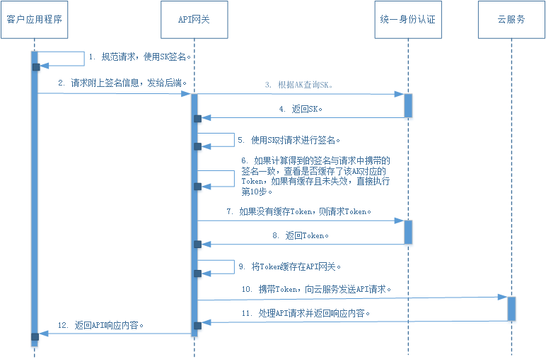
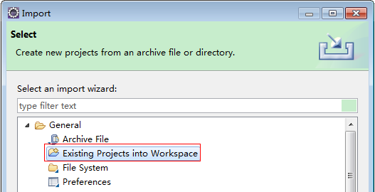
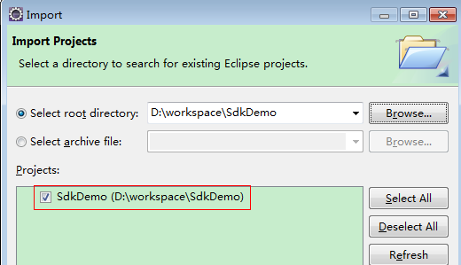
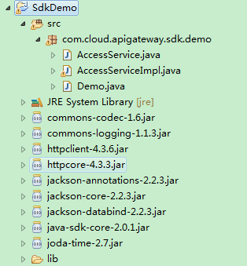

# AK/SK认证<a name="ZH-CN_TOPIC_0146955886"></a>

调用接口有如下两种认证方式，您可以选择其中一种进行认证鉴权。

-   Token认证：通过Token认证通用请求。
-   **AK/SK认证**：通过AK（Access Key ID）/SK（Secret Access Key\)加密调用请求。

    推荐使用AK/SK认证，其安全性比Token认证要高。


本章节主要从以下几方面介绍AK/SK认证。

-   [AK/SK调用流程](#section193951126134615)
-   [AK/SK认证步骤](#section1563113011189)
-   [AK/SK调用示例](#section199977285218)

## AK/SK调用流程<a name="section193951126134615"></a>

通过使用Access Key ID（AK）/Secret Access Key（SK）加密的方法来验证某个请求发送者身份。当您使用AK/SK认证方式完成认证鉴权时，需要通过请求签名流程获取签名，并将签名信息增加到业务接口请求消息头。

> **说明：**   
>AK（Access Key ID）：访问密钥ID。与私有访问密钥关联的唯一标识符；访问密钥ID和私有访问密钥一起使用，对请求进行加密签名。  
>SK（Secret Access Key）：与访问密钥ID结合使用的密钥，对请求进行加密签名，可标识发送方，并防止请求被修改。  

调用API流程时序如下：

**图 1**  调用API时序图<a name="fig128068146347"></a>  


## AK/SK认证步骤<a name="section1563113011189"></a>

1.  下载API网关签名工具。

    下载地址：[http://esdk.huawei.com/ilink/esdk/download/HW\_456706](http://esdk.huawei.com/ilink/esdk/download/HW_456706)。

2.  解压下载的压缩包，得到一个jar文件。
3.  将解压出来的jar文件引用到依赖路径中。如下图所示：

    **图 2**  引用依赖路径设置<a name="fig1511913941815"></a>  
    

4.  参考[AK/SK调用示例](#section199977285218)编写签名模块代码。
5.  编译并运行接口调用。

## AK/SK调用示例<a name="section199977285218"></a>

以下结合一个Demo来介绍如何对一个请求进行签名，并通过HTTP Client发送一个HTTPS请求的过程。

> **说明：**   
>签名方法已集成到Demo中，不需要单独将签名.jar包引用到依赖路径中。  

您也可以通过这个视频教程了解AK/SK认证的使用：[https://bbs.huaweicloud.com/videos/69d4cf0269c34d41ab3dff02c73dd6c9](https://bbs.huaweicloud.com/videos/69d4cf0269c34d41ab3dff02c73dd6c9)  。

1.  生成AK/SK。

    如果已生成过AK/SK，则可跳过该步骤，找到原来已下载的AK/SK文件，文件名一般为：credentials.csv。

    1.  注册用户并登录管理控制台。
    2.  单击用户名，在下拉列表中单击“我的凭证”。

        如果下拉列表中没有“我的凭证”，则单击“基本信息”，在基本信息页面中找到“我的凭证”，然后单击进入“我的凭证”管理页面。


    1.  单击“管理访问密钥”。
    2.  单击“新增访问密钥”，进入“新增访问密钥”页面。
    3.  输入登录密码和短信验证码，单击“确定”，下载密钥，请妥善保管。

2.  获取示例代码，解压缩。

    Demo下载地址：[https://restapi.obs.cn-north-1.myhwclouds.com/SdkDemo.zip](https://restapi.obs.cn-north-1.myhwclouds.com/SdkDemo.zip)  。

3.  <a name="li19564155663214"></a>通过import方式将示例工程导入到Eclipse。

    **图 3**  选择已存在的工程<a name="fig16546145205014"></a>  
    

    **图 4**  选择解压后的示例代码<a name="fig767232218519"></a>  
    

    **图 5**  导入成功后工程结构示例<a name="fig159778103242"></a>  
    

4.  对请求进行签名。

    签名方法集成在[3](#li19564155663214)引入的jar文件中。发送请求前，需要对请求内容进行签名，得到的签名结果将作为http头部信息一起发送。

    1.  （可选）添加请求消息头。

        如果是多项目场景，才需要执行此操作，否则，直接执行[4.b](#li1985133317503)。

        请在“AccessServiceImpl.java”文件中找到如下行，取消代码行屏蔽，并且替换成实际的子项目ID和账号ID。

        ```
        //TODO: Add special headers.
        //request.addHeader("X-Project-Id", "xxxxx");
        //request.addHeader("X-Domian-Id", "xxxxx");
        ```

    2.  <a name="li1985133317503"></a>编辑“Demo.java”文件中的main方法。

        如下所示，region、serviceName、ak、sk、url，请根据实际情况修改。

        ```
        //TODO: Replace region with the name of the region in which the service to be accessed is located. 
        private static final String region = "";
        
        //TODO: Replace vpc with the name of the service you want to access. For example, ecs, vpc, iam, and elb.
        private static final String serviceName = "";
        
        public static void main(String[] args) throws UnsupportedEncodingException
        {
        //TODO: Replace the AK and SK with those obtained on the My Credential page.
        String ak = "ZIRRKMTWP******1WKNKB";
        String sk = "Us0mdMNHk******YrRCnW0ecfzl";
        
        //TODO: To specify a project ID (multi-project scenarios), add the X-Project-Id header.
        //TODO: To access a global service, such as IAM, DNS, CDN, and TMS, add the X-Domain-Id header to specify an account ID.
        //TODO: To add a header, find "Add special headers" in the AccessServiceImple.java file.
        
        //TODO: Test the API
        String url = "https://{Endpoint}/v1/{project_id}/vpcs";
        get(ak, sk, url);
        
        //TODO: When creating a VPC, replace {project_id} in postUrl with the actual value.
        //String postUrl = "https://serviceEndpoint/v1/{project_id}/cloudservers";
        //String postbody ="{\"vpc\": {\"name\": \"vpc\",\"cidr\": \"192.168.0.0/16\"}}";
        //post(ak, sk, postUrl, postbody);
        
        //TODO: When querying a VPC, replace {project_id} in url with the actual value.
        //String url = "https://serviceEndpoint/v1/{project_id}/vpcs/{vpc_id}";
        //get(ak, sk, url);
        
        //TODO: When updating a VPC, replace {project_id} and {vpc_id} in putUrl with the actual values.
        //String putUrl = "https://serviceEndpoint/v1/{project_id}/vpcs/{vpc_id}";
        //String putbody ="{\"vpc\":{\"name\": \"vpc1\",\"cidr\": \"192.168.0.0/16\"}}";
        //put(ak, sk, putUrl, putbody);
        
        //TODO: When deleting a VPC, replace {project_id} and {vpc_id} in deleteUrl with the actual values.
        //String deleteUrl = "https://serviceEndpoint/v1/{project_id}/vpcs/{vpc_id}";
        //delete(ak, sk, deleteUrl);
        }
        ```

    3.  编译与运行接口调用。

        在左侧“Package Explorer”中找到“Demo.java”，右键选择“Run AS \>Java Application”并单击运行。

        可在控制台查看调用日志。


