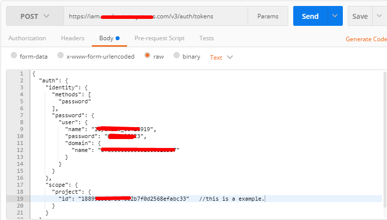
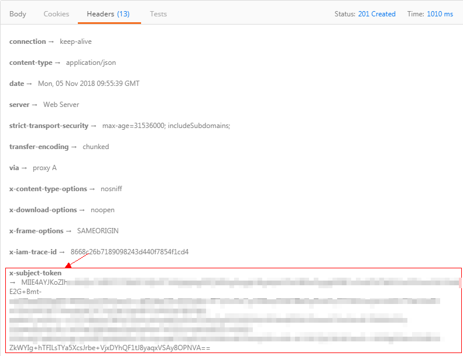
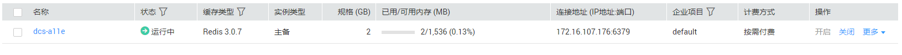

# Token认证<a name="ZH-CN_TOPIC_0146955885"></a>

当您使用Token认证方式完成认证鉴权时，需要获取用户Token并在调用接口时增加“X-Auth-Token”到业务接口请求消息头中。

> **说明：**   
>调用接口有如下两种认证方式，您可以选择其中一种进行认证鉴权。  
>-   **Token认证**：通过Token认证通用请求。  
>-   AK/SK认证：通过AK（Access Key ID）/SK（Secret Access Key\)对调用请求内容进行签名认证。  

本节主要从以下几方面介绍Token认证。

-   [调用接口步骤](#section3546598312249)
-   [接口调用示例](#section0458351194216)

## 调用接口步骤<a name="section3546598312249"></a>

1.  发送“POST https://_**IAM的Endpoint**_/v3/auth/tokens”，获取IAM的Endpoint及消息体中的区域名称。

    请参考[地区和终端节点](http://developer.huaweicloud.com/dev/endpoint)。

    当服务区域名称为“所有”时，选择IAM“中国华北区1”的Endpoint。

    请求内容示例如下：

    > **说明：**   
    >下面示例代码中的斜体字需要替换为实际内容，详情请参考《统一身份认证服务API参考》。  

    ```
    {
      "auth": {
        "identity": {
          "methods": [
            "password"
          ],
          "password": {
            "user": {
              "name": "username", //登录控制台后，从“我的凭证”页面获取“用户名”
              "password": "password",
              "domain": {
                "name": "domainname" //登录控制台后，从“我的凭证”页面获取“账号名”
              }
            }
          }
        },
        "scope": {
          "project": {
            "id": "0215ef11e49d4743be23dd97a1561e91" //登录控制台后，从“我的凭证”页面获取“项目ID”       
          }
        }
      }
    }
    ```

2.  <a name="li2615608112249"></a>获取Token，请参考《统一身份认证服务API参考》的“获取用户Token”章节。请求响应成功后在响应消息头中包含的“X-Subject-Token”的值即为Token值。

    以下示例为使用Postman工具手工获取Token方案。

    **图 1**  请求示例<a name="fig423411369101"></a>  
    

    **图 2**  从返回消息的Header中获取X-Subject-Token<a name="fig1097673441212"></a>  
    

3.  调用业务接口，在请求消息头中增加“X-Auth-Token”，“X-Auth-Token”的取值为[2](#li2615608112249)中获取的Token。

## 接口调用示例<a name="section0458351194216"></a>

本小节通过调用创建缓存实例API创建一个缓存实例，介绍使用DCS API的基本流程。

1.  <a name="li3766077109"></a>获取相关信息。
    -   已获取IAM的Endpoint，具体请参见[地区和终端节点](http://developer.huaweicloud.com/endpoint)。
    -   已获取DCS的Endpoint，具体请参见[地区和终端节点](http://developer.huaweicloud.com/endpoint)。
    -   已获取项目ID，具体请参见[获取项目ID](获取项目ID.md)。
    -   已获取租户的VPC id，安全组id和子网id。具体请参见《虚拟私有云用户指南》。

2.  获取用户Token，并设置成环境变量，Token用于后续调用其他接口鉴权。
    1.  执行以下命令，获取用户Token。

        ```
        curl -X POST https://{iam_endpoint}/v3/auth/tokens -H 'content-type: application/json' -d '{
        	"auth": {
        		"identity": {
        			"methods": [
        				"password"
        			],
        			"password": {
        				"user": {
        				"name": "{user_name}",
        					"domain": {
        						"name": "{user_name}"
        					},
        			"password": "{password}"
        				}
        			}
        		},
        		"scope": {
        			"project": {
        				"id": "{project_id}"
        			}
        		}
        	}
        }' -vk
        ```

        上述命令中，部分参数请参见以下说明进行修改（具体请参考_《统一身份认证服务API参考》_）：

        1.  **\{iam\_endpoint\}**替换为[1](#li3766077109)中获取的IAM的Endpoint。
        2.  **\{project\_id\}**替换为[1](#li3766077109)中获取的项目ID。
        3.  **\{user\_name\}**和**\{password\}**分别替换为连接IAM服务器的用户名和密码。

        响应Header中“X-Subject-Token“的值即为Token：

        ```
        X-Subject-Token:MIIDkgYJKoZIhvcNAQcCoIIDgzCCA38CAQExDTALBglghkgBZQMEAgEwgXXXXX...
        ```

    2.  使用如下命令将token设置为环境变量，方便后续事项。

        **export Token=_\{__X-Subject-Token\}_**

        **X-Subject-Token**即为上一步骤获取到的token，命令示例如下。

        ```
        export Token=MIIDkgYJKoZIhvcNAQcCoIIDgzCCA38CAQExDTALBglghkgBZQMEAgEwgXXXXX...
        ```


3.  <a name="li113852330577"></a>调用[查询可用分区信息](查询可用分区信息.md)接口，查询待创建缓存实例节点所指定的可用分区id。

    查询可用分区id请求消息样例如下：

    ```
    curl -X GET https://{dcs_endpoint}/v1.0/availableZones -H 'content-type: application/json' -H "x-auth-token: $Token" -vk
    ```

    上述命令中，**\{dcs\_endpoint\}**替换为[1](#li3766077109)中获取的DCS的Endpoint。

4.  <a name="li9385433195711"></a>调用[查询产品规格列表](查询产品规格列表.md)接口，查询产品id。

    查询产品id请求消息样例如下：

    ```
    curl -X GET https://{dcs_endpoint}/v1.0/products -H 'content-type: application/json' -H "x-auth-token: $Token" -vk
    ```

    上述命令中，**\{dcs\_endpoint\}**替换为[1](#li3766077109)中获取的DCS的Endpoint。

5.  调用[创建缓存实例](创建缓存实例.md)接口创建一个缓存实例。

    创建缓存实例请求消息样例如下：

    ```
    curl -X POST https://{dcs_endpoint}/v1.0/{project_id}/instances -H 'content-type: application/json' -H "x-auth-token: $Token" -d '{
    	"name": "dcs-a11e",
    	"description": "Create a instance",
    	"engine": "Redis",
    	"engine_version": "3.0.7",
    	"capacity": 2,
    	"password": "XXXXXX",
            "vpc_id": "{vpc_id}",
            "security_group_id": "{security_group_id}",
            "subnet_id": "{subnet_id}",
            "available_zones": [
    	      "{available_zones_id}"
    	],
    	"product_id": "{product_id}",
    	"instance_backup_policy": {
    		"save_days": 1,
    		"backup_type": "auto",
    		"periodical_backup_plan": {
    			"begin_at": "00:00-01:00",
    			"period_type": "weekly",
    			"backup_at": [
    				1,
    				2,
    				3,
    				4,
    				5,
    				6,
    				7
    			]
    		}
    	},
    	"maintain_begin": "22:00:00",
    	"maintain_end": "02:00:00"
    }' -vk
    ```

    上述命令中，部分参数请参见以下说明进行修改（其他参数为自定义参数，请根据[创建缓存实例](创建缓存实例.md)中的参数解释进行设置）：

    1.  **\{dcs\_endpoint\}**和**\{project\_id\}**分别替换为[1](#li3766077109)中获取的DCS的Endpoint和项目ID。
    2.  **\{vpc\_id\}**、**\{security\_group\_id\}**和**\{subnet\_id\}**分别替换为[1](#li3766077109)中获取的租户的VPC id，安全组id和子网id。
    3.  **\{available\_zones\_id\}**替换为[3](#li113852330577)中查询到的可用分区的id值。
    4.  **\{product\_id\}**替换为[4](#li9385433195711)中查询到的产品的product\_id值。

6.  缓存实例创建完后，您可以在DCS的管理控制台查看到该缓存实例。

    **图 3**  查看缓存实例<a name="fig775989175411"></a>  
    


