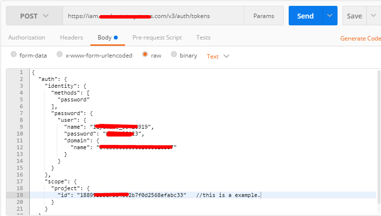
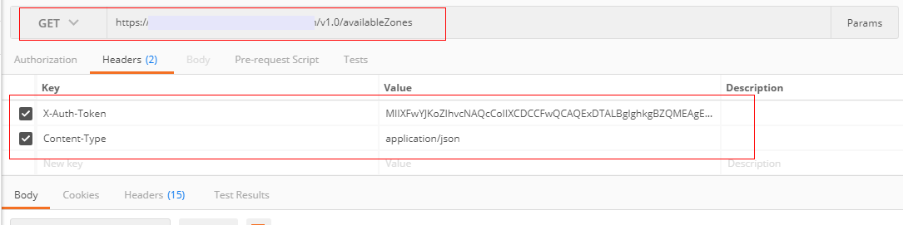
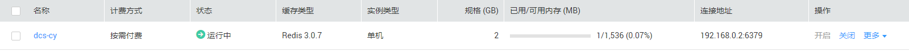

# Token认证<a name="ZH-CN_TOPIC_0146955885"></a>

当您使用Token认证方式完成认证鉴权时，需要获取用户Token并在调用接口时增加“X-Auth-Token”到业务接口请求消息头中。

> **说明：**   
>调用接口有如下两种认证方式，您可以选择其中一种进行认证鉴权。  
>-   **Token认证**：通过Token认证通用请求。  
>-   AK/SK认证：通过AK（Access Key ID）/SK（Secret Access Key\)对调用请求内容进行签名认证。  

本文分别通过cURL和客户端使用Token进行接口调用创建缓存实例API创建一个缓存实例，介绍使用DCS API的基本流程。

## 接口调用示例一：cURL<a name="section1822544511572"></a>

1.  <a name="li392115008"></a>获取相关信息。
    1.  获取IAM的Endpoint，具体请参见[地区和终端节点](http://developer.huaweicloud.com/endpoint)。
    2.  获取DCS的Endpoint，具体请参见[地区和终端节点](http://developer.huaweicloud.com/endpoint)。
    3.  获取项目ID，具体请参见[获取项目ID](获取项目ID.md)。
    4.  获取租户的VPC ID，安全组ID和子网ID。具体请参见[获取VPC ID、安全组ID和子网ID](创建缓存实例.md#section682614592540)。

2.  获取用户Token，并设置成环境变量，Token用于后续调用其他接口鉴权。
    1.  <a name="li6644191816"></a>执行以下命令，获取用户Token。

        ```
        curl -X POST https://{iam_endpoint}/v3/auth/tokens -H 'content-type: application/json' -d '{ 
        	"auth": { 
        		"identity": { 
        			"methods": [ 
        				"password" 
        			], 
        			"password": { 
        				"user": { 
        				"name": "{user_name}", 
        					"domain": { 
        						"name": "{user_name}" 
        					}, 
        			"password": "{password}" 
        				} 
        			} 
        		}, 
        		"scope": { 
        			"project": { 
        				"id": "{project_id}" 
        			} 
        		} 
        	} 
        }' -vk
        ```

        上述命令中，部分参数请参见以下说明进行修改（具体请参考_《_统一身份认证服务API参考》）：

        1.  **\{iam\_endpoint\}**替换为[1](#li392115008)中获取的IAM的Endpoint。
        2.  **\{project\_id\}**替换为[1](#li392115008)中获取的项目ID。
        3.  **\{user\_name\}**和**\{password\}**分别替换为连接IAM服务器的用户名和密码。

        响应Header中“X-Subject-Token”的值即为Token：

        ```
        X-Subject-Token:MIIDkgYJKoZIhvcNAQcCoIIDgzCCA38CAQExDTALBglghkgBZQMEAgEwgXXXXX...
        ```

    2.  使用如下命令将token设置为环境变量，方便后续操作。

        **export Token=_\{X-Subject-Token\}_**

        **X-Subject-Token**即为[2.a](#li6644191816)获取到的token，命令示例如下。

        ```
        export Token=MIIDkgYJKoZIhvcNAQcCoIIDgzCCA38CAQExDTALBglghkgBZQMEAgEwgXXXXX...
        ```

    3.  <a name="li14828310451"></a>调用[查询可用区信息](查询可用区信息.md)接口，查询待创建缓存实例节点所指定的可用区id。

        查询可用区id请求消息样例如下：

        ```
        curl -X GET https://{dcs_endpoint}/v1.0/availableZones -H 'content-type: application/json' -H "x-auth-token: $Token" -vk
        ```

        上述命令中，**\{dcs\_endpoint\}**替换为[1](#li392115008)中获取的DCS的Endpoint。


    1.  <a name="li2045910539015"></a>调用[查询产品规格列表](查询产品规格列表.md)接口，查询产品id。

        查询产品id请求消息样例如下：

        ```
        curl -X GET https://{dcs_endpoint}/v1.0/products -H 'content-type: application/json' -H "x-auth-token: $Token" -vk
        ```

        上述命令中，**\{dcs\_endpoint\}**替换为[1](#li392115008)中获取的DCS的Endpoint。

    2.  调用[创建缓存实例](创建缓存实例.md)接口创建一个缓存实例。

        创建缓存实例请求消息样例如下：

        ```
        curl -X POST https://{dcs_endpoint}/v1.0/{project_id}/instances -H 'content-type: application/json' -H "x-auth-token: $Token" -d '{ 
        	"name": "dcs-a11e", 
        	"description": "Create a instance", 
        	"engine": "Redis", 
        	"engine_version": "3.0.7", 
        	"capacity": 2, 
        	"password": "XXXXXX", 
                "vpc_id": "{vpc_id}", 
                "security_group_id": "{security_group_id}", 
                "subnet_id": "{subnet_id}", 
                "available_zones": [ 
                  "{available_zones_id}" 
        	   ], 
                "product_id": "{product_id}", 
        	"instance_backup_policy": { 
        		"save_days": 1, 
        		"backup_type": "auto", 
        		"periodical_backup_plan": { 
        			"begin_at": "00:00-01:00", 
        			"period_type": "weekly", 
        			"backup_at": [ 
        				1, 
        				2, 
        				3, 
        				4, 
        				5, 
        				6, 
        				7 
        			] 
        		} 
        	}, 
        	"maintain_begin": "22:00:00", 
        	"maintain_end": "02:00:00" 
        }' -vk
        
        ```

        上述命令中，部分参数请参见以下说明进行修改（其他参数为自定义参数，请根据[创建缓存实例](创建缓存实例.md)中的参数解释进行设置）：

        1.  **\{dcs\_endpoint\}**和**\{project\_id\}**分别替换为[1](#li392115008)中获取的DCS的Endpoint和项目ID。
        2.  **\{vpc\_id\}**、**\{security\_group\_id\}**和**\{subnet\_id\}**分别替换为[1](#li392115008)中获取的租户的VPC id，安全组id和子网id。
        3.  **\{available\_zones\_id\}**替换为[2.c](#li14828310451)中查询到的可用区的id值。
        4.  **\{product\_id\}**替换为[2.d](#li2045910539015)中查询到的产品的product\_id值。

    3.  缓存实例创建完后，您可以在DCS的管理控制台查看到该缓存实例。

        **图 1**  查看缓存实例<a name="fig1046245313013"></a>  
        


## 接口调用示例二：REST客户端<a name="section0458351194216"></a>

本文以使用Postman图形化工具，进行手工获取Token和接口调用操作为示例。用户也可使用其他客户端进行操作。

1.  <a name="li1085714114819"></a>获取相关信息。
    -   获取IAM的Endpoint，具体请参见[地区和终端节点](http://developer.huaweicloud.com/endpoint)。
    -   获取DCS的Endpoint，具体请参见[地区和终端节点](http://developer.huaweicloud.com/endpoint)。
    -   获取项目ID，具体请参见[获取项目ID](获取项目ID.md)。
    -   获取租户的VPC id，安全组id和子网id。具体请参见[获取VPC ID、安全组ID和子网ID](创建缓存实例.md#section682614592540)。

2.  获取用户Token。
    1.  设置请求方法为“POST”；消息头中，设置消息体类型Content-Type为application/json。
    2.  设置请求URL为“https://_**IAM的Endpoint**_/v3/auth/tokens”，在请求消息体中设置如下内容，获取Token。

        ```
        {
          "auth": {
            "identity": {
              "methods": [
                "password"
              ],
              "password": {
                "user": {
                  "name": "username", 
                  "password": "password",
                  "domain": {
                    "name": "domainname" 
                  }
                }
              }
            },
            "scope": {
              "project": {
                "id": "0215ef11e49d4743be23dd97a1561e91" 
              }
            }
          }
        }
        ```

        上述命令中，部分参数请参见以下说明进行修改（具体请参考_《统一身份认证服务API参考》_）：

        1.  **\{iam\_endpoint\}**替换为[1](#li1085714114819)中获取的IAM的Endpoint。
        2.  **\{project\_id\}**替换为[获取项目ID](获取项目ID.md)中获取的项目ID。
        3.  **\{user\_name\}**和**\{password\}**分别替换为连接IAM服务器的用户名和密码。
        4.  **\{domainname\}**替换为[获取账号和账号ID](获取账号和账号ID.md)获取的账号名。

        在Postman工具的请求操作如[图2](#fig1123253194613)所示。

        **图 2**  Postman工具请求样例<a name="fig1123253194613"></a>  
        

        **图 3**  从返回消息的Header中获取X-Subject-Token<a name="fig15230538460"></a>  
        

        响应Header中“X-Subject-Token“的值即为Token：

        ```
        X-Subject-Token:MIIDkgYJKoZIhvcNAQcCoIIDgzCCA38CAQExDTALBglghkgBZQMEAgEwgXXXXX...
        ```


3.  在每次业务请求中，都要增加“X-Auth-Token”和消息体类型Content-Type到业务接口请求消息头中。
4.  <a name="li113852330577"></a>调用[查询可用区信息](查询可用区信息.md)接口，查询待创建缓存实例节点所指定的可用区id。

    请求的URL如下：

    ```
    GET https://{dcs_endpoint}/v1.0/availableZones 
    ```

    命令中**的\{dcs\_endpoint\}**替换为[1](#li1085714114819)中获取的DCS的Endpoint。

    请求设置如下：

    **图 4**  查询可用区id<a name="fig816514254362"></a>  
    

5.  <a name="li16312367283"></a>调用[查询产品规格列表](查询产品规格列表.md)接口，查询产品id。

    请求的URL如下：

    ```
    GET https://{dcs_endpoint}/v1.0/products  
    ```

    其中，命令中的**\{dcs\_endpoint\}**替换为[1](#li1085714114819)中获取的DCS的Endpoint。

    请求设置如下：

    **图 5**  查询产品id<a name="fig1847011116389"></a>  
    

6.  调用[创建缓存实例](创建缓存实例.md)接口创建一个缓存实例。

    创建缓存实例请求消息体样例如下：

    ```
    {
    	"name": "dcs-a11e",
    	"description": "Create a instance",
    	"engine": "Redis",
    	"engine_version": "3.0.7",
    	"capacity": 2,
    	"password": "XXXXXX",
            "vpc_id": "{vpc_id}",
            "security_group_id": "{security_group_id}",
            "subnet_id": "{subnet_id}",
            "available_zones": [
    	      "{available_zones_id}"
    	],
    	"product_id": "{product_id}",
    	"instance_backup_policy": {
    		"save_days": 1,
    		"backup_type": "auto",
    		"periodical_backup_plan": {
    			"begin_at": "00:00-01:00",
    			"period_type": "weekly",
    			"backup_at": [
    				1,
    				2,
    				3,
    				4,
    				5,
    				6,
    				7
    			]
    		}
    	},
    	"maintain_begin": "22:00:00",
    	"maintain_end": "02:00:00"
    }
    ```

    上述命令中，部分参数请参见以下说明进行修改（其他参数为自定义参数，请根据[创建缓存实例](创建缓存实例.md)中的参数解释进行设置）：

    1.  **\{dcs\_endpoint\}**和**\{project\_id\}**分别替换为[1](#li1085714114819)中获取的DCS的Endpoint和项目ID。
    2.  **\{vpc\_id\}**、**\{security\_group\_id\}**和**\{subnet\_id\}**分别替换为[1](#li1085714114819)中获取的租户的VPC id，安全组id和子网id。
    3.  **\{available\_zones\_id\}**替换为[4](#li113852330577)中查询到的可用区的id值。
    4.  **\{product\_id\}**替换为[5](#li16312367283)中查询到的产品的product\_id值。

7.  缓存实例创建完后，您可以在DCS的管理控制台查看到该缓存实例。

    **图 6**  查看缓存实例<a name="fig981004462818"></a>  
    


