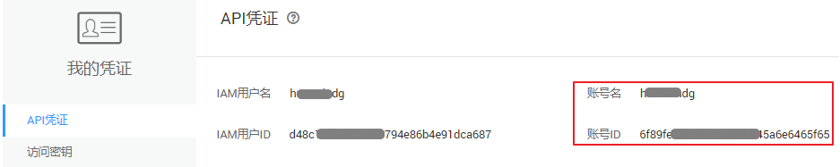

# 获取帐户名和帐号ID

在调用接口的时候，部分URL中需要填入帐户名和帐号ID，所以需要先在管理控制台上获取到帐户名和帐号ID。帐户名和帐号ID获取步骤如下：

1.  注册并登录管理控制台。
2.  单击用户名，在下拉列表中单击“基本信息”。
3.  在基本信息页面单击“管理我的凭证”。

    在“我的凭证”页面查看帐号名和帐号ID。

    **图 1**  查看帐号名和帐号ID  
    

