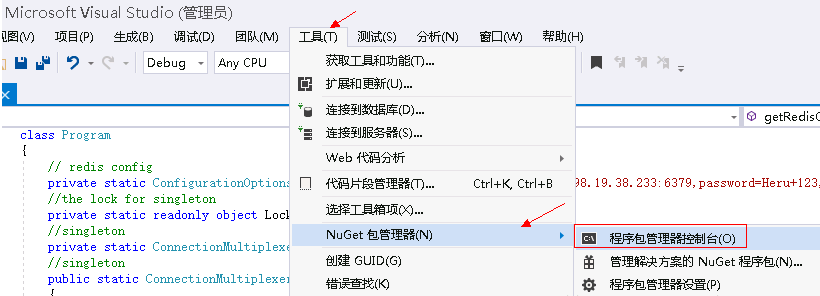

# C\# Redis客户端连接Redis实例<a name="ZH-CN_TOPIC_0144197425"></a>

介绍使用同一VPC内弹性云服务器ECS上的C\# Redis客户端连接Redis实例的方法。更多的客户端的使用方法，请参考[https://redis.io/clients](https://redis.io/clients)。

## 前提条件<a name="zh-cn_topic_0126076987_section1502270695932"></a>

-   已成功申请Redis实例，且状态为“运行中”。
-   已创建弹性云服务器，创建弹性云服务器的方法，请参见《弹性云服务器用户指南》。
-   如果弹性云服务器为Linux系统，该弹性云服务器必须已经安装gcc编译环境。

## 操作步骤<a name="zh-cn_topic_0126076987_section994505645015"></a>

1.  <a name="zh-cn_topic_0126076987_li457118182512"></a>查看并获取待连接Redis实例的IP地址/域名和端口。

    具体步骤请参见[查看缓存实例信息](查看缓存实例信息.md#ZH-CN_TOPIC_0144197334)。

2.  登录弹性云服务器。

    弹性云服务器操作系统，这里以Window为例。

3.  在弹性云服务器安装VS 2017社区版。
4.  启动VS 2017，新建一个工程。

    工程名自定义，这里设置为“redisdemo”。

5.  使用VS的nuget管理工具安装C\# Redis客户端StackExchange.Redis。

    按照如[图1](#zh-cn_topic_0126076987_fig394516508313)操作，进入程序包管理器控制台，在nuget控制台输入：**Install-Package StackExchange.Redis** _-Version 1.2.6_。（版本号可以不指定）

    **图 1**  进入程序包管理器控制台<a name="zh-cn_topic_0126076987_fig394516508313"></a>  
    

6.  编写如下代码，并使用String的set和get测试连接。

    ```
    using System;
    using StackExchange.Redis;
    
    namespace redisdemo
    {
        class Program
        {
            // redis config
            private static ConfigurationOptions connDCS = ConfigurationOptions.Parse("10.10.38.233:6379,password=********,connectTimeout=2000");
            //the lock for singleton
            private static readonly object Locker = new object();
            //singleton
            private static ConnectionMultiplexer redisConn;
            //singleton
            public static ConnectionMultiplexer getRedisConn()
            {
                if (redisConn == null)
                {
                    lock (Locker)
                    {
                        if (redisConn == null || !redisConn.IsConnected)
                        {
                            redisConn = ConnectionMultiplexer.Connect(connDCS);
                        }
                    }
                }
                return redisConn;
            }
            static void Main(string[] args)
            {
                redisConn = getRedisConn();
                var db = redisConn.GetDatabase();
                //set get
                string strKey = "Hello";
                string strValue = "DCS for Redis!";
                Console.WriteLine( strKey + ", " + db.StringGet(strKey));
    
                Console.ReadLine();
            }
        }
    }
    ```

    其中，10.10.38.233:6379分别为Redis实例的IP地址/域名以及端口。IP地址/域名和端口获取见步骤[1](#zh-cn_topic_0126076987_li457118182512)，请按实际情况修改后执行。\*\*\*\*\*\*\*\*为创建Redis实例时自定义的密码，请按实际情况修改后执行。

7.  运行代码，控制台界面输出如下，表示连接成功。

    ```
    Hello, DCS for Redis!
    ```

    关于客户端的其他命令，可以参考官网：[https://stackexchange.github.io/StackExchange.Redis/](https://stackexchange.github.io/StackExchange.Redis/)。


## 相关产品及文档<a name="zh-cn_topic_0126076987_section152613113129"></a>

<a name="zh-cn_topic_0126076987_zh-cn_topic_0046844820_table1073594361220"></a>
<table><thead align="left"><tr id="zh-cn_topic_0126076987_zh-cn_topic_0046844820_row197372430123"><th class="cellrowborder" valign="top" width="50%" id="mcps1.1.3.1.1"><p id="zh-cn_topic_0126076987_zh-cn_topic_0046844820_p4737243111216"><a name="zh-cn_topic_0126076987_zh-cn_topic_0046844820_p4737243111216"></a><a name="zh-cn_topic_0126076987_zh-cn_topic_0046844820_p4737243111216"></a>相关产品</p>
</th>
<th class="cellrowborder" valign="top" width="50%" id="mcps1.1.3.1.2"><p id="zh-cn_topic_0126076987_zh-cn_topic_0046844820_p18737144301214"><a name="zh-cn_topic_0126076987_zh-cn_topic_0046844820_p18737144301214"></a><a name="zh-cn_topic_0126076987_zh-cn_topic_0046844820_p18737144301214"></a>相关文档</p>
</th>
</tr>
</thead>
<tbody><tr id="zh-cn_topic_0126076987_zh-cn_topic_0046844820_row17371443131210"><td class="cellrowborder" valign="top" width="50%" headers="mcps1.1.3.1.1 "><p id="zh-cn_topic_0126076987_zh-cn_topic_0046844820_p13372054101419"><a name="zh-cn_topic_0126076987_zh-cn_topic_0046844820_p13372054101419"></a><a name="zh-cn_topic_0126076987_zh-cn_topic_0046844820_p13372054101419"></a><a href="https://www.huaweicloud.com/product/dcs.html?infodocbz" target="_blank" rel="noopener noreferrer">分布式缓存 Redis</a></p>
<p id="zh-cn_topic_0126076987_zh-cn_topic_0046844820_p19548105714519"><a name="zh-cn_topic_0126076987_zh-cn_topic_0046844820_p19548105714519"></a><a name="zh-cn_topic_0126076987_zh-cn_topic_0046844820_p19548105714519"></a><a href="https://www.huaweicloud.com/product/dcsmem.html?infodocbz" target="_blank" rel="noopener noreferrer">分布式缓存 Memcached</a></p>
<p id="zh-cn_topic_0126076987_zh-cn_topic_0046844820_p8862161219564"><a name="zh-cn_topic_0126076987_zh-cn_topic_0046844820_p8862161219564"></a><a name="zh-cn_topic_0126076987_zh-cn_topic_0046844820_p8862161219564"></a><a href="https://www.huaweicloud.com/product/ecs.html?infodocbz" target="_blank" rel="noopener noreferrer">弹性云服务器 ECS</a></p>
<p id="zh-cn_topic_0126076987_zh-cn_topic_0046844820_p841193941416"><a name="zh-cn_topic_0126076987_zh-cn_topic_0046844820_p841193941416"></a><a name="zh-cn_topic_0126076987_zh-cn_topic_0046844820_p841193941416"></a><a href="http://www.huaweicloud.com/product/vpc.html?infodocbz" target="_blank" rel="noopener noreferrer">虚拟私有云 VPC</a></p>
</td>
<td class="cellrowborder" valign="top" width="50%" headers="mcps1.1.3.1.2 "><p id="zh-cn_topic_0126076987_zh-cn_topic_0046844820_p1381695711471"><a name="zh-cn_topic_0126076987_zh-cn_topic_0046844820_p1381695711471"></a><a name="zh-cn_topic_0126076987_zh-cn_topic_0046844820_p1381695711471"></a><a href="https://support.huaweicloud.com/usermanual-dcs/dcs-zh-ug-180315001.html?infodocbz" target="_blank" rel="noopener noreferrer">购买Redis实例</a></p>
<p id="zh-cn_topic_0126076987_zh-cn_topic_0046844820_p682916370595"><a name="zh-cn_topic_0126076987_zh-cn_topic_0046844820_p682916370595"></a><a name="zh-cn_topic_0126076987_zh-cn_topic_0046844820_p682916370595"></a><a href="https://support.huaweicloud.com/usermanual-dcs/zh-cn_topic_0082114847.html?infodocbz" target="_blank" rel="noopener noreferrer">连接Redis实例</a></p>
<p id="zh-cn_topic_0126076987_zh-cn_topic_0046844820_p16726748155912"><a name="zh-cn_topic_0126076987_zh-cn_topic_0046844820_p16726748155912"></a><a name="zh-cn_topic_0126076987_zh-cn_topic_0046844820_p16726748155912"></a><a href="https://support.huaweicloud.com/usermanual-dcs/zh-cn_topic_0061845451.html?infodocbz" target="_blank" rel="noopener noreferrer">变更缓存实例规格</a></p>
<p id="zh-cn_topic_0126076987_zh-cn_topic_0046844820_p12250886517"><a name="zh-cn_topic_0126076987_zh-cn_topic_0046844820_p12250886517"></a><a name="zh-cn_topic_0126076987_zh-cn_topic_0046844820_p12250886517"></a><a href="https://support.huaweicloud.com/usermanual-dcs/zh-cn_topic_0079545637.html?infodocbz" target="_blank" rel="noopener noreferrer">缓存实例备份恢复</a></p>
<p id="zh-cn_topic_0126076987_zh-cn_topic_0046844820_p143616360517"><a name="zh-cn_topic_0126076987_zh-cn_topic_0046844820_p143616360517"></a><a name="zh-cn_topic_0126076987_zh-cn_topic_0046844820_p143616360517"></a><a href="https://support.huaweicloud.com/migration-dcs/zh-cn_topic_0078784423.html?infodocbz" target="_blank" rel="noopener noreferrer">缓存实例数据迁移</a></p>
</td>
</tr>
</tbody>
</table>

