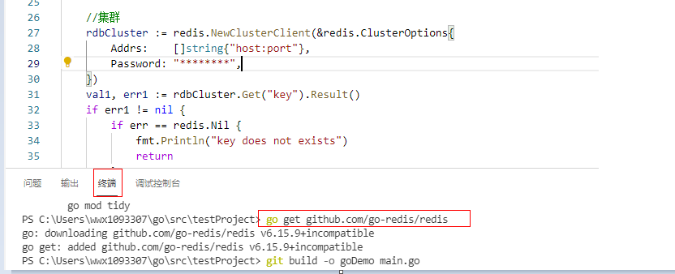

# Go Redis客户端<a name="dcs-ug-211105001"></a>

介绍使用同一VPC内弹性云服务器ECS上的go Redis客户端连接Redis实例的方法。更多的客户端的使用方法请参考[Redis客户端](https://redis.io/clients)。

## 前提条件<a name="section1502270695932"></a>

-   已成功申请Redis实例，且状态为“运行中”。
-   已创建弹性云服务器，创建弹性云服务器的方法，请参见[创建弹性云服务器](https://support.huaweicloud.com/qs-ecs/ecs_02_0005.html)  。

## 操作步骤<a name="section14220739028"></a>

1.  <a name="li457118182512"></a>查看并获取待连接Redis实例的IP地址/域名和端口。

    具体步骤请参见[查看实例信息](查看实例信息.md)。

2.  登录弹性云服务器。

    弹性云服务器操作系统，这里以Window为例。

3.  在弹性云服务器安装VS 2017社区版。
4.  启动VS 2017，新建一个工程，工程名自定义，这里设置为“redisdemo”。
5.  导入go-redis的依赖包，在终端输入**go get github.com/go-redis/redis**。

    **图 1**  终端输入<a name="fig47520363471"></a>  
    

6.  编写如下代码：

    ```
    package main
    
    import (
    	"fmt"
    	"github.com/go-redis/redis"
    )
    
    func main() {
    	// 单机
    	rdb := redis.NewClient(&redis.Options{
    		Addr:     "host:port",
    		Password: "********", // no password set
    		DB:       0,  // use default DB
    	})
    
    	val, err := rdb.Get("key").Result()
    	if err != nil {
    		if err == redis.Nil {
    			fmt.Println("key does not exists")
    			return
    		}
    		panic(err)
    	}
    	fmt.Println(val)
    
    	//集群
    	rdbCluster := redis.NewClusterClient(&redis.ClusterOptions{
    		Addrs:    []string{"host:port"},
    		Password: "********",
    	})
    	val1, err1 := rdbCluster.Get("key").Result()
    	if err1 != nil {
    		if err == redis.Nil {
    			fmt.Println("key does not exists")
    			return
    		}
    		panic(err)
    	}
    	fmt.Println(val1)
    }
    ```

    其中，**host:port**分别为Redis实例的IP地址/域名以及端口。IP地址/域名和端口获取见[1](#li457118182512)，请按实际情况修改后执行。\*\*\*\*\*\*\*\*为创建Redis实例时自定义的密码，请按实际情况修改后执行。

7.  执行**go build -o test main.go**命令进行打包，如打包名为**test**可执行文件。

    > **注意：** 
    >若打包后需要在Linux系统下运行则需要在打包前设置：
    >**set GOARCH=amd64**
    >**set GOOS=linux**

8.  执行**./test**连接实例。

## 连接Redis实例操作视频<a name="section107022112212"></a>

如果需要详细了解连接redis实例的操作，请单击以下链接观看视频。

[访问缓存实例操作视频](https://support.huaweicloud.com/dcs_video/index.html)

