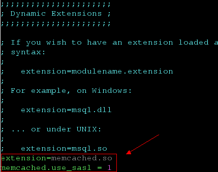
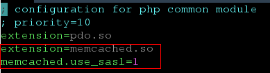

# PHP客户端<a name="dcs-ug-190715005"></a>

介绍使用同一VPC内弹性云服务器ECS上的PHP客户端连接Memcached实例的方法。

## 前提条件<a name="section05011451115518"></a>

-   已成功申请Memcached实例，且状态为“运行中”。
-   已创建弹性云服务器。创建弹性云服务器的方法，请参见《弹性云服务器用户指南》。

    > **说明：** 
    >您创建的弹性云服务器必须与Memcached实例属于同一个VPC，并配置相同的安全组，以确保弹性云服务器与缓存实例的网络是连通的。
    >如果弹性云服务器与Memcached实例不在相同VPC中，可以通过建立VPC对等连接方式连通网络，具体请参考常见问题：[缓存实例是否支持跨VPC访问？](https://support.huaweicloud.com/dcs_faq/dcs-faq-0427002.html)
    >如果弹性云服务器与Memcached实例配置了不同的安全组，可以通过设置安全组规则连通网络，具体请参考常见问题：[如何选择和配置安全组？](https://support.huaweicloud.com/dcs_faq/dcs-faq-0713002.html)


## **RedHat系列**<a name="section1581772318118"></a>

以CentOS7为例介绍PHP版本客户端的安装。Redhat、Fedora等系统也适用。

1.  安装gcc-c++及make等编译组件。

    **yum install gcc-c++ make**

2.  安装sasl相关包。

    **yum install cyrus-sasl\***

3.  安装libmemcached。

    由于libmemcached库需要增加sasl认证参数，因此不能直接使用yum命令安装。

    **wget https://launchpad.net/libmemcached/1.0/1.0.18/+download/libmemcached-1.0.18.tar.gz**

    **tar -xvf libmemcached-1.0.18.tar.gz**

    **cd libmemcached-1.0.18**

    **./configure --prefix=/usr/local/libmemcached --enable-sasl**

    **make && make install**

    > **说明：** 
    >安装libmemcached之前要完成gcc-c++、sasl相关组件的安装。否则会在编译过程中报错，报错问题解决后请执行make clean之后重新make。

4.  安装php。

    **yum install php-devel php-common php-cli**

    > **须知：** 
    >php7.x对SASL认证存在兼容问题，建议使用php 5.6版本。如果yum源提供的php不是5.6版本，请自行在网上查找下载源。

5.  安装memcached客户端。

    注意运行configure配置安装时，增加开启sasl参数。

    **wget http://pecl.php.net/get/memcached-2.1.0.tgz**

    **tar zxvf memcached-2.1.0.tgz**

    **cd memcached-2.1.0**

    **phpize**

    **./configure --with-libmemcached-dir=/usr/local/libmemcached --enable-memcached-sasl**

    **make && make install**

6.  增加php.ini配置。

    使用find或者locate命令找到php.ini文件。

    **find / -name php.ini**

    编辑该文件，增加以下两行：

    ```
    extension=memcached.so
    memcached.use_sasl = 1
    ```

    **图 1**  增加php.ini配置<a name="fig19586203114111"></a>  
    

7.  测试连接。

    新增一个memcached.php文件，增加如下内容：

    ```
    <?php
        $connect = new Memcached; //声明一个Memcached连接
        $connect->setOption(Memcached::OPT_COMPRESSION, false); //关闭压缩
        $connect->setOption(Memcached::OPT_BINARY_PROTOCOL, true); //使用二进制协议
        $connect->setOption(Memcached::OPT_TCP_NODELAY, true); //关闭TCP网络延迟策略
        $connect->addServer('{memcached_instance_ip}', 11211); //此处填写实例ip和端口
        $connect->setSaslAuthData('{username}', '{password}'); //如果实例开启免密访问，则删除或者注释此行
        $connect->set("DCS", "Come on!");
        echo 'DCS: ',$connect->get("DCS");
        echo "\n";
        $connect->quit();
    ?>
    ```

    保存后运行情况如下：

    ```
    [root@testphpmemcached ~]# php memcached.php 
        DCS: Come on!
    [root@testphpmemcached ~]# 
    ```


## **debian系列**<a name="section6546122883719"></a>

以Ubuntu为例，安装步骤如下：

1.  安装gcc及make等编译组件。

    **apt install gcc make**

2.  安装php。

    推荐使用php5.x的版本，对sasl认证兼容性较好。

    按照如下步骤先添加php低版本的镜像源，然后安装php5.6以及php5.6-dev。

    **apt-get install -y language-pack-en-base;**

    **LC\_ALL=en\_US.UTF-8;**

    **add-apt-repository ppa:ondrej/php;**

    **apt-get update;**

    **apt-get install php5.6 php5.6-dev;**

    安装完成后，使用php -version，查看版本号为5.6，说明安装成功。

    ```
    root@dcs-nodelete:/etc/apt# php -version
    PHP 5.6.36-1+ubuntu16.04.1+deb.sury.org+1 (cli) 
    Copyright (c) 1997-2016 The PHP Group
    ```

    > **说明：** 
    >如果需要卸载php，可使用如下命令：
    >**apt install aptitude -y**
    >**aptitude purge \`dpkg -l | grep php| awk '\{print $2\}' |tr "\\n" " "\`**

3.  安装sasl组件。

    **apt install libsasl2-dev cloog.ppl**

4.  安装libmemcached。

    **wget https://launchpad.net/libmemcached/1.0/1.0.18/+download/libmemcached-1.0.18.tar.gz**

    **tar -xvf libmemcached-1.0.18.tar.gz**

    **cd libmemcached-1.0.18**

    **./configure --prefix=/usr/local/libmemcached**

    **make && make install**

    > **说明：** 
    >安装libmemcached之前要完成gcc、sasl相关组件的安装。否则会在编译过程中报错，报错问题解决后请执行make clean之后重新make。

5.  安装memcached客户端。

    首先安装zlib组件。

    **apt install zlib1g.dev**

    安装注意运行configure配置安装时，增加开启sasl参数。

    **wget http://pecl.php.net/get/memcached-2.2.0.tgz**;

    **tar zxvf memcached-2.2.0.tgz**;

    **cd memcached-2.2.0**;

    **phpize5.6**;

    **./configure --with-libmemcached-dir=/usr/local/libmemcached --enable-memcached-sasl**;

    **make && make install**;

6.  增加pdo.ini配置。

    使用find命令找到pdo.ini文件。

    **find / -name pdo.ini**

    默认应该在/etc/php/5.6/mods-available路径下。编辑该文件，增加以下两行：

    ```
    extension=memcached.so
    memcached.use_sasl = 1
    ```

    **图 2**  增加pdo.ini配置<a name="fig8684182814372"></a>  
    

7.  测试连接。

    新增一个memcached.php文件，增加如下内容：

    ```
    <?php
        $connect = new Memcached; //声明一个Memcached连接
        $connect->setOption(Memcached::OPT_COMPRESSION, false); //关闭压缩
        $connect->setOption(Memcached::OPT_BINARY_PROTOCOL, true); //使用二进制协议
        $connect->setOption(Memcached::OPT_TCP_NODELAY, true); //关闭TCP网络延迟策略
        $connect->addServer('{memcached_instance_ip}', 11211); //此处填写实例ip和端口
        $connect->setSaslAuthData('{username}', '{password}'); //如果实例开启免密访问，则删除或者注释此行
        $connect->set("DCS", "Come on!");
        echo 'DCS: ',$connect->get("DCS");
        echo "\n";
        $connect->quit();
    ?>
    ```

    保存后运行情况如下：

    ```
    [root@dcs-nodelete ~]# php memcached.php 
        DCS: Come on!
    [root@dcs-nodelete ~]# 
    ```


