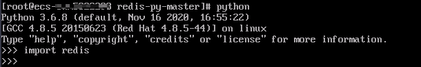
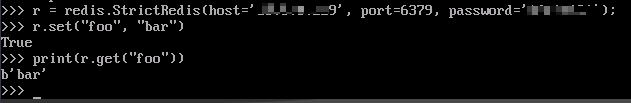

# Python Redis客户端<a name="dcs-ug-0312011"></a>

介绍使用同一VPC内弹性云服务器ECS上的Python Redis客户端Redis-py连接Redis实例的方法。更多的客户端的使用方法请参考[Redis客户端](https://redis.io/clients)。

## 前提条件<a name="section1502270695932"></a>

-   已成功申请Redis实例，且状态为“运行中”。
-   已创建弹性云服务器，创建弹性云服务器的方法，请参见[创建弹性云服务器](https://support.huaweicloud.com/qs-ecs/ecs_02_0005.html)  。
-   如果弹性云服务器为Linux系统，该弹性云服务器必须已经安装python编译环境。

## 操作步骤<a name="section886785613318"></a>

1.  <a name="li450593110588"></a>查看并获取待连接Redis实例的IP地址/域名和端口。

    具体步骤请参见[查看实例信息](查看实例信息.md)。

2.  登录弹性云服务器。

    本章节以弹性云服务器操作系统为centos为例介绍通过python redis客户端连接实例。

3.  连接Redis实例。

    如果系统没有自带Python，可以使用yum方式安装。

    **yum install python**

    > **说明：** 
    >要求系统python版本为3.6+，当默认python版本小于3.6时，可通过以下操作修改python默认版本。
    >1.  删除python软链接文件： rm -rf python
    >2.  重新创建新指向python：ln -s pythonX.X.X python，其中X为python具体版本号。

    -   若是单机、主备、proxy集群实例。
        1.  安装Python和Python Redis客户端Redis-py。
            1.  如果系统没有自带Python，可以使用yum方式安装。
            2.  下载并解压Redis-py。

                **wget https://github.com/andymccurdy/redis-py/archive/master.zip**

                **unzip** **master.zip**

            3.  进入到解压目录后安装Python Redis客户端Redis-py。

                **python setup.py install**

                安装后执行**python**命令，返回如下信息说明成功安装Redis-py：

                **图 1**  执行python<a name="fig135939194314"></a>  
                

        2.  使用Redis-py客户端连接实例。以下步骤以命令行模式进行示例（也可以将命令写入python脚本中再执行）：
            1.  执行**python**命令，进入命令行模式。返回如下信息说明已进入命令行模式：

                **图 2**  进入命令行模式<a name="fig01801119455"></a>  
                

            2.  在命令行中执行以下命令，连接Redis实例。

                ```
                r = redis.StrictRedis(host='XXX.XXX.XXX.XXX', port=6379, password='******');
                ```

                其中，XXX.XXX.XXX.XXX为Redis实例的IP地址/域名，“6379“为Redis实例的端口。IP地址/域名和端口获取见[1](#li450593110588)，请按实际情况修改后执行。**\*\*\*\*\*\***为创建Redis实例时自定义的密码，请按实际情况修改后执行。

                界面显示一行新的命令行，说明连接Redis实例成功。可以输入命令对数据库进行读写操作。

                **图 3**  连接redis成功<a name="fig2367133024516"></a>  
                


    -   若是Cluster集群实例。
        1.  安装redis-py-cluster客户端。
            1.  执行以下命令下载released版本。

                **wget https://github.com/Grokzen/redis-py-cluster/releases/download/2.1.3/redis-py-cluster-2.1.3.tar.gz**

            2.  解压压缩包。

                **tar -xvf** **redis-py-cluster-2.1.3.tar.gz**

            3.  进入到解压目录后安装Python Redis客户端Redis-py-cluster。

                **python setup.py install**

        2.  使用Redis-py-cluster客户端连接Redis实例。

            以下步骤以命令行模式进行示例（也可以将命令写入python脚本中再执行）：

            1.  执行**python**命令，进入命令行模式。
            2.  在命令行中执行以下命令，连接Redis实例

                ```
                >>> from rediscluster import RedisCluster
                
                >>> startup_nodes = [{"host": "192.168.0.143", "port": "6379"}]
                
                >>> rc = RedisCluster(startup_nodes=startup_nodes, decode_responses=True)
                
                >>> rc.set("foo", "bar")
                True
                >>> print(rc.get("foo"))
                'bar'
                ```


## 连接Redis实例操作视频<a name="section1818730142011"></a>

如果需要详细了解连接redis实例的操作，请单击以下链接观看视频。

[访问缓存实例操作视频](https://support.huaweicloud.com/dcs_video/index.html)

