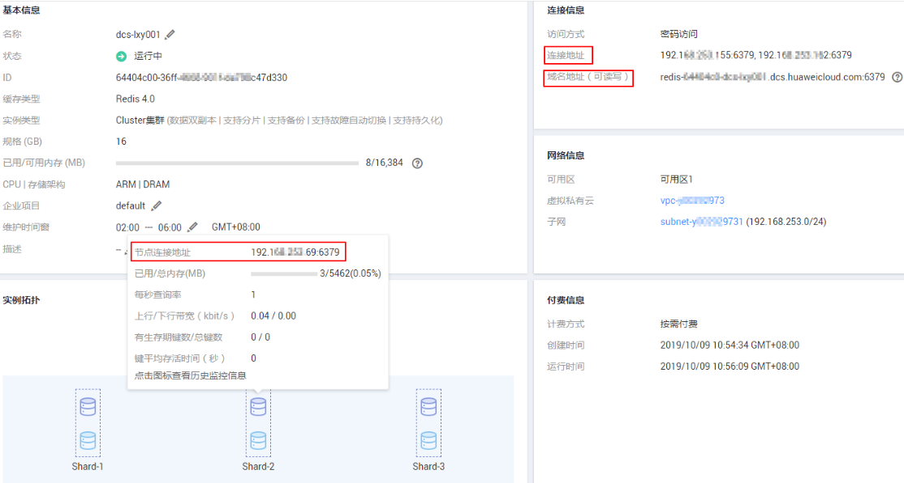

# Redis-cli连接<a name="ZH-CN_TOPIC_0148195299"></a>

介绍使用同一VPC内弹性云服务器ECS上的Redis-Cli连接Redis实例的方法。更多的客户端的使用方法，请参考[https://redis.io/clients](https://redis.io/clients)

如果是公网访问Redis实例，请参考[公网连接](公网连接.md)。

> **说明：**   
>Redis3.0不支持定义端口，端口固定为6379，Redis4.0和Redis5.0支持定义端口，如果不自定义端口，则使用默认端口6379。本文操作步骤涉及实例端口时，统一以默认端口6379为例，如果已自定义端口，请根据实际情况替换，并确认安全组是否放通该端口。  

## 前提条件<a name="section1502270695932"></a>

-   已成功申请Redis实例，且状态为“运行中”。
-   已创建弹性云服务器，创建弹性云服务器的方法，请参见《弹性云服务器用户指南》。
-   如果弹性云服务器为Linux系统，该弹性云服务器必须已经安装gcc编译环境。

## 操作步骤（Linux版）<a name="section596432855917"></a>

1.  <a name="li5799181918288"></a>查看并获取待连接Redis实例的IP地址/域名和端口。

    具体步骤请参见[查看缓存实例信息](查看缓存实例信息.md)。

2.  安装Redis-cli客户端。

    以下步骤以客户端安装在Linux系统上为例进行描述。

    1.  登录弹性云服务器。
    2.  执行以下命令，获取Redis客户端源码，下载路径为[http://download.redis.io/releases/redis-3.0.7.tar.gz](http://download.redis.io/releases/redis-3.0.7.tar.gz)。

        **wget http://download.redis.io/releases/redis-3.0.7.tar.gz**

    3.  执行如下命令，解压Redis客户端源码包。

        **tar -xzf redis-3.0.7.tar.gz**

    4.  进入Redis目录并编译Redis客户端源码。

        **cd redis-3.0.7**

        **make**

        **cd src**

3.  连接Redis非Cluster集群实例。

    如果是Redis3.0、Redis4.0单机/主备、Redis5.0单机/主备实例，请执行以下操作。

    1.  执行以下命令连接Redis实例。

        _**./redis-cli -h**_ _**\{dcs\_instance\_address\} -p 6379**_

        其中**_\{dcs\_instance\_address\}_**为Redis实例的IP地址/域名，“6379“为Redis实例的端口。IP地址/域名和端口获取见步骤[1](#li5799181918288)。

        > **说明：**   
        >如果是Redis3.0 Proxy集群实例，**_\{dcs\_instance\_address\}_**可以为Redis实例的“连接地址”、“域名地址”、“后端服务地址”，获取方法，在控制台单击实例进入实例详情页面即可查看，如[图1](#fig19471181817427)所示。  
        >-   “连接地址”和“域名地址”为负载均衡器地址，系统将请求分发到不同的Proxy节点上。  
        >-   使用“后端服务地址”，可以直接连接到指定的Proxy节点。  

        **图 1**  获取Proxy集群实例连接地址<a name="fig19471181817427"></a>  
        

        以下以使用Redis实例的域名地址为示例，具体请根据实际情况修改：

        ```
        [root@ecs--paas-h00407154 redis-3.0.7]# cd src
        [root@ecs--paas-h00407154 src]# ./redis-cli -h redis-069949a-dcs-lxy.dcs.huaweicloud.com -p 6379
        redis-069949a-dcs-lxy.dcs.huaweicloud.com:6379> 
        ```

    2.  如果Redis实例设置了密码访问，则执行本步骤输入密码，校验通过后才可进行缓存数据读写。

        **auth <password\>**

        其中“<password\>“为创建Redis实例时自定义的密码，请按实际情况修改后执行。

        密码访问回显示例如下：

        ```
        redis-069949a-dcs-lxy.dcs.huaweicloud.com:6379> auth *******
        OK
        redis-069949a-dcs-lxy.dcs.huaweicloud.com:6379> 
        ```

4.  连接Redis Cluster集群实例。

    如果是Redis4.0 Cluster集群、Redis5.0 Cluster集群实例，请执行以下操作。

    1.  执行以下命令连接Redis实例。

        **./redis-cli -h \{dcs\_instance\_address\} -p 6379 -a \{password\} -c**

        其中**，\{dcs\_instance\_address\}**为Redis实例的IP地址/域名，“6379“为Redis实例的端口，**\{password\}**为Cluster集群实例的密码，**-c**连接集群节点时使用。IP地址/域名和端口获取见步骤[1](#li5799181918288)。

        > **说明：**   
        >**\{dcs\_instance\_address\}**参数的值可以为Redis实例“连接地址”、“域名地址”、“实例拓扑”图中分片上的“节点连接地址”。获取方法，在控制台单击实例进入实例详情页面即可查看，如[图2](#fig16174741192314)所示。  
        >-   “连接地址”字段中提供了两个IP，这两个IP地址均可用于连接实例，在连接时，可任选其中一个连接。  
        >-   实例拓扑图中分片上的“节点连接地址”，可以直接连接到指定的分片。  

        **图 2**  获取Cluster集群实例连接地址<a name="fig16174741192314"></a>  
        

        -   以下以使用Redis实例的IP连接为示例，具体请根据实际情况修改：

            ```
            root@ecs-lwx636111:~/redis-3.0.7/src# ./redis-cli -h 192.168.0.85 -p 6379 -a ****** -c
            192.168.0.85:6379> 
            ```

        -   以下以使用Redis实例的域名连接为示例，具体请根据实际情况修改：

            ```
            root@ecs-lwx636111:~/redis-3.0.7/src# ./redis-cli -h redis-51e463c-dcs-lxy.dcs.huaweicloud.com -p 6379 -a ****** -c
            redis-51e463c-dcs-lxy.dcs.huaweicloud.com:6379> 
            ```

    2.  查看Cluster集群节点信息。

        **cluster nodes**

        Cluster集群每一个分片都是一主一从的双副本结构，执行该命令可以查看该实例的所有节点信息，如下所示。

        ```
        192.168.0.85:6379> cluster nodes
        0988ae8fd3686074c9afdcce73d7878c81a33ddc 192.168.0.231:6379@16379 slave f0141816260ca5029c56333095f015c7a058f113 0 1568084030
        000 3 connected
        1a32d809c0b743bd83b5e1c277d5d201d0140b75 192.168.0.85:6379@16379 myself,master - 0 1568084030000 2 connected 5461-10922
        c8ad7af9a12cce3c8e416fb67bd6ec9207f0082d 192.168.0.130:6379@16379 slave 1a32d809c0b743bd83b5e1c277d5d201d0140b75 0 1568084031
        000 2 connected
        7ca218299c254b5da939f8e60a940ac8171adc27 192.168.0.22:6379@16379 master - 0 1568084030000 1 connected 0-5460
        f0141816260ca5029c56333095f015c7a058f113 192.168.0.170:6379@16379 master - 0 1568084031992 3 connected 10923-16383
        19b1a400815396c6223963b013ec934a657bdc52 192.168.0.161:6379@16379 slave 7ca218299c254b5da939f8e60a940ac8171adc27 0 1568084031
        000 1 connected
        ```

        备节点只能进行只读操作，不能进行写操作。在进行数据写入时，key存储在哪个slot中，由Crc16\(key\) mod 16384的值决定。

        如下所示，数据写入时，根据Crc16\(key\) mod 16384的值决定key存储位置，并跳转到该slot所在的节点上。

        ```
        192.168.0.170:6379> set hello world
        -> Redirected to slot [866] located at 192.168.0.22:6379
        OK
        192.168.0.22:6379> set happy day
        OK
        192.168.0.22:6379> set abc 123
        -> Redirected to slot [7638] located at 192.168.0.85:6379
        OK
        192.168.0.85:6379> get hello
        -> Redirected to slot [866] located at 192.168.0.22:6379
        "world"
        192.168.0.22:6379> get abc
        -> Redirected to slot [7638] located at 192.168.0.85:6379
        "123"
        192.168.0.85:6379> 
        ```


## 操作步骤（Windows版）<a name="section0560105823710"></a>

Windows版本的Redis客户端安装包，下载请单击[这里](https://github.com/MicrosoftArchive/redis/tags)。下载后直接解压安装包，然后使用cmd工具进入解压目录，执行以下命令连接redis实例：

**redis-cli -h** **_XXX_  -p  _6379_**

其中：“XXX“为Redis实例的IP地址/域名，“6379“为Redis实例的端口。IP地址/域名和端口获取见[查看缓存实例信息](查看缓存实例信息.md)，请按实际情况修改后执行。

## 连接Redis实例操作视频<a name="section9833202819317"></a>

如果需要详细了解连接Reids实例的操作，请单击以下链接观看视频。

[访问缓存实例操作视频](https://support.huaweicloud.com/dcs_video/index.html)

