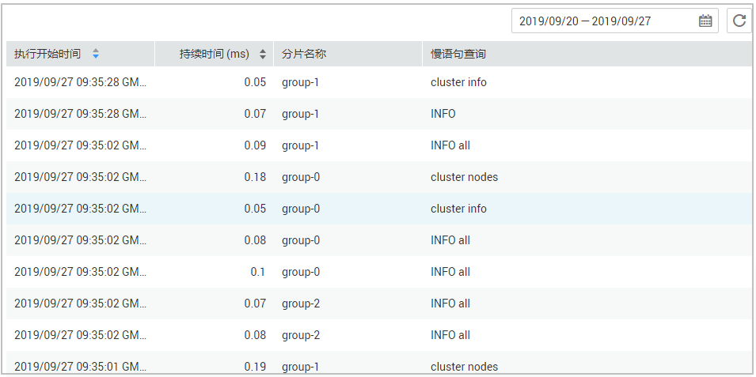

# Redis实例慢查询

慢查询是Redis用于记录命令执行时间过长请求的机制。您可以在DCS控制台查看慢请求日志，帮助解决性能问题。

查询结果中，涉及的慢语句命令详情，请前往[Redis官方网站](https://redis.io/commands)（中文网站为：[http://www.redis.cn/commands.html](http://www.redis.cn/commands.html)）查看。

慢查询结果由实例两个配置参数决定，如下：

-   slowlog-log-slower-than：如果在Redis实例的数据节点中执行一个命令，执行时间超过了slowlog-log-slower-than参数设置的阈值（单位为微秒），则会被记录到慢查询中。该参数的默认值为10000，即10ms，当Redis命令执行时间超过10ms，则生成慢查询。
-   slowlog-max-len：Redis记录的慢查询个数由slowlog-max-len参数的值决定，默认值为128个。当慢查询个数超过128时，会将旧的慢查询删除，记录新的慢查询。

实例配置参数的修改以及参数解释，请参考[修改单实例配置参数](修改单实例配置参数.md)。

> **说明：** 
>如果是Redis 3.0 Proxy集群实例，必须是2019年10月14号后创建的才支持慢查询。如果是之前的实例，可提工单申请升级。升级对业务无任何影响，只是控制台新增支持慢查询功能。

## 控制台操作慢查询

1.  登录[分布式缓存服务管理控制台](https://console.huaweicloud.com/dcs)。
2.  在管理控制台左上角单击，选择区域和项目。

    > **说明：** 
    >此处请选择与您的应用服务相同的区域。

3.  单击左侧菜单栏的“缓存管理”，进入实例信息页面。
4.  单击需要创建白名单的DCS缓存实例名称，进入该实例的基本信息页面。
5.  选择“分析与诊断 \> 慢查询”进入慢查询页面。
6.  设置查询时间，查看慢查询记录。

    > **说明：** 
    >-   如果您想了解返回查询结果中慢语句命令详情，请前往[Redis官方网站](https://redis.io/commands)（中文网站为：[http://www.redis.cn/commands.html](http://www.redis.cn/commands.html)）查看。
    >-   当前界面只能查询七天内的慢查询。

    **图 1**  实例慢查询记录  
    

