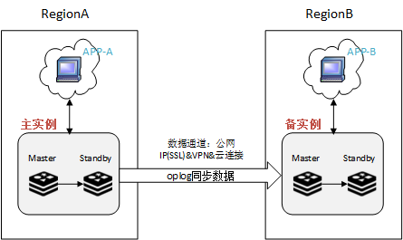

# 全球灾备介绍

全球灾备，即在DCS中创建一个全球灾备实例，将两个在不同区域的主备实例建立灾备关系，其中一个主备实例作为全球灾备的主实例，另一个作为备实例，从而实现在全球跨区域的灾备。

当前跨区的实例只支持通过公网IP连接，暂不支持VPN连接、云连接。公网IP会额外收取费用，收费规则请参考[弹性公网IP收费说明](https://www.huaweicloud.com/pricing.html?tab=detail#/eip)。

DCS服务在原生Redis的基础上修改增强了主从同步部分的代码，支持更高的连接中断容忍度，提升同步效率，避免因为广域网的性能和稳定性问题而导致主备实例链接断开、频繁重连的几率，减少数据丢失的可能，提高数据可靠性。

[图1](#fig4451103761718)列出了全球灾备实例的业务示意图。

**图 1**  全球灾备实例业务示意图  

## 业务流程说明

1.  RegionA和RegionB为华为云上的两个不同区域。
2.  RegionA下的Redis主实例独立对外提供服务，RegionB下的Redis备实例的数据只读，不提供数据写入服务。
3.  主实例生成oplog（应用对缓存实例的数据操作记录，类似于关系型数据库的binlog），然后通过公网连接的数据通道，同步数据到备实例，将备实例的数据状态更新至和主实例的数据状态一致。
4.  客户应用在两个区域部署了相同的应用，分别连接主实例与备实例。
5.  当主实例的Master节点故障，或者备实例的Master节点故障，对应的Standby会升级为Master，继续支持数据灾备同步。

## 实例特性变化

两个Redis主备实例开启全球灾备后，有以下变化：

-   如果主实例和备实例设置了备份策略，备份策略会失效，不支持备份恢复。
-   主实例和备实例不能执行删除、变更规格、修改密码、重置密码操作。
-   主实例和备实例不支持离线导入操作。
-   主实例和备实例不支持手工进行主备切换。
-   主实例和备实例不能关闭公网访问。

以上特性变化，近期会逐步修改并上线

