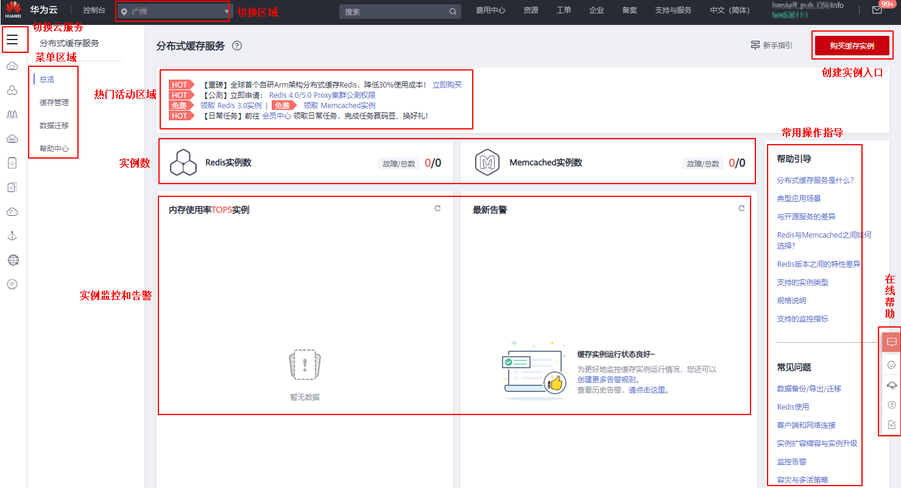

# 分布式缓存服务控制台简介

您可以登录[分布式缓存服务管理控制台](https://console.huaweicloud.com/dcs)，购买缓存实例、进行实例日常操作和维护，查看实例状态和实例内存使用情况，进行在线咨询，解决使用过程的问题。

**图 1**  分布式缓存控制台页面  

-   切换Region

    切换不同Region，您可以选择接近您的应用程序的区域。

-   切换云服务

    切换到其他云服务的Console页面，例如，虚拟私有云服务、云监控服务。

-   购买入口

    购买Redis、Memcached、IMDG实例入口。

-   菜单区域

    提供缓存实例日常操作、创建全球灾备实例、数据迁移、IMDG实例连接向导等功能入口。

-   热门活动区域

    主要显示当前阶段分布式缓存服务新上线的功能，以及优惠活动。

-   资源统计区域

    显示您已申请的实例总数、所有实例状态信息以及所有实例内存空间的使用情况，便于您快速了解实例使用情况。如果您需要了解单个实例的信息，可参考[查看缓存实例信息](查看缓存实例信息.md)。

-   实例监控

    您可以为自己的实例创建告警规则，当产生告警时，可以第一时间处理。设置操作，请参考[设置告警规则](设置告警规则.md)。

-   常用操作指导

    提供分布式缓存服务中常用的操作指导链接，您可以进入操作文档，了解更多业务细节。

-   在线帮助

    在产品使用过程中有任何疑问，可以使用智能客服进行在线咨询。

