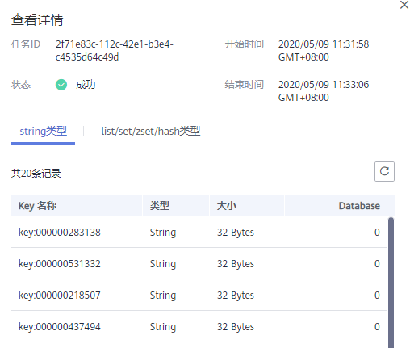
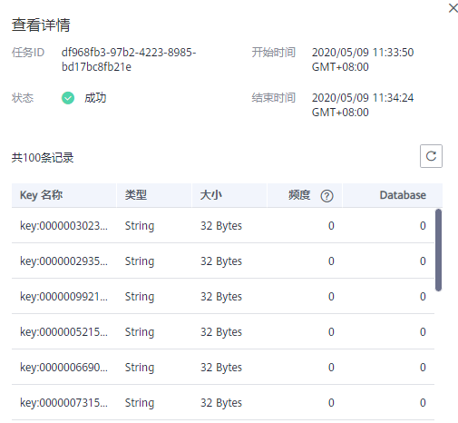

# 分析Redis实例大Key和热Key

大Key和热Key问题是Redis使用中的常见问题，本章节主要介绍对Redis实例进行大Key和热Key分析，通过大Key和热Key分析，可以监控到占用空间过大的Key，以及该Redis实例存储数据中被访问最多的Key。

**大Key分析使用限制和说明：**

-   所有Redis实例都支持。
-   在大Key分析时，会遍历Redis实例中的所有Key，因此分析所需要时间取决于Key的数量。
-   在进行大Key分析时，建议在业务低谷期间进行，且不要与配置的自动备份时间重叠。
-   如果是主备和集群实例，大Key分析是对备节点的分析，对实例性能影响较小。如果是单机实例，由于只有一个节点，是对主节点进行分析，客户访问性能会略有影响（不高于10%），所以建议在业务低谷期进行大Key分析。
-   对于大Key分析结果，每个Redis实例默认最多保存100条记录（string类型保存top20，list/set/zset/hash类型保存top80），当超过100条记录时会默认删除最老的分析记录，而存入最新的记录。同时，支持用户在控制台上手动删除无用的大Key分析记录。

**热Key分析使用限制和说明：**

-   只有Redis4.0/Redis5.0实例支持，并且实例maxmemory-policy参数必须配置为allkeys-lfu或者volatile-lfu。
-   在热Key分析时，会遍历Redis实例中的所有Key，因此分析所需要时间取决于Key的数量。
-   配置自动热key分析时，要考虑不要在业务高峰期进行，避免影响业务，同时也不要过了高峰期太久，避免分析结果不准确。
-   热key分析是对于主节点的分析，在进行分析时，客户访问性能会略有影响（不高于10%）。
-   对于热Key分析结果，每个Redis实例默认最多保存100条记录。当超过100条记录时会默认删除最老的分析记录，而存入最新的记录。同时，支持用户在控制台上手动删除无用的热Key分析记录

> **说明：**   
>建议在业务低峰时段执行大Key和热Key分析，降低CPU被用满的可能。  

## 大Key分析操作步骤

1.  登录[分布式缓存服务管理控制台](https://console.huaweicloud.com/dcs)。
2.  在管理控制台左上角单击，选择区域和项目。

    > **说明：**   
    >此处请选择与您的应用服务相同的区域。  

3.  单击左侧菜单栏的“缓存管理”，进入实例信息页面。
4.  单击需要缓存分析的Redis实例名称，进入该实例的基本信息页面。
5.  单击“缓存分析”页签。
6.  在“缓存分析”页面的“大Key分析”页签，您可以立即对实例进行大Key分析或者设置定时任务，每日自动分析。
7.  当分析任务结束后，可以单击分析列表“操作”列的“查看”，查看分析结果。

    您可以查询当前实例不同数据类型的大Key分析结果。

    > **说明：**   
    >分析结果中，string类型显示top20的记录，list/set/zset/hash类型显示top80的记录。具体分析记录，请以实际返回结果为准。  

    **图 1**  查看大Key分析结果（string类型）  
    

    **图 2**  查看大Key分析结果（list/set/zset/hash类型）  
    

## 热Key分析操作步骤

1.  登录[分布式缓存服务管理控制台](https://console.huaweicloud.com/dcs)。
2.  在管理控制台左上角单击，选择区域和项目。

    > **说明：**   
    >此处请选择与您的应用服务相同的区域。  

3.  单击左侧菜单栏的“缓存管理”，进入实例信息页面。
4.  单击需要缓存分析的Redis实例名称，进入该实例的基本信息页面。
5.  单击“缓存分析”页签。
6.  在“缓存分析”页面的“热Key分析”页签，您可以对实例进行热Key分析或者设置定时任务，每日自动分析。

    > **说明：**   
    >如果是新创建的Redis4.0/Redis5.0实例，maxmemory-policy默认为noeviction，您需要先将参数配置为allkeys-lfu或者volatile-lfu，才能执行热Key分析。如果是已经配置为allkeys-lfu或者volatile-lfu，即可立即进行热Key分析。  

7.  当分析任务结束后，可以单击分析列表“操作”列的“查看”，查看分析结果。

    您可以查询当前实例的热Key分析结果。

    > **说明：**   
    >热Key分析结果，每个Redis实例默认显示top100的记录。  

    **图 3**  查看热Key分析结果  
    

    **表 1**  热Key分析结果参数说明

    
    <table><thead align="left"><tr id="row14468116165117"><th class="cellrowborder" valign="top" width="28.49%" id="mcps1.2.3.1.1">
参数名称

    </th>
    <th class="cellrowborder" valign="top" width="71.50999999999999%" id="mcps1.2.3.1.2">
参数说明

    </th>
    </tr>
    </thead>
    <tbody><tr id="row34681564515"><td class="cellrowborder" valign="top" width="28.49%" headers="mcps1.2.3.1.1 ">
Key名称

    </td>
    <td class="cellrowborder" valign="top" width="71.50999999999999%" headers="mcps1.2.3.1.2 ">
热Key的名称。

    </td>
    </tr>
    <tr id="row1446896135112"><td class="cellrowborder" valign="top" width="28.49%" headers="mcps1.2.3.1.1 ">
类型

    </td>
    <td class="cellrowborder" valign="top" width="71.50999999999999%" headers="mcps1.2.3.1.2 ">
热Key的类型，包括String、Hash、List、Set、Sorted Set等数据类型。

    </td>
    </tr>
    <tr id="row546813616517"><td class="cellrowborder" valign="top" width="28.49%" headers="mcps1.2.3.1.1 ">
大小

    </td>
    <td class="cellrowborder" valign="top" width="71.50999999999999%" headers="mcps1.2.3.1.2 ">
热Key的Value的大小。

    </td>
    </tr>
    <tr id="row146810611519"><td class="cellrowborder" valign="top" width="28.49%" headers="mcps1.2.3.1.1 ">
频度

    </td>
    <td class="cellrowborder" valign="top" width="71.50999999999999%" headers="mcps1.2.3.1.2 ">
表示某个key在一段时间的访问频度，会随着访问的频率而变化。

    
该值并不是简单的访问频率值，而是一个基于概率的对数计数器结果，最大为255(可表示100万次访问)，超过255后如果继续频繁访问该值并不会继续增大，同时默认如果每过一分钟没有访问，该值会衰减1。

    </td>
    </tr>
    <tr id="row204694612510"><td class="cellrowborder" valign="top" width="28.49%" headers="mcps1.2.3.1.1 ">
DataBase

    </td>
    <td class="cellrowborder" valign="top" width="71.50999999999999%" headers="mcps1.2.3.1.2 ">
热Key所在的DB。

    </td>
    </tr>
    </tbody>
    </table>

## 大Key和热Key的常见问题

-   问题1：Redis Cluster集群实例级别容量和性能未达到瓶颈，但某个分片容量或性能已过载？

    这是由于Cluster集群采用的是分片设计理念，每个**具体的Key只能分布到某一个具体的分片节点上**，计算Key的分布过程有以下两个步骤：

    1.  针对Key值进行CRC16算法计算后对16384取模，得到对应的槽位（Slot）值。
    2.  根据S槽位（Slot）和分片的映射关系，找到Key具体应该属于的分片，并且进行存取。

    所以，Key并没有均匀分布在实例的各个分片上，是根据计算结果进行存取的。在大Key和热Key存在时，就会出现某个分片容量或性能已过载，但其他分片内存负载还是很低，并没有达到容量和性能的瓶颈。

-   问题2：单个Key过大，有什么影响？

    在Redis中，如果单个Key过大，容易造成对于单个Key的操作占用带宽和内存资源过高，影响其他Key的操作。

-   问题3：单个Key负载过大（热Key），有什么影响？

    在Redis中，如果单个Key的负载过大（热Key），容易造成单个Key的操作占用CPU或带宽资源过高，影响其他Key的操作。

-   问题4：为了减少大Key和热Key过大，有什么使用建议？
    -   **string类型控制在10KB以内**，hash、list、set、zset**元素尽量不超过5000**。
    -   key的命名前缀为业务缩写，禁止包含特殊字符\(比如空格、换行、单双引号以及其他转义字符\)。
    -   Redis事务功能较弱，不建议过多使用。
    -   短连接性能差，推荐使用带有连接池的客户端。
    -   如果只是用于数据缓存，容忍数据丢失，建议关闭持久化。

-   问题5：为什么Redis3.0实例没有热Key功能？

    由于Redis3.0本身不提供热Key能力，您可以通过DCS服务提供的节点监控能力进行分析。

