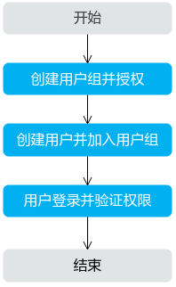

# 创建用户并授权使用DCS

如果您需要对您所拥有的DMS服务进行精细的权限管理，您可以使用[统一身份认证服务](https://support.huaweicloud.com/usermanual-iam/zh-cn_topic_0079496985.html)（Identity and Access Management，简称IAM），通过IAM，您可以：

-   根据企业的业务组织，在您的华为云账号中，给企业中不同职能部门的员工创建IAM用户，让员工拥有唯一安全凭证，并使用DMS资源。
-   根据企业用户的职能，设置不同的访问权限，以达到用户之间的权限隔离。
-   将DMS资源委托给更专业、高效的其他华为云账号或者云服务，这些账号或者云服务可以根据权限进行代运维。

如果华为云账号已经能满足您的要求，不需要创建独立的IAM用户，您可以跳过本章节，不影响您使用DMS服务的其它功能。

本章节以创建用户并授予“DCS Viewer”权限为例，为您介绍对用户授权的方法，操作流程如[图1](#zh-cn_topic_0170877287_fig15451536531)所示。

## 前提条件

-   “DMS Viewer”权限为细粒度策略，请先在IAM控制台中开通细粒度策略，开通方法请参见：[申请基于策略的访问控制公测](https://support.huaweicloud.com/usermanual-iam/iam_01_019.html)。
-   给用户组授权之前，请您了解用户组可以添加的DCS系统策略，并结合实际需求进行选择，DCS支持的系统策略及策略间的对比，请参见：[DCS系统策略](https://support.huaweicloud.com/productdesc-dcs/ProductDescPrivilegeManagement.html)。若您需要对除DCS之外的其它服务授权，IAM支持服务的所有策略请参见[权限策略](https://support.huaweicloud.com/usermanual-permissions/zh-cn_topic_0063498930.html)。

## 示例流程

**图 1**  给用户授权DCS权限流程  

1.  [创建用户组并授权](https://support.huaweicloud.com/usermanual-iam/zh-cn_topic_0046611269.html)

    在IAM控制台创建用户组，并授予分布式消息服务的只读权限“DCS Viewer”。

2.  [创建用户并加入用户组](https://support.huaweicloud.com/usermanual-iam/zh-cn_topic_0046611303.html)

    在IAM控制台创建用户，并将其加入[1](#zh-cn_topic_0170877287_li10176121316284)中创建的用户组。

3.  [用户登录](https://support.huaweicloud.com/usermanual-iam/iam_01_0552.html)并验证权限

    新创建的用户登录控制台，验证分布式消息服务的只读权限。

