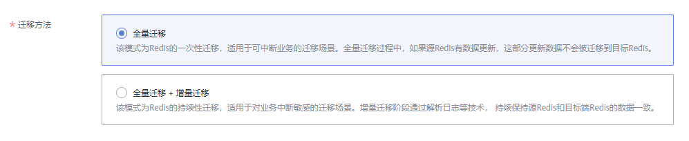
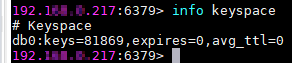

# 在线迁移方式

## 场景描述

在满足源Redis和目标Redis的网络相通、源Redis已放通SYNC和PSYNC命令这两个前提下，使用在线迁移的方式，将源Redis中的数据全量迁移或增量迁移到目标Redis中。

> **注意：** 
>-   如果源Redis禁用了SYNC和PSYNC命令，请务必放通后再执行在线迁移，否则迁移失败，选择华为云Redis实例进行在线迁移时，会自动放开SYNC命令。
>-   在线迁移不支持公网方式直接迁移。
>-   进行在线迁移时，建议将源端实例的参数repl-timeout配置为300秒，client-output-buffer-limit配置为实例最大内存的20%。

## 对业务影响

在线迁移，相当于增加一个从节点并且会做一次全量同步，所以，建议在业务低峰期迁移。

## 前提条件

-   在迁移之前，请先阅读[迁移方案概览](https://support.huaweicloud.com/migration-dcs/dcs-migration-090626002.html)，选择正确的迁移方案，了解当前DCS支持的在线迁移能力，选择适当的目标实例。
-   如果是单机/主备实例迁移到集群实例，由于目标Redis集群实例只有一个DB，请先确保源Redis实例DB0以外的DB是否有数据，如果有，请先将数据转存到DB0，否则会出现迁移失败。

## 步骤1：获取源Redis的信息

-   当源端为云服务Redis时，需获取准备迁移的源Redis实例的名称。
-   当源端为自建Redis时，需获取准备迁移的源Redis实例的IP和端口，或者域名和端口。

## 步骤2：准备目标Redis实例

-   如果您还没有目标Redis，请先创建，创建操作，请参考[购买Redis实例](https://support.huaweicloud.com/usermanual-dcs/dcs-ug-0713002.html)。
-   如果您已有目标Redis，则不需要重复创建，但在迁移之前，您需要清空实例数据，清空操作请参考[清空Redis实例数据](https://support.huaweicloud.com/usermanual-dcs/dcs-ug-0312018.html)。

    如果没有清空，如果存在与源Redis实例相同的key，迁移后，会覆盖目标Redis实例原来的数据。

## 步骤:3：检查网络

1.  检查源Redis、目标Redis、迁移任务资源所在VPC是否在同一个VPC内。

    如果是，则执行[步骤4：创建在线迁移任务](#zh-cn_topic_0177563541_section157769524519)；如果不是，执行[2](#zh-cn_topic_0177563541_li160420185217)。

2.  检查源Redis的VPC、目标Redis的VPC、迁移任务资源所在VPC的网络是否打通，确保迁移任务的虚拟机资源能访问源Redis和目标Redis。

    如果已打通，则执行[步骤4：创建在线迁移任务](#zh-cn_topic_0177563541_section157769524519)；如果没打通，则执行[3](#zh-cn_topic_0177563541_li423483319412)。

3.  执行相应操作，打通网络。
    -   当源Redis和目标Redis属于华为云同一Region，请参考[VPC对等连接说明](https://support.huaweicloud.com/usermanual-vpc/vpc_peering_0000.html)，查看和创建对等连接，打通网络。
    -   当源Redis和目标Redis属于华为云不同Region，请参考[云连接](https://support.huaweicloud.com/qs-cc/cc_02_0001.html)，查看和创建云连接，打通网络。
    -   当源Redis和目标Redis属于不同的云厂商，请参考[云专线](https://support.huaweicloud.com/productdesc-dc/zh-cn_topic_0032053183.html)打通网络。

## 步骤4：创建在线迁移任务

1.  登录分布式缓存服务控制台。
2.  单击左侧菜单栏的“数据迁移”。页面显示迁移任务列表页面。
3.  单击右上角的“创建在线迁移任务”。
4.  设置迁移任务名称和描述。
5.  配置在线迁移任务虚拟机资源的VPC、子网和安全组。

    创建在线迁移任务时，需要选择迁移虚拟机资源的VPC和安全组，并确保迁移资源能访问源Redis和目标Redis实例。

## 步骤5：配置在线迁移任务

1.  创建完在线迁移任务之后，在“在线迁移”的列表，单击“配置”，配置在线迁移的源Redis、目标Redis等信息。
2.  选择迁移方法。

    支持“全量迁移”和“全量迁移＋增量迁移”两种，“全量迁移”和“全量迁移＋增量迁移”的功能及限制如[表1](#zh-cn_topic_0177563541_table55653322215)所示。

    **表 1**  在线迁移方法说明

    
    <table><thead align="left"><tr id="zh-cn_topic_0177563541_row5587330229"><th class="cellrowborder" valign="top" width="27.47%" id="mcps1.2.3.1.1">
迁移类型

    </th>
    <th class="cellrowborder" valign="top" width="72.53%" id="mcps1.2.3.1.2">
描述

    </th>
    </tr>
    </thead>
    <tbody><tr id="zh-cn_topic_0177563541_row1958203312220"><td class="cellrowborder" valign="top" width="27.47%" headers="mcps1.2.3.1.1 ">
全量迁移

    </td>
    <td class="cellrowborder" valign="top" width="72.53%" headers="mcps1.2.3.1.2 ">
该模式为Redis的一次性迁移，适用于可中断业务的迁移场景。全量迁移过程中，<strong id="zh-cn_topic_0177563541_b14987182810919">如果源Redis有数据更新，这部分更新数据不会被迁移到目标Redis</strong>。

    </td>
    </tr>
    <tr id="zh-cn_topic_0177563541_row205815338228"><td class="cellrowborder" valign="top" width="27.47%" headers="mcps1.2.3.1.1 ">
全量迁移＋增量迁移

    </td>
    <td class="cellrowborder" valign="top" width="72.53%" headers="mcps1.2.3.1.2 ">
该模式为Redis的持续性迁移，适用于对业务中断敏感的迁移场景。增量迁移阶段通过解析日志等技术， 持续保持源Redis和目标端Redis的数据一致。

    
增量迁移，<strong id="zh-cn_topic_0177563541_b1237722021311">迁移任务会在迁移开始后，一直保持迁移中状态，不会自动停止</strong>。需要您在合适时间，在“操作”列单击“停止”，手动停止迁移。停止后，源端数据不会造成丢失，只是目标端不再写入数据。增量迁移在传输链路网络稳定情况下是秒级时延，具体的时延情况依赖于网络链路的传输质量。

    </td>
    </tr>
    </tbody>
    </table>

    **图 1**  选择迁移方法  
    

3.  分别选择源Redis和目标Redis。
    1.  “源Redis”，支持“云服务Redis”和“自建Redis”，需要根据迁移场景选择数据来源。
        -   云服务Redis：华为云Redis实例，需要选择与迁移任务处于相同VPC的华为云Redis服务。
        -   自建Redis：华为云、其他云厂商、本地数据中心自行搭建的Redis，需要输入Redis的连接地址。

    2.  如果是密码访问模式实例，在输入连接实例密码后，您可以单击密码右侧的“测试连接”，检查实例密码是否正确、网络是否连通。

4.  在“目标Redis实例”中，选择[步骤2：准备目标Redis实例](#zh-cn_topic_0177563541_section1128152020384)中创建的目标实例。

    如果是密码访问模式实例，在输入连接实例密码后，您可以单击密码右侧的“测试连接”，检查实例密码是否符合要求。

    > **说明：** 
    >当源Redis和目标Redis属于华为云不同Region，则打通网路后，目标Redis实例无论是自建Redis或华为云Redis实例，在“目标Redis实例”区域，只能选中自建Redis，输入实例相关信息。

5.  确认迁移信息，然后单击“提交”，开始创建迁移任务。

    可返回迁移任务列表中，观察对应的迁移任务的状态，迁移成功后，任务状态显示“成功”。

    > **说明：** 
    >如果是增量迁移，会一直保持迁移中状态，需要手动停止迁移。

    如果出现迁移失败，可以单击迁移任务名称，进入迁移任务详情页面，查看“迁移日志”。

## 迁移后验证

迁移完成后，请使用Redis-cli连接源Redis和目标Redis，确认数据的完整性。

1.  连接源Redis和目标Redis。
2.  输入info keyspace，查看keys参数和expires参数的值。

    

3.  对比源Redis和目标Redis的keys参数分别减去expires参数的差值。如果差值一致，则表示数据完整，迁移正常

注意：如果是全量迁移，迁移过程中源Redis更新的数据不会迁移到目标实例。

