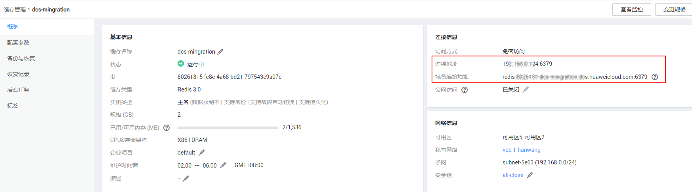
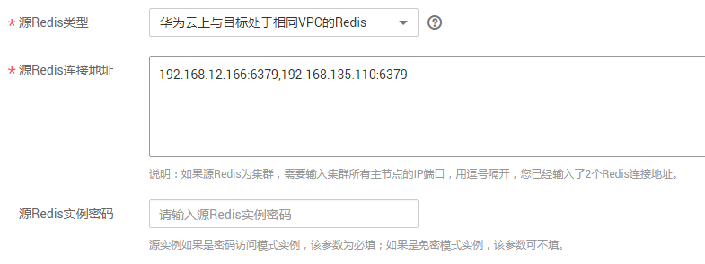

# 在线迁移方式

## 场景描述

在满足源Redis和目标Redis的网络相通、源Redis未禁用SYNC和PSYNC命令这两个前提下，使用在线迁移的方式，将源Redis中的数据全量迁移或增量迁移到目标Redis中。

## 前提条件

在迁移之前，请先阅读[使用DCS迁移介绍](使用DCS迁移介绍.md#ZH-CN_TOPIC_0179456696)，了解当前DCS支持的在线迁移能力，选择适当的目标实例。

## 步骤1：获取源Redis的IP（域名）和端口

1.  登录分布式缓存服务控制台。
2.  确认源Redis实例版本。
3.  在源Redis实例详情页面，获取源Redis实例的IP和端口，或者域名和端口，并保存到本地。

    **图 1**  获取Redis的IP（域名）和端口  
    

4.  确认源Redis实例的密码是否符合要求。

    源Redis实例的密码不能包含如下特殊字符（\`\~!@\#$^&\*\(\)-\_=+\\|\{\}:,<.\>/?），否则无法创建迁移任务。

    如果不符合以上要求，您需要先修改实例的密码，使密码复杂度要求符合上述要求，具体修改操作，请参考[修改Redis实例密码](https://support.huaweicloud.com/usermanual-dcs/dcs-ug-0312040.html)。

## 步骤2：准备目标Redis实例

-   如果您还没有目标Redis，请先创建，创建操作，请参考[购买Redis实例](https://support.huaweicloud.com/usermanual-dcs/dcs-zh-ug-180315001.html)。

    在创建Redis实例时，Redis实例的密码必须设置为不能包含如下特殊字符（\`\~!@\#$^&\*\(\)-\_=+\\|\{\}:,<.\>/?），否则无法创建迁移任务。

-   如果您已有目标Redis，则不需要重复创建，但在迁移之前，您需要执行以下操作：
    1.  参考[清空Redis实例数据](https://support.huaweicloud.com/usermanual-dcs/dcs-ug-0312018.html)，清空实例数据。
    2.  确认已有的Redis实例密码是否符合要求。

        在创建迁移任务时，要求Redis实例的密码不能包含如下特殊字符（\`\~!@\#$^&\*\(\)-\_=+\\|\{\}:,<.\>/?），否则无法创建迁移任务。

        如果不符合以上要求，您需要先修改目标实例的密码，使密码复杂度要求符合上述要求，具体修改操作，请参考[修改目标实例密码](https://support.huaweicloud.com/usermanual-dcs/dcs-ug-0312040.html)。

## 步骤:3：检查源Redis和目标Redis的网络

1.  检查源Redis和目标Redis是否在同一个VPC内。

    如果是，则执行[步骤4：创建在线迁移任务](#zh-cn_topic_0177563541_section14919536272)；如果不是，执行[2](#zh-cn_topic_0177563541_li160420185217)。

2.  检查源Redis的VPC和目标Redis的VPC，两个VPC的网络是否打通，目标Redis是否能跨VPC访问源Redis。

    如果已打通，则执行[1](#zh-cn_topic_0177563541_li187884091914)；如果没打通，请参考[VPC对等连接说明](https://support.huaweicloud.com/usermanual-vpc/vpc_peering_0000.html)，查看和创建对等连接。

## 步骤4：创建在线迁移任务

1.  登录分布式缓存服务控制台。
2.  单击左侧菜单栏的“数据迁移”。页面显示迁移任务列表页面。
3.  单击右上角的“创建数据迁移”。进入创建数据迁移页面。
4.  设置迁移任务名称和描述。
5.  “迁移类型”选择“在线迁移”。
6.  选择迁移方法。

    从其他云Redis到华为云Redis的数据迁移，支持全量迁移＋增量迁移，全量迁移及增量迁移的功能及限制如[表1](#zh-cn_topic_0177563541_table55653322215)所示。

    **表 1**  在线迁移方法说明

    
    <table><thead align="left"><tr id="zh-cn_topic_0177563541_row5587330229"><th class="cellrowborder" valign="top" width="27.47%" id="mcps1.2.3.1.1">
迁移类型

    </th>
    <th class="cellrowborder" valign="top" width="72.53%" id="mcps1.2.3.1.2">
描述

    </th>
    </tr>
    </thead>
    <tbody><tr id="zh-cn_topic_0177563541_row1958203312220"><td class="cellrowborder" valign="top" width="27.47%" headers="mcps1.2.3.1.1 ">
全量迁移

    </td>
    <td class="cellrowborder" valign="top" width="72.53%" headers="mcps1.2.3.1.2 ">
该模式为Redis的一次性迁移，适用于可中断业务的迁移场景。全量迁移过程中，如果源Redis有数据更新，这部分更新数据不会被迁移到目标Redis。

    </td>
    </tr>
    <tr id="zh-cn_topic_0177563541_row205815338228"><td class="cellrowborder" valign="top" width="27.47%" headers="mcps1.2.3.1.1 ">
全量迁移＋增量迁移

    </td>
    <td class="cellrowborder" valign="top" width="72.53%" headers="mcps1.2.3.1.2 ">
该模式为Redis的持续性迁移，适用于对业务中断敏感的迁移场景。增量迁移阶段通过解析日志等技术， 持续保持源Redis和目标端Redis的数据一致。

    
迁移过程中，用户是可以手动停止迁移的。

    </td>
    </tr>
    </tbody>
    </table>

    **图 2**  选择迁移方法  
    

7.  输入[步骤1：获取源Redis的IP（域名）和端口](#zh-cn_topic_0177563541_section760319488490)中获取到的源Redis IP和端口，或者域名和端口。

    当前支持的网络类型有：

    -   华为云上与目标处于相同VPC的Redis：表示源Redis和目标Redis通过VPC联通。
    -   通过专线/VPN网关接入的自建Redis：源Redis和目标Redis通过VPN或专线网络联通。

    **图 3**  在线迁移设置源Redis IP（域名）和端口  
    

8.  在“目标Redis实例”中，选择[步骤2：准备目标Redis实例](#zh-cn_topic_0177563541_section1128152020384)中创建的目标实例。

    如果是密码访问模式实例，在输入连接实例密码后，您可以单击密码右侧的“测试连接”，检查实例密码是否符合要求。

9.  单击“立即创建”。
10. 确认迁移信息，然后单击“提交”，开始创建迁移任务。

    可返回迁移任务列表中，观察对应的迁移任务的状态，迁移成功后，任务状态显示“成功”。

    > **说明：**   
    >如果是增量迁移，迁移任务会在迁移开始后，一直保持迁移中状态，直到您在“操作”列单击“停止”，手动停止迁移。停止后，源端数据不会造成丢失，只是目标端不再写入数据。  

