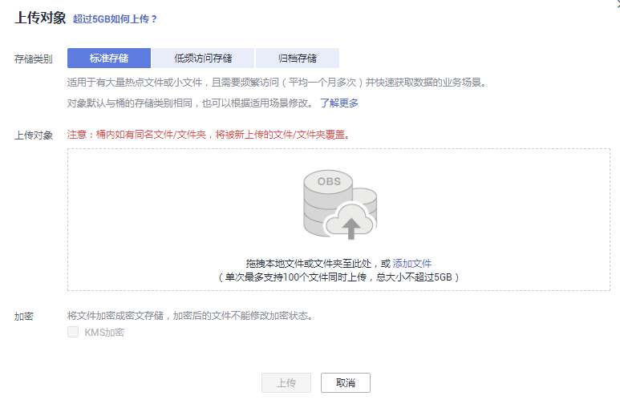
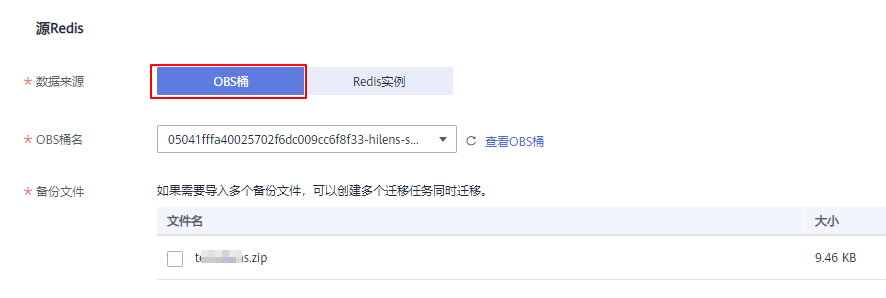

# 备份文件导入方式-OBS桶

## 场景描述

当前华为云DCS支持将其他云厂商Redis、自建Redis的数据通过DCS控制台迁移到华为云Redis。

您需要先将其他云厂商Redis、自建Redis的数据备份下载到本地，然后将备份数据文件上传到华为云与DCS Redis实例同一租户下相同Region下的OBS桶中，最后在DCS控制台创建迁移任务，DCS从OBS桶中读取数据，将数据迁移到华为云Redis中。

上传OBS桶的文件支持.aof、.rdb、.zip、.tar.gz四种格式，您可以直接上传.aof和.rdb文件，也可以将.aof和.rdb文件压缩成.zip或.tar.gz文件，然后将压缩后的文件上传到OBS桶。

## 前提条件

-   OBS桶所在区域必须跟Redis目标实例所在区域相同。例如，OBS桶和Redis所在的区域都为“华北-北京一”。
-   上传的数据文件必须为.aof、.rdb、.zip、.tar.gz的格式。
-   如果是其他云厂商的单机版Redis和主备版Redis，您需要在备份页面创建备份任务，然后下载备份文件。
-   如果是其他云厂商的集群版Redis，在备份页面创建备份后会有多个备份文件，每个备份文件对应集群中的一个分片，需要下载所有的备份文件，然后逐个上传到OBS桶。在迁移时，需要把所有分片的备份文件选中。
-   暂不支持导入自建Redis5.0生成的rdb备份文件，如果是自建Redis3.0和Redis4.0，可以使用Redis-cli工具导出.rdb备份文件。其他云厂商Redis只能通过各云的备份页面创建备份任务导出获取，不能通过Redis-cli工具使用命令导出。
-   Cluster集群仅支持导入.rdb备份文件，不支持.aof备份文件。

## 步骤1：准备目标Redis实例

-   如果您还没有华为云Redis，请先创建，创建操作，请参考[购买Redis实例](https://support.huaweicloud.com/usermanual-dcs/dcs-ug-0713002.html)。
-   如果您已有华为云Redis，则不需要重复创建，但在迁移之前，您需要清空实例数据，清空操作，请参考[清空Redis实例数据](https://support.huaweicloud.com/usermanual-dcs/dcs-ug-0312018.html)。

当前支持迁移到Redis3.0、Redis4.0和Redis5.0，您可以根据实际情况选择。

## 步骤2：创建OBS桶并上传备份文件

1.  通过OBS Browser+客户端，上传备份数据文件到OBS桶。

    如果上传的备份文件较小，且小于5GB，请执行[2](#zh-cn_topic_0177563520_li12679210144012)，通过OBS控制台上传即可；

    如果上传的备份文件大于5GB，请按照OBS服务提供的[超过5GB如何上传](https://support.huaweicloud.com/usermanual-obs/zh-cn_topic_0045829661.html)操作指导执行。

2.  通过OBS控制台，上传备份数据文件到OBS桶。

    如果上传的备份文件较小，且小于5GB，请执如下步骤：

    1.  创建OBS桶。

        在创建过程中，以下两个参数请按要求设置，其他详细的创建步骤，请参考《对象存储服务 控制台用户指南》的“[创建桶](https://support.huaweicloud.com/usermanual-obs/obs_03_0306.html)”章节。

        1.  选择“区域”。

            OBS桶所在区域必须跟Redis目标实例所在区域相同。

        2.  设置“存储类别”，当前支持“标准存储”、“低频访问存储”和“归档存储”。

            请不要选择“归档存储”，否则会导致备份文件迁移失败。

        3.  设置完成后，单击“立即创建”，等待OBS桶创建完成。

    2.  在OBS管理控制台的桶列表中，单击[2.a](#zh-cn_topic_0177563520_li9459194020435)中的桶名称，进入“概览”页面。
    3.  在左侧导航栏，单击“对象”。
    4.  在“对象”页签下，单击“上传对象”，系统弹出“上传对象”对话框。
    5.  指定对象的存储类别。

        请不要选择“归档存储”，否则会导致备份文件迁移失败。

    6.  上传对象。

        您可以拖拽本地文件或文件夹至“上传对象”区域框内添加待上传的文件，也可以通过单击“上传对象”区域框内的“添加文件”，选择本地文件添加。

        单次最多支持100个文件同时上传，总大小不超过5GB。

        **图 1**  批量上传对象  
        

    7.  可选：勾选“KMS加密”，用于加密上传文件。
    8.  单击“上传”。

## 步骤3：创建迁移任务

1.  登录分布式缓存服务控制台。
2.  单击左侧菜单栏的“数据迁移”。页面显示迁移任务列表页面。
3.  单击右上角的“创建备份导入任务”。
4.  设置迁移任务名称和描述。
5.  “源Redis”区域中，“数据来源”选择“OBS桶”，在“OBS桶名”中选择已上传备份文件的OBS桶。

    在“备份文件”列表中显示已上传的备份数据文件，如下图所示。

    > **说明：** 
    >上传的备份文件格式支持.aof、.rdb、.zip、.tar.gz，您可以上传任意其中一种。

    **图 2**  备份文件导入  
    

6.  选择需要迁移的备份文件。
7.  选择[步骤1：准备目标Redis实例](#zh-cn_topic_0177563520_section1128152020384)中创建的目标Redis，如果目标Redis是密码访问模式，请输入密码，并进行测试连接，检查密码是否正确。
8.  单击“立即创建”。
9.  确认迁移信息，然后单击“提交”，开始创建迁移任务。

    可返回迁移任务列表中，观察对应的迁移任务的状态，迁移成功后，任务状态显示“成功”。

