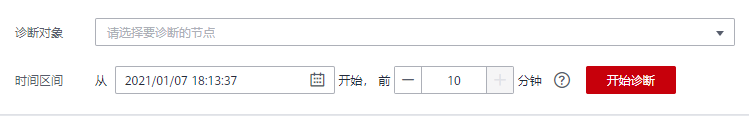

# 实例诊断

## 使用场景

当您的Redis实例发现故障、性能有问题时，您可以通过实例诊断功能，及时获取实例诊断项目异常的原因、影响以及处理建议。

## 使用限制

-   Redis3.0、Memcached实例不支持实例诊断。
-   如果是Redis4.0/5.0实例，仅单机、主备、Cluster集群实例支持，Proxy集群实例暂不支持实例诊断。
-   企业版Redis6.0实例，主备实例支持实例诊断。

## 操作步骤

1.  登录[分布式缓存服务管理控制台](https://console.huaweicloud.com/dcs)。
2.  在管理控制台左上角单击，选择区域和项目。
3.  单击左侧菜单栏的“缓存管理”，进入实例信息页面。
4.  单击需要查看运行日志的DCS缓存实例名称，进入该实例的基本信息页面。
5.  单击“实例诊断”页签。
6.  设置诊断对象和诊断时间区间，单击“开始诊断”。
    -   诊断对象：支持选择单节点、所有节点。默认诊断实例所有节点。
    -   时间区间：支持诊断实例7天内的数据，每次诊断最长时间周期为10分钟。

        如下图设置，表示诊断实例在2021年1月7日18:03:37至18:13:37之间的数据。

        **图 1**  设置实例诊断对象和时间  
        

7.  诊断完成后，在诊断记录列表中可以查看诊断结果中，如果出现异常，单击“查看报告”，查看具体异常的诊断项。

    在异常的诊断项中，您可以查看产生异常的原因、异常的影响，以及处理异常的建议。

