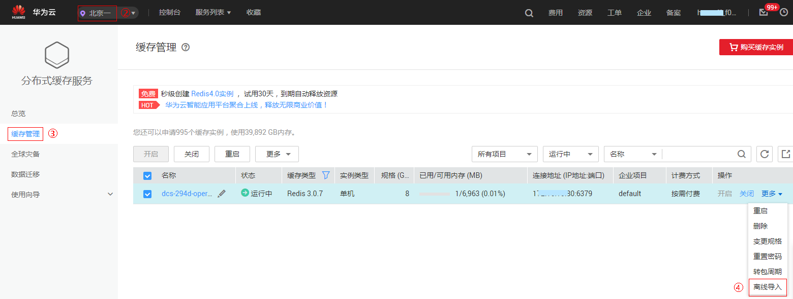

# 导入离线实例

您可以将离线实例数据导入Redis3.x版本的DCS实例。当前版本只有部分Redis3.x版本的DCS实例支持离线导入功能。

## 前提条件

已创建Redis3.x版本的DCS实例。

## 操作步骤

1.  登录[分布式缓存服务管理控制台](https://console.huaweicloud.com/dcs)。
2.  在管理控制台左上角单击，选择区域和项目。
3.  单击左侧菜单栏的“缓存管理”。
4.  在需要导入离线实例的DCS缓存实例右侧，单击“操作”栏下的“更多 \> 离线导入”。

    页面跳转到DRS的创建离线导入任务页面，具体的迁移操作，请参考《分布式缓存服务数据迁移指南》的“迁移操作”下的“[使用DRS迁移数据](https://support.huaweicloud.com/migration-dcs/dcs-zh-migration-190314001.html)”操作。

    > **说明：**   
    >-   如果Redis3.x版本的DCS实例右侧的“操作”栏下的“更多”下没有“离线导入”功能，请联系技术支持先升级实例，再执行离线导入操作。  
    >-   当导入的离线文件较小时，导入所需时间可能小于1分钟，可能导致云监控的部分监控项采集不到导入期间的监控数据，出现监控的数据无变化的问题，例如“每秒并发操作数”、“活跃客户端数量”。  

    **图 1**  导入离线实例  
    

## 相关产品及文档

<table><thead align="left"><tr id="rb27d733848ce4e7a9386965803595f1b"><th class="cellrowborder" valign="top" width="50%" id="mcps1.1.3.1.1">
相关产品

</th>
<th class="cellrowborder" valign="top" width="50%" id="mcps1.1.3.1.2">
相关文档

</th>
</tr>
</thead>
<tbody><tr id="re4588baf45714b4f80c021cca1290879"><td class="cellrowborder" valign="top" width="50%" headers="mcps1.1.3.1.1 ">
<a href="https://www.huaweicloud.com/product/dcs.html?infodocbz" target="_blank" rel="noopener noreferrer">分布式缓存 Redis</a>

<a href="https://www.huaweicloud.com/product/dcsmem.html?infodocbz" target="_blank" rel="noopener noreferrer">分布式缓存 Memcached</a>

<a href="https://www.huaweicloud.com/product/ecs.html?infodocbz" target="_blank" rel="noopener noreferrer">弹性云服务器 ECS</a>

<a href="http://www.huaweicloud.com/product/vpc.html?infodocbz" target="_blank" rel="noopener noreferrer">虚拟私有云 VPC</a>

</td>
<td class="cellrowborder" valign="top" width="50%" headers="mcps1.1.3.1.2 ">
<a href="https://support.huaweicloud.com/usermanual-dcs/dcs-zh-ug-180315001.html?infodocbz" target="_blank" rel="noopener noreferrer">购买Redis实例</a>

<a href="https://support.huaweicloud.com/usermanual-dcs/zh-cn_topic_0082114847.html?infodocbz" target="_blank" rel="noopener noreferrer">连接Redis实例</a>

<a href="https://support.huaweicloud.com/usermanual-dcs/zh-cn_topic_0061845451.html?infodocbz" target="_blank" rel="noopener noreferrer">变更缓存实例规格</a>

<a href="https://support.huaweicloud.com/usermanual-dcs/zh-cn_topic_0079545637.html?infodocbz" target="_blank" rel="noopener noreferrer">缓存实例备份恢复</a>

<a href="https://support.huaweicloud.com/migration-dcs/zh-cn_topic_0078784423.html?infodocbz" target="_blank" rel="noopener noreferrer">缓存实例数据迁移</a>

</td>
</tr>
</tbody>
</table>

