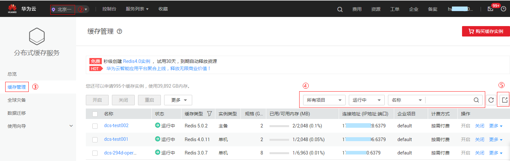

# 导出缓存实例列表

DCS管理控制台支持全量导出缓存实例信息功能，导出形式为Excel。

## 操作步骤

1.  登录[分布式缓存服务管理控制台](https://console.huaweicloud.com/dcs)。
2.  在管理控制台左上角单击，选择区域和项目。
3.  单击左侧菜单栏的“缓存管理”。
4.  设置筛选条件，查询对应的DCS缓存实例。
5.  单击信息栏右上侧的按钮，导出缓存实例列表。

    页面左下角显示导出的结果，单击可查看导出的实例信息，导出结果如[图1](#fig9494143610442)所示。

    **图 1**  导出缓存实例列表  
    

