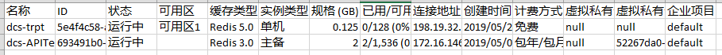

# 导出缓存实例列表

DCS管理控制台支持全量导出缓存实例信息功能，导出形式为Excel。

## 操作步骤

1.  登录[分布式缓存服务管理控制台](https://console.huaweicloud.com/dcs)。
2.  在管理控制台左上角单击，选择区域和项目。

    > **说明：**   
    >此处请选择与租户的应用服务相同的区域。  

3.  单击左侧菜单栏的“缓存管理”。
4.  设置筛选条件“状态”和“名称”，查询对应的DCS缓存实例，然后单击信息栏右上侧的按钮，导出缓存实例列表。

    页面左下角显示导出的结果，单击可查看导出的实例信息，导出结果如[图1](#zh-cn_topic_0141875991_fig9494143610442)所示。

    **图 1**  导出缓存实例列表  
    

## 相关产品及文档

<table><thead align="left"><tr id="zh-cn_topic_0141875991_zh-cn_topic_0046844820_row197372430123"><th class="cellrowborder" valign="top" width="50%" id="mcps1.1.3.1.1">
相关产品

</th>
<th class="cellrowborder" valign="top" width="50%" id="mcps1.1.3.1.2">
相关文档

</th>
</tr>
</thead>
<tbody><tr id="zh-cn_topic_0141875991_zh-cn_topic_0046844820_row17371443131210"><td class="cellrowborder" valign="top" width="50%" headers="mcps1.1.3.1.1 ">
<a href="https://www.huaweicloud.com/product/dcs.html?infodocbz" target="_blank" rel="noopener noreferrer">分布式缓存 Redis</a>

<a href="https://www.huaweicloud.com/product/dcsmem.html?infodocbz" target="_blank" rel="noopener noreferrer">分布式缓存 Memcached</a>

<a href="https://www.huaweicloud.com/product/ecs.html?infodocbz" target="_blank" rel="noopener noreferrer">弹性云服务器 ECS</a>

<a href="http://www.huaweicloud.com/product/vpc.html?infodocbz" target="_blank" rel="noopener noreferrer">虚拟私有云 VPC</a>

</td>
<td class="cellrowborder" valign="top" width="50%" headers="mcps1.1.3.1.2 ">
<a href="https://support.huaweicloud.com/usermanual-dcs/dcs-zh-ug-180315001.html?infodocbz" target="_blank" rel="noopener noreferrer">购买Redis实例</a>

<a href="https://support.huaweicloud.com/usermanual-dcs/zh-cn_topic_0082114847.html?infodocbz" target="_blank" rel="noopener noreferrer">连接Redis实例</a>

<a href="https://support.huaweicloud.com/usermanual-dcs/zh-cn_topic_0061845451.html?infodocbz" target="_blank" rel="noopener noreferrer">变更缓存实例规格</a>

<a href="https://support.huaweicloud.com/usermanual-dcs/zh-cn_topic_0079545637.html?infodocbz" target="_blank" rel="noopener noreferrer">缓存实例备份恢复</a>

<a href="https://support.huaweicloud.com/migration-dcs/zh-cn_topic_0078784423.html?infodocbz" target="_blank" rel="noopener noreferrer">缓存实例数据迁移</a>

</td>
</tr>
</tbody>
</table>

