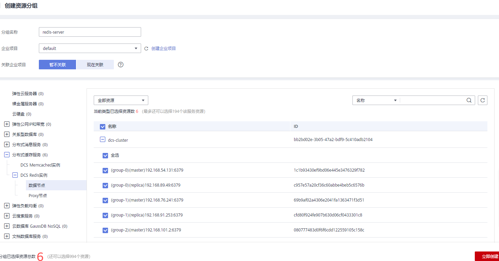

# 必须配置的监控告警

本章节主要介绍部分监控指标的告警策略，以及配置操作。在实际业务中，请按照以下告警策略，配置监控指标的告警规则。

## Redis实例告警策略

**表 1**  Redis实例配置告警的指标

<table><thead align="left"><tr id="row133010254169"><th class="cellrowborder" valign="top" width="13.600000000000001%" id="mcps1.2.6.1.1">
指标名称

</th>
<th class="cellrowborder" valign="top" width="15.079999999999998%" id="mcps1.2.6.1.2">
正常范围

</th>
<th class="cellrowborder" valign="top" width="16.09%" id="mcps1.2.6.1.3">
告警策略

</th>
<th class="cellrowborder" valign="top" width="11.86%" id="mcps1.2.6.1.4">
是否接近性能上限

</th>
<th class="cellrowborder" valign="top" width="43.37%" id="mcps1.2.6.1.5">
告警处理建议

</th>
</tr>
</thead>
<tbody><tr id="row01511254203813"><td class="cellrowborder" valign="top" width="13.600000000000001%" headers="mcps1.2.6.1.1 ">
CPU利用率

</td>
<td class="cellrowborder" valign="top" width="15.079999999999998%" headers="mcps1.2.6.1.2 ">
0~100

</td>
<td class="cellrowborder" valign="top" width="16.09%" headers="mcps1.2.6.1.3 ">
告警阈值：&gt;70

连续触发次数：2

告警级别：重要

</td>
<td class="cellrowborder" valign="top" width="11.86%" headers="mcps1.2.6.1.4 ">
否

</td>
<td class="cellrowborder" valign="top" width="43.37%" headers="mcps1.2.6.1.5 ">
结合业务分析是否由于业务上涨导致的，判断是否需要扩容。

如果单机/主备实例，无法扩展CPU能力，需要考虑切换为集群实例。

该指标仅针对单机、主备、Proxy集群实例设置，Cluster集群实例级别不支持该指标，仅在数据节点支持，即需要在实例详情的“性能监控”中选择“数据节点”页签查看。

</td>
</tr>
<tr id="row33301251166"><td class="cellrowborder" valign="top" width="13.600000000000001%" headers="mcps1.2.6.1.1 ">
内存利用率

</td>
<td class="cellrowborder" valign="top" width="15.079999999999998%" headers="mcps1.2.6.1.2 ">
0~100

</td>
<td class="cellrowborder" valign="top" width="16.09%" headers="mcps1.2.6.1.3 ">
告警阈值：&gt;70

连续触发次数：2

告警级别：紧急

</td>
<td class="cellrowborder" valign="top" width="11.86%" headers="mcps1.2.6.1.4 ">
否

</td>
<td class="cellrowborder" valign="top" width="43.37%" headers="mcps1.2.6.1.5 ">
建议进行扩容。

</td>
</tr>
<tr id="row11612547193318"><td class="cellrowborder" valign="top" width="13.600000000000001%" headers="mcps1.2.6.1.1 ">
活跃的客户端数量

</td>
<td class="cellrowborder" valign="top" width="15.079999999999998%" headers="mcps1.2.6.1.2 ">
0~10000

</td>
<td class="cellrowborder" valign="top" width="16.09%" headers="mcps1.2.6.1.3 ">
告警阈值：&gt;8000

连续触发次数：2

告警级别：重要

</td>
<td class="cellrowborder" valign="top" width="11.86%" headers="mcps1.2.6.1.4 ">
否

</td>
<td class="cellrowborder" valign="top" width="43.37%" headers="mcps1.2.6.1.5 ">
建议结合业务代码对连接池等进行优化，避免连接数超过最大限制。

仅单机和主备实例配置该指标。如果是集群实例，在数据节点和Proxy节点配置即可。

单机和主备实例，最大连接数限制为10000，可以根据业务情况对阈值进行调整。

</td>
</tr>
<tr id="row44698103613"><td class="cellrowborder" valign="top" width="13.600000000000001%" headers="mcps1.2.6.1.1 ">
新建连接数

（个/min）

</td>
<td class="cellrowborder" valign="top" width="15.079999999999998%" headers="mcps1.2.6.1.2 ">
0~10000

</td>
<td class="cellrowborder" valign="top" width="16.09%" headers="mcps1.2.6.1.3 ">
告警阈值：&gt;10000

连续触发次数：2

告警级别：次要

</td>
<td class="cellrowborder" valign="top" width="11.86%" headers="mcps1.2.6.1.4 ">
-

</td>
<td class="cellrowborder" valign="top" width="43.37%" headers="mcps1.2.6.1.5 ">
排查是否使用短连接，或者客户端异常连接。建议使用长连接，避免使用短连接影响性能。

仅单机和主备实例配置该指标。如果是集群实例，在数据节点和Proxy节点配置即可。

</td>
</tr>
<tr id="row543444163610"><td class="cellrowborder" valign="top" width="13.600000000000001%" headers="mcps1.2.6.1.1 ">
网络瞬时输入流量

</td>
<td class="cellrowborder" valign="top" width="15.079999999999998%" headers="mcps1.2.6.1.2 ">
&gt;0

</td>
<td class="cellrowborder" valign="top" width="16.09%" headers="mcps1.2.6.1.3 ">
告警阈值：&gt;规格基准带宽的80%

连续触发次数：2

告警级别：重要

</td>
<td class="cellrowborder" valign="top" width="11.86%" headers="mcps1.2.6.1.4 ">
是

</td>
<td class="cellrowborder" valign="top" width="43.37%" headers="mcps1.2.6.1.5 ">
结合业务分析和规格带宽限制，判断是否需要扩容。

仅Redis3.0实例的单机/主备实例进行配置，建议按Redis3.0规格基准带宽的80%进行配置。其他实例不配置。

</td>
</tr>
<tr id="row1155142513363"><td class="cellrowborder" valign="top" width="13.600000000000001%" headers="mcps1.2.6.1.1 ">
网络瞬时输出流量

</td>
<td class="cellrowborder" valign="top" width="15.079999999999998%" headers="mcps1.2.6.1.2 ">
&gt;0

</td>
<td class="cellrowborder" valign="top" width="16.09%" headers="mcps1.2.6.1.3 ">
告警阈值：&gt;规格基准带宽的80%

连续触发次数：2

告警级别：重要

</td>
<td class="cellrowborder" valign="top" width="11.86%" headers="mcps1.2.6.1.4 ">
是

</td>
<td class="cellrowborder" valign="top" width="43.37%" headers="mcps1.2.6.1.5 ">
结合业务分析和规格带宽限制，判断是否需要扩容。

仅Redis3.0实例的单机/主备实例进行配置，建议按Redis3.0规格基准带宽的80%进行配置。其他实例不配置。

</td>
</tr>
</tbody>
</table>

## Memcached实例告警策略

**表 2**  Memcache实例建议配置告警的指标

<table><thead align="left"><tr id="row1926612275283"><th class="cellrowborder" valign="top" width="13.600000000000001%" id="mcps1.2.6.1.1">
指标名称

</th>
<th class="cellrowborder" valign="top" width="15.079999999999998%" id="mcps1.2.6.1.2">
正常范围

</th>
<th class="cellrowborder" valign="top" width="16.09%" id="mcps1.2.6.1.3">
告警策略

</th>
<th class="cellrowborder" valign="top" width="14.39%" id="mcps1.2.6.1.4">
是否接近性能上限

</th>
<th class="cellrowborder" valign="top" width="40.839999999999996%" id="mcps1.2.6.1.5">
告警处理建议

</th>
</tr>
</thead>
<tbody><tr id="row6278816314"><td class="cellrowborder" valign="top" width="13.600000000000001%" headers="mcps1.2.6.1.1 ">
CPU利用率

</td>
<td class="cellrowborder" valign="top" width="15.079999999999998%" headers="mcps1.2.6.1.2 ">
0~100

</td>
<td class="cellrowborder" valign="top" width="16.09%" headers="mcps1.2.6.1.3 ">
告警阈值：&gt;70

连续触发次数：2

告警级别：重要

</td>
<td class="cellrowborder" valign="top" width="14.39%" headers="mcps1.2.6.1.4 ">
否

</td>
<td class="cellrowborder" valign="top" width="40.839999999999996%" headers="mcps1.2.6.1.5 ">
结合业务分析是否由于业务上涨导致的。

如果是单机/主备实例，无法扩展CPU能力，需要结合业务分析是否可进行业务拆分或在客户端使用多个实例组建集群。

</td>
</tr>
<tr id="row526672712288"><td class="cellrowborder" valign="top" width="13.600000000000001%" headers="mcps1.2.6.1.1 ">
内存利用率

</td>
<td class="cellrowborder" valign="top" width="15.079999999999998%" headers="mcps1.2.6.1.2 ">
0~100

</td>
<td class="cellrowborder" valign="top" width="16.09%" headers="mcps1.2.6.1.3 ">
告警阈值：&gt;65

连续触发次数：2

告警级别：次要

</td>
<td class="cellrowborder" valign="top" width="14.39%" headers="mcps1.2.6.1.4 ">
否

</td>
<td class="cellrowborder" valign="top" width="40.839999999999996%" headers="mcps1.2.6.1.5 ">
建议扩容。

</td>
</tr>
<tr id="row2026782752818"><td class="cellrowborder" valign="top" width="13.600000000000001%" headers="mcps1.2.6.1.1 ">
活跃的客户端数量

</td>
<td class="cellrowborder" valign="top" width="15.079999999999998%" headers="mcps1.2.6.1.2 ">
0~10000

</td>
<td class="cellrowborder" valign="top" width="16.09%" headers="mcps1.2.6.1.3 ">
告警阈值：&gt;8000

连续触发次数：2

告警级别：重要

</td>
<td class="cellrowborder" valign="top" width="14.39%" headers="mcps1.2.6.1.4 ">
否

</td>
<td class="cellrowborder" valign="top" width="40.839999999999996%" headers="mcps1.2.6.1.5 ">
建议结合业务代码对连接池等进行优化，避免连接数超过最大限制。

</td>
</tr>
<tr id="row172671927152820"><td class="cellrowborder" valign="top" width="13.600000000000001%" headers="mcps1.2.6.1.1 ">
新建连接数

</td>
<td class="cellrowborder" valign="top" width="15.079999999999998%" headers="mcps1.2.6.1.2 ">
0~10000

</td>
<td class="cellrowborder" valign="top" width="16.09%" headers="mcps1.2.6.1.3 ">
告警阈值：&gt;10000

连续触发次数：2

告警级别：次要

</td>
<td class="cellrowborder" valign="top" width="14.39%" headers="mcps1.2.6.1.4 ">
-

</td>
<td class="cellrowborder" valign="top" width="40.839999999999996%" headers="mcps1.2.6.1.5 ">
排查是否使用短连接，或者客户端异常连接。建议使用长连接，避免使用短连接影响性能。

</td>
</tr>
<tr id="row172686276287"><td class="cellrowborder" valign="top" width="13.600000000000001%" headers="mcps1.2.6.1.1 ">
网络瞬时输入流量

</td>
<td class="cellrowborder" valign="top" width="15.079999999999998%" headers="mcps1.2.6.1.2 ">
&gt;0

</td>
<td class="cellrowborder" valign="top" width="16.09%" headers="mcps1.2.6.1.3 ">
告警阈值：&gt;规格基准带宽的80%

连续触发次数：2

告警级别：重要

</td>
<td class="cellrowborder" valign="top" width="14.39%" headers="mcps1.2.6.1.4 ">
是

</td>
<td class="cellrowborder" valign="top" width="40.839999999999996%" headers="mcps1.2.6.1.5 ">
结合业务分析和规格带宽限制，判断是否需要扩容。

不同规格的带宽限制，请查看<a href="https://support.huaweicloud.com/productdesc-dcs/dcs-pd-0522003.html" target="_blank" rel="noopener noreferrer">实例规格</a>页面。

</td>
</tr>
<tr id="row526814279289"><td class="cellrowborder" valign="top" width="13.600000000000001%" headers="mcps1.2.6.1.1 ">
网络瞬时输出流量

</td>
<td class="cellrowborder" valign="top" width="15.079999999999998%" headers="mcps1.2.6.1.2 ">
&gt;0

</td>
<td class="cellrowborder" valign="top" width="16.09%" headers="mcps1.2.6.1.3 ">
告警阈值：&gt;规格基准带宽的80%

连续触发次数：2

告警级别：重要

</td>
<td class="cellrowborder" valign="top" width="14.39%" headers="mcps1.2.6.1.4 ">
是

</td>
<td class="cellrowborder" valign="top" width="40.839999999999996%" headers="mcps1.2.6.1.5 ">
结合业务分析和规格带宽限制，判断是否需要扩容。

不同规格的带宽限制，请查看<a href="https://support.huaweicloud.com/productdesc-dcs/dcs-pd-0522003.html" target="_blank" rel="noopener noreferrer">实例规格</a>页面。

</td>
</tr>
<tr id="row17352115793610"><td class="cellrowborder" valign="top" width="13.600000000000001%" headers="mcps1.2.6.1.1 ">
认证失败次数

</td>
<td class="cellrowborder" valign="top" width="15.079999999999998%" headers="mcps1.2.6.1.2 ">
&gt;0

</td>
<td class="cellrowborder" valign="top" width="16.09%" headers="mcps1.2.6.1.3 ">
告警阈值：&gt;0

连续触发次数：1

告警级别：紧急

</td>
<td class="cellrowborder" valign="top" width="14.39%" headers="mcps1.2.6.1.4 ">
-

</td>
<td class="cellrowborder" valign="top" width="40.839999999999996%" headers="mcps1.2.6.1.5 ">
检查密码配置是否正确。

</td>
</tr>
</tbody>
</table>

## Redis集群实例数据节点告警策略

**表 3**  Redis集群实例数据节点建议配置告警的指标

<table><thead align="left"><tr id="row111371317194014"><th class="cellrowborder" valign="top" width="13.600000000000001%" id="mcps1.2.6.1.1">
指标名称

</th>
<th class="cellrowborder" valign="top" width="15.079999999999998%" id="mcps1.2.6.1.2">
正常范围

</th>
<th class="cellrowborder" valign="top" width="16.09%" id="mcps1.2.6.1.3">
告警策略

</th>
<th class="cellrowborder" valign="top" width="14.39%" id="mcps1.2.6.1.4">
是否接近性能上限

</th>
<th class="cellrowborder" valign="top" width="40.839999999999996%" id="mcps1.2.6.1.5">
告警处理建议

</th>
</tr>
</thead>
<tbody><tr id="row11138317194020"><td class="cellrowborder" valign="top" width="13.600000000000001%" headers="mcps1.2.6.1.1 ">
CPU利用率

</td>
<td class="cellrowborder" valign="top" width="15.079999999999998%" headers="mcps1.2.6.1.2 ">
0~100

</td>
<td class="cellrowborder" valign="top" width="16.09%" headers="mcps1.2.6.1.3 ">
告警阈值：&gt;70

连续触发次数：2

告警级别：重要

</td>
<td class="cellrowborder" valign="top" width="14.39%" headers="mcps1.2.6.1.4 ">
否

</td>
<td class="cellrowborder" valign="top" width="40.839999999999996%" headers="mcps1.2.6.1.5 ">
结合业务分析是否由于业务上涨导致的。

需要分析各个数据节点的CPU使用率分布是否均匀，如果节点普遍CPU高，需要考虑扩容，集群扩容会增加数据节点，分担CPU压力。

如果是单个节点CPU上涨，需要业务侧分析是否存在热key，优化业务侧代码消除热key。

</td>
</tr>
<tr id="row19138151719408"><td class="cellrowborder" valign="top" width="13.600000000000001%" headers="mcps1.2.6.1.1 ">
内存利用率

</td>
<td class="cellrowborder" valign="top" width="15.079999999999998%" headers="mcps1.2.6.1.2 ">
0~100

</td>
<td class="cellrowborder" valign="top" width="16.09%" headers="mcps1.2.6.1.3 ">
告警阈值：&gt;70

连续触发次数：2

告警级别：重要

</td>
<td class="cellrowborder" valign="top" width="14.39%" headers="mcps1.2.6.1.4 ">
否

</td>
<td class="cellrowborder" valign="top" width="40.839999999999996%" headers="mcps1.2.6.1.5 ">
结合业务分析是否由于业务上涨导致的。

需要分析各个数据节点的内存利用率分布是否均匀，如果节点普遍内存利用率高，需要考虑扩容。如果是单个节点内存上涨，需要业务侧分析是否存在大key，优化业务侧代码消除热大key。

</td>
</tr>
<tr id="row5139117184014"><td class="cellrowborder" valign="top" width="13.600000000000001%" headers="mcps1.2.6.1.1 ">
活跃的客户端数量

</td>
<td class="cellrowborder" valign="top" width="15.079999999999998%" headers="mcps1.2.6.1.2 ">
0~10000

</td>
<td class="cellrowborder" valign="top" width="16.09%" headers="mcps1.2.6.1.3 ">
告警阈值：&gt;8000

连续触发次数：2

告警级别：重要

</td>
<td class="cellrowborder" valign="top" width="14.39%" headers="mcps1.2.6.1.4 ">
否

</td>
<td class="cellrowborder" valign="top" width="40.839999999999996%" headers="mcps1.2.6.1.5 ">
分析业务，是否合理，如果结合业务分析连接数是合理的，建议调整告警阈值。

</td>
</tr>
<tr id="row0140317174011"><td class="cellrowborder" valign="top" width="13.600000000000001%" headers="mcps1.2.6.1.1 ">
新建连接数

</td>
<td class="cellrowborder" valign="top" width="15.079999999999998%" headers="mcps1.2.6.1.2 ">
0~10000

</td>
<td class="cellrowborder" valign="top" width="16.09%" headers="mcps1.2.6.1.3 ">
告警阈值：&gt;10000

连续触发次数：2

告警级别：次要

</td>
<td class="cellrowborder" valign="top" width="14.39%" headers="mcps1.2.6.1.4 ">
-

</td>
<td class="cellrowborder" valign="top" width="40.839999999999996%" headers="mcps1.2.6.1.5 ">
新建连接数多，可能是短连接导致，建议使用长连接，避免使用短连接影响性能。

</td>
</tr>
<tr id="row61411617194020"><td class="cellrowborder" valign="top" width="13.600000000000001%" headers="mcps1.2.6.1.1 ">
是否存在慢查询

</td>
<td class="cellrowborder" valign="top" width="15.079999999999998%" headers="mcps1.2.6.1.2 ">
0~1

</td>
<td class="cellrowborder" valign="top" width="16.09%" headers="mcps1.2.6.1.3 ">
告警阈值：&gt;0

连续触发次数：1

告警级别：重要

</td>
<td class="cellrowborder" valign="top" width="14.39%" headers="mcps1.2.6.1.4 ">
-

</td>
<td class="cellrowborder" valign="top" width="40.839999999999996%" headers="mcps1.2.6.1.5 ">
通过慢查询功能分析具体的慢查询命令。

</td>
</tr>
<tr id="row1246185119254"><td class="cellrowborder" valign="top" width="13.600000000000001%" headers="mcps1.2.6.1.1 ">
带宽使用率

</td>
<td class="cellrowborder" valign="top" width="15.079999999999998%" headers="mcps1.2.6.1.2 ">
0~200

</td>
<td class="cellrowborder" valign="top" width="16.09%" headers="mcps1.2.6.1.3 ">
告警阈值：&gt;90

连续触发次数：2

告警级别：重要

</td>
<td class="cellrowborder" valign="top" width="14.39%" headers="mcps1.2.6.1.4 ">
是

</td>
<td class="cellrowborder" valign="top" width="40.839999999999996%" headers="mcps1.2.6.1.5 ">
可结合网络瞬时输入流量和网络瞬时输出流量，分析业务是读业务和还是写业务导致的流量上涨。

对于单个节点带宽使用率上涨，需要分析是否有存在大key。

其中，带宽使用率超过100%，不一定导致限流，有没有被流控需要看流控次数指标。

带宽使用率没有超过100%，也有可能有限流，因为带宽使用率是上报周期实时值，一个上报周期检查一次。流控检查是秒级的。有可能存在上报周期间隔期间，流量有秒级冲高，然后回落，待上报带宽使用率指标时已恢复正常。

</td>
</tr>
<tr id="row322920573255"><td class="cellrowborder" valign="top" width="13.600000000000001%" headers="mcps1.2.6.1.1 ">
流控次数

</td>
<td class="cellrowborder" valign="top" width="15.079999999999998%" headers="mcps1.2.6.1.2 ">
&gt;0

</td>
<td class="cellrowborder" valign="top" width="16.09%" headers="mcps1.2.6.1.3 ">
告警阈值：&gt;0

连续触发次数：1

告警级别：紧急

</td>
<td class="cellrowborder" valign="top" width="14.39%" headers="mcps1.2.6.1.4 ">
是

</td>
<td class="cellrowborder" valign="top" width="40.839999999999996%" headers="mcps1.2.6.1.5 ">
结合规格限制、网络瞬时输入流量和网络瞬时输出流量，查看是否扩容解决。

 说明： 

Redis4.0/Redis5.0实例才支持该指标，Redis3.0实例不支持。

</td>
</tr>
</tbody>
</table>

## Redis集群实例Proxy节点告警策略

**表 4**  Proxy节点建议配置告警的指标

<table><thead align="left"><tr id="row17397182604513"><th class="cellrowborder" valign="top" width="13.600000000000001%" id="mcps1.2.6.1.1">
指标名称

</th>
<th class="cellrowborder" valign="top" width="15.079999999999998%" id="mcps1.2.6.1.2">
正常范围

</th>
<th class="cellrowborder" valign="top" width="16.09%" id="mcps1.2.6.1.3">
告警策略

</th>
<th class="cellrowborder" valign="top" width="14.39%" id="mcps1.2.6.1.4">
是否接近性能上限

</th>
<th class="cellrowborder" valign="top" width="40.839999999999996%" id="mcps1.2.6.1.5">
告警处理建议

</th>
</tr>
</thead>
<tbody><tr id="row1397182614514"><td class="cellrowborder" valign="top" width="13.600000000000001%" headers="mcps1.2.6.1.1 ">
CPU利用率

</td>
<td class="cellrowborder" valign="top" width="15.079999999999998%" headers="mcps1.2.6.1.2 ">
0~100

</td>
<td class="cellrowborder" valign="top" width="16.09%" headers="mcps1.2.6.1.3 ">
告警阈值：&gt;70

连续触发次数：2

告警级别：紧急

</td>
<td class="cellrowborder" valign="top" width="14.39%" headers="mcps1.2.6.1.4 ">
是

</td>
<td class="cellrowborder" valign="top" width="40.839999999999996%" headers="mcps1.2.6.1.5 ">
建议考虑扩容，扩容会增加proxy节点。

</td>
</tr>
<tr id="row9397132617452"><td class="cellrowborder" valign="top" width="13.600000000000001%" headers="mcps1.2.6.1.1 ">
内存利用率

</td>
<td class="cellrowborder" valign="top" width="15.079999999999998%" headers="mcps1.2.6.1.2 ">
0~100

</td>
<td class="cellrowborder" valign="top" width="16.09%" headers="mcps1.2.6.1.3 ">
告警阈值：&gt;70

连续触发次数：2

告警级别：紧急

</td>
<td class="cellrowborder" valign="top" width="14.39%" headers="mcps1.2.6.1.4 ">
是

</td>
<td class="cellrowborder" valign="top" width="40.839999999999996%" headers="mcps1.2.6.1.5 ">
建议考虑扩容，扩容会增加proxy节点。

</td>
</tr>
<tr id="row17398826104516"><td class="cellrowborder" valign="top" width="13.600000000000001%" headers="mcps1.2.6.1.1 ">
活跃的客户端数量

</td>
<td class="cellrowborder" valign="top" width="15.079999999999998%" headers="mcps1.2.6.1.2 ">
0-30000

</td>
<td class="cellrowborder" valign="top" width="16.09%" headers="mcps1.2.6.1.3 ">
告警阈值：&gt;20000

连续触发次数：2

告警级别：重要

</td>
<td class="cellrowborder" valign="top" width="14.39%" headers="mcps1.2.6.1.4 ">
否

</td>
<td class="cellrowborder" valign="top" width="40.839999999999996%" headers="mcps1.2.6.1.5 ">
建议结合业务代码对连接池等进行优化，避免连接数超过最大限制。

</td>
</tr>
</tbody>
</table>

## 配置告警（按资源分组）

云监控服务支持资源分组功能，在使用DCS缓存服务时，您可以按照实例级别、数据节点、Proxy节点创建资源分组，从分组角度查管理实例，管理告警规则，可以极大的降低运维复杂度，提高运维效率。资源分组的更多信息，请参考[资源分组介绍](https://support.huaweicloud.com/usermanual-ces/ces_01_0017.html)。

1.  创建资源分组。
    1.  登录云监控服务管理控制台，在左侧选择“资源分组”，然后单击页面右上角的“创建资源分组”按钮。
    2.  按照界面提示，设置分组名称，选择需要添加的数据节点。

        数据节点，可以同时选择不同实例的数据节点。

        **图 1**  创建资源分组  
        

    3.  单击“立即创建”，完成资源分组的创建。

2.  在左侧选择“告警 \> 告警规则”，单击“创建告警规则”，为资源分组设置告警信息。

    如下图所示，为资源分组内的所有数据节点创建CPU利用率的告警规则。

    **图 2**  为资源分组创建告警规则  
    

3.  单击“立即创建”，等待创建告警规则成功。

## 配置步骤（按指定资源）

以配置**是否存在慢查询（is\_slow\_log\_exist）**监控指标的告警规则为例：

1.  登录[分布式缓存服务管理控制台](https://console.huaweicloud.com/dcs)。
2.  在管理控制台左上角单击，选择区域和项目。

    > **说明：** 
    >此处请选择与您的应用服务相同的区域。

3.  单击左侧菜单栏的“缓存管理”，进入缓存实例信息页面。
4.  在需要查看的缓存实例的“操作”列，单击“查看监控”，进入该实例的监控指标页面。

    **图 3**  查看实例监控指标  
    

5.  在实例监控指标页面中，找到指标名称为“是否存在慢查询”的指标项，鼠标移动到指标区域，然后单击指标右上角的，创建告警规则。

    跳转到创建告警规则页面。

6.  在告警规则页面，设置告警信息。
    1.  在“规则信息”，设置告警名称和告警的描述。
    2.  在“告警内容”，设置告警策略和告警级别。

        如[图4](#fig12101827131911)所示，在指标监控时，如果连续2个周期，客户执行了耗时命令，产生了慢查询，则产生告警，如果未及时处理，则每一天发送一次告警通知，直至指标恢复到0，表示不存在慢查询。

        **图 4**  设置告警内容  
        

    3.  在“告警通知”，设置“发送通知”开关。当开启时，设置告警生效时间、产生告警时通知的对象以及触发的条件。
    4.  单击“立即创建”，等待创建告警规则成功。

        > **说明：** 
        >如果创建告警规则有问题，可查看云监控服务的用户指南“[创建告警规则](https://support.huaweicloud.com/usermanual-ces/zh-cn_topic_0084572213.html)”。

