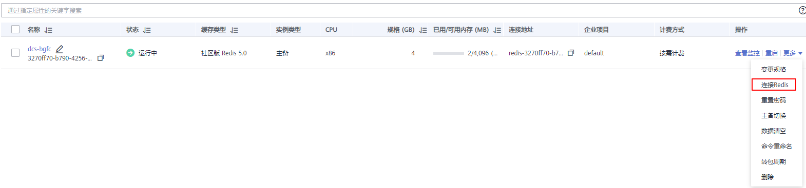

# 控制台连接Redis4.0/5.0/企业版Redis6.0

DCS支持通过管理控制台的Web CLI功能连接Redis实例。只有Redis 4.0、Redis 5.0和企业版Redis6.0实例支持该操作，Redis3.0不支持该功能。

> **说明：** 
>-   请勿通过Web CLI输入敏感信息，以免敏感信息泄露。
>-   当前在Web CLI下所有命令参数暂不支持中文且key和value不支持空格。
>-   当value值为空时，执行get命令返回nil。

## 前提条件

只有当Redis 4.0、Redis 5.0和企业版Redis6.0实例处于“运行中”状态，才能执行此操作。

## 操作步骤

1.  登录[分布式缓存服务管理控制台](https://console.huaweicloud.com/dcs)。
2.  在管理控制台左上角单击，选择区域和项目。

    > **说明：** 
    >此处请选择与用户的应用服务相同的区域。

3.  单击左侧菜单栏的“缓存管理”，然后单击“操作”栏下的“更多 \> 连接Redis”，进入Web CLI登录界面，如[图1](#fig653622219616)所示。

    **图 1**  进入Web CLI登录界面  
    

4.  输入实例的密码进入Web CLI，然后选择当前操作的Redis数据库，在命令输入框输入Redis命令，按Enter键执行。

