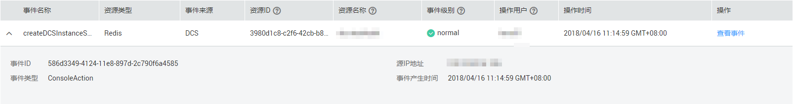
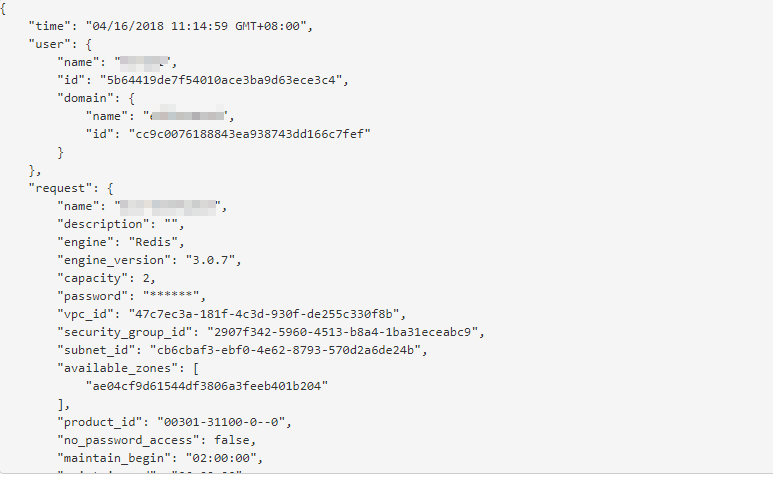

# 查看云审计日志

开启了云审计服务后，系统开始记录DCS资源的操作。云审计服务管理控制台保存最近7天的操作记录。本节介绍如何在云审计服务管理控制台查看最近7天的操作记录。

## 操作步骤

1.  登录[管理控制台](https://console.huaweicloud.com/console)。
2.  在管理控制台左上角单击，选择区域和项目。

    > **说明：**   
    >此处请选择与租户的应用服务相同的区域。  

3.  单击页面上方的“服务列表”，选择“管理与部署 \> 云审计服务”，进入云审计服务信息页面。
4.  单击左侧导航树的“事件列表”，进入事件列表信息页面。
5.  事件列表支持通过筛选来查询对应的操作事件。当前事件列表支持四个维度的组合查询，详细信息如下：
    -   事件来源、资源类型和筛选类型。

        在下拉框中选择查询条件。其中，事件来源选择“DCS”。

        其中筛选类型选择事件名称时，还需选择某个具体的事件名称。

        选择资源ID时，还需选择或者手动输入某个具体的资源ID。

        选择资源名称时，还需选择或手动输入某个具体的资源名称。

    -   操作用户：在下拉框中选择某一具体的操作用户，此操作用户指用户级别，而非租户级别。
    -   事件级别：可选项为“所有事件级别”、“normal”、“warning”、“incident”，只可选择其中一项。
    -   起始时间、结束时间：可通过选择时间段查询操作事件。

6.  在需要查看的记录左侧，单击展开该记录的详细信息，展开记录如[图1](#zh-cn_topic_0106969248_fig16275142414395)所示。

    **图 1**  展开记录  
    

7.  在需要查看的记录右侧，单击“查看事件”，弹出一个窗口，如[图2](#zh-cn_topic_0106969248_fig6764226461)所示，显示了该操作事件结构的详细信息。

    **图 2**  查看事件  
    

## 相关产品及文档

<table><thead align="left"><tr id="zh-cn_topic_0106969248_zh-cn_topic_0046844792_row197372430123"><th class="cellrowborder" valign="top" width="50%" id="mcps1.1.3.1.1">
相关产品

</th>
<th class="cellrowborder" valign="top" width="50%" id="mcps1.1.3.1.2">
相关文档

</th>
</tr>
</thead>
<tbody><tr id="zh-cn_topic_0106969248_zh-cn_topic_0046844792_row17371443131210"><td class="cellrowborder" valign="top" width="50%" headers="mcps1.1.3.1.1 ">
<a href="https://www.huaweicloud.com/product/dcs.html?infodocbz" target="_blank" rel="noopener noreferrer">分布式缓存 Redis</a>

<a href="https://www.huaweicloud.com/product/dcsmem.html?infodocbz" target="_blank" rel="noopener noreferrer">分布式缓存 Memcached</a>

<a href="https://www.huaweicloud.com/product/ecs.html?infodocbz" target="_blank" rel="noopener noreferrer">弹性云服务器 ECS</a>

<a href="http://www.huaweicloud.com/product/vpc.html?infodocbz" target="_blank" rel="noopener noreferrer">虚拟私有云 VPC</a>

<a href="https://www.huaweicloud.com/product/iam.html?infodocbz" target="_blank" rel="noopener noreferrer">统一身份认证 IAM</a>

<a href="https://www.huaweicloud.com/product/ces.html?infodocbz" target="_blank" rel="noopener noreferrer">云监控 CES</a>

<a href="https://www.huaweicloud.com/product/cts.html?infodocbz" target="_blank" rel="noopener noreferrer">云审计 CTS</a>

</td>
<td class="cellrowborder" valign="top" width="50%" headers="mcps1.1.3.1.2 ">
<a href="https://support.huaweicloud.com/usermanual-dcs/dcs-zh-ug-180315001.html?infodocbz" target="_blank" rel="noopener noreferrer">购买Redis实例</a>

<a href="https://support.huaweicloud.com/usermanual-dcs/zh-cn_topic_0082114847.html?infodocbz" target="_blank" rel="noopener noreferrer">连接Redis实例</a>

<a href="https://support.huaweicloud.com/usermanual-dcs/zh-cn_topic_0061845451.html?infodocbz" target="_blank" rel="noopener noreferrer">缓存实例扩容</a>

<a href="https://support.huaweicloud.com/usermanual-dcs/zh-cn_topic_0079545637.html?infodocbz" target="_blank" rel="noopener noreferrer">缓存实例备份恢复</a>

<a href="https://support.huaweicloud.com/migration-dcs/zh-cn_topic_0078784423.html?infodocbz" target="_blank" rel="noopener noreferrer">缓存实例数据迁移</a>

</td>
</tr>
</tbody>
</table>

