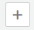
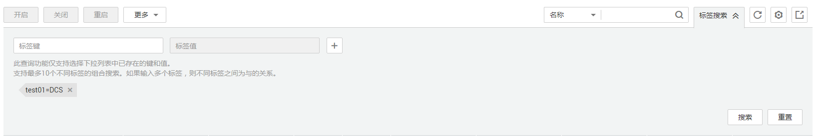

# 查看缓存实例信息

本节介绍如何在DCS管理控制台查看DCS缓存实例的详细信息。

## 前提条件

已成功购买DCS缓存实例。

## 操作步骤

1.  登录[分布式缓存服务管理控制台](https://console.huaweicloud.com/dcs)。
2.  在管理控制台左上角单击，选择区域和项目。
3.  单击左侧菜单栏的“缓存管理”，进入缓存实例信息页面。
4.  查询DCS缓存实例。
    -   支持通过筛选条件来查询对应的DCS缓存实例。

        当前支持的筛选条件为“名称”、“ID”、“IP地址”。

    -   支持通过标签搜索对应的DCS缓存实例。

        1.  单击实例列表右上角的“标签搜索”。
        2.  在展开的查询区域中，输入待查询实例的“标签键”和“标签值”，然后单击右侧的，添加标签。

            系统支持添加多个标签，并取各个标签的交集，对目标实例进行搜索。

        3.  添加完后，单击“搜索”，实例列表显示所有目标实例。

        **图 1**  标签搜索DCS实例  
        

    -   支持通过实例状态过滤对应的DCS缓存实例。

        系统默认展示您所有的缓存实例。您可以单击“状态”列的，通过实例状态过滤DCS实例。

        当前支持的缓存实例状态如下：

        **变更规格中**：表示DCS缓存实例处于正在规格变更的状态。

        **创建中**：表示申请DCS缓存实例后，在DCS缓存实例状态进入运行中之前的状态。

        **故障**：表示DCS缓存实例处于故障不可用的状态。

        **启动中**：DCS缓存实例从已关闭到运行中的中间状态。

        **清空中**：DCS缓存实例处于实例数据清空的状态。

        **升级中**：DCS缓存实例正在升级的状态。

        **数据恢复中**：表示DCS缓存实例在做备份数据恢复的状态。

        **已冻结**：DCS缓存实例处于已冻结状态，您可以在“我的订单”中续费开启冻结的DCS缓存实例。

        **已关闭**：DCS缓存实例被正常停止。在这个状态下的实例，不能对外提供业务。

        **运行中**：DCS缓存实例正常运行状态。在这个状态的实例可以运行您的业务。

        **正在关闭**：DCS缓存实例从运行中到已关闭的中间状态。

        **支付中**：DCS缓存实例处于支付中。

        **重启中**：DCS缓存实例正在进行重启操作。

    -   支持通过缓存类型、版本号过滤DCS缓存实例。

        系统默认展示您所有的缓存实例。您可以单击“缓存类型”列的，通过缓存类型（Redis、Memcached、IMDG）或者缓存版本（Redis 3.x、Redis 4.x、Redis 5.x）过滤实例。

5.  在需要查看的DCS缓存实例左侧，单击该实例的名称，进入实例的基本信息页面。参数说明如[表1](#table76493131315)所示。

    **表 1**  参数说明

    
    <table><thead align="left"><tr id="row166322137116"><th class="cellrowborder" valign="top" width="15.841584158415841%" id="mcps1.2.4.1.1">
信息类型

    </th>
    <th class="cellrowborder" valign="top" width="17.82178217821782%" id="mcps1.2.4.1.2">
参数

    </th>
    <th class="cellrowborder" valign="top" width="66.33663366336634%" id="mcps1.2.4.1.3">
说明

    </th>
    </tr>
    </thead>
    <tbody><tr id="row663413137116"><td class="cellrowborder" rowspan="17" valign="top" width="15.841584158415841%" headers="mcps1.2.4.1.1 ">
基本信息

    

    

    

    

    

    

    

    

    

    

    

    

    

    

    

    

    

    

    

    

    

    

    

    

    

    </td>
    <td class="cellrowborder" valign="top" width="17.82178217821782%" headers="mcps1.2.4.1.2 ">
缓存名称

    </td>
    <td class="cellrowborder" valign="top" width="66.33663366336634%" headers="mcps1.2.4.1.3 ">
DCS缓存实例的名称。单击“缓存名称”后的可以修改实例名称。

    </td>
    </tr>
    <tr id="row13645819132018"><td class="cellrowborder" valign="top" headers="mcps1.2.4.1.1 ">
状态

    </td>
    <td class="cellrowborder" valign="top" headers="mcps1.2.4.1.2 ">
DCS缓存实例状态。

    </td>
    </tr>
    <tr id="row16254203913208"><td class="cellrowborder" valign="top" headers="mcps1.2.4.1.1 ">
缓存类型

    </td>
    <td class="cellrowborder" valign="top" headers="mcps1.2.4.1.2 ">
DCS的缓存类型，包括Redis、Memcached和IMDG，其中，如果Redis，还会展示版本号，例如，Redix3.x。

    </td>
    </tr>
    <tr id="row563511320113"><td class="cellrowborder" valign="top" headers="mcps1.2.4.1.1 ">
实例类型

    </td>
    <td class="cellrowborder" valign="top" headers="mcps1.2.4.1.2 ">
DCS缓存实例类型，支持“单机”、“主备”和“集群”。

    </td>
    </tr>
    <tr id="row218245372617"><td class="cellrowborder" valign="top" headers="mcps1.2.4.1.1 ">
CPU&amp;存储架构

    </td>
    <td class="cellrowborder" valign="top" headers="mcps1.2.4.1.2 ">
DCS缓存实例的CPU和存储架构。

    </td>
    </tr>
    <tr id="row1863518136113"><td class="cellrowborder" valign="top" headers="mcps1.2.4.1.1 ">
规格（GB）

    </td>
    <td class="cellrowborder" valign="top" headers="mcps1.2.4.1.2 ">
DCS缓存实例规格。

    </td>
    </tr>
    <tr id="row9637101316114"><td class="cellrowborder" valign="top" headers="mcps1.2.4.1.1 ">
已用/可用内存 (MB)

    </td>
    <td class="cellrowborder" valign="top" headers="mcps1.2.4.1.2 ">
DCS缓存实例已经使用的内存量和您可以使用的最大内存量。

    
已使用的内存量包括两部分：

    <ul id="ul663611317119"><li>用户存储的数据；</li><li>Redis-server内部的buffer（如client buffer、repl-backlog等），以及内部的数据结构。</li></ul>
    </td>
    </tr>
    <tr id="row1963761312119"><td class="cellrowborder" valign="top" headers="mcps1.2.4.1.1 ">
计费方式

    </td>
    <td class="cellrowborder" valign="top" headers="mcps1.2.4.1.2 ">
DCS缓存实例的计费方式，支持“包年/包月”和“按需付费”方式。

    </td>
    </tr>
    <tr id="row563851310114"><td class="cellrowborder" valign="top" headers="mcps1.2.4.1.1 ">
维护时间窗

    </td>
    <td class="cellrowborder" valign="top" headers="mcps1.2.4.1.2 ">
运维操作时间。单击“时间窗”后的可以修改时间窗。

    </td>
    </tr>
    <tr id="row116388131413"><td class="cellrowborder" valign="top" headers="mcps1.2.4.1.1 ">
ID

    </td>
    <td class="cellrowborder" valign="top" headers="mcps1.2.4.1.2 ">
DCS缓存实例的ID。

    </td>
    </tr>
    <tr id="row76381613214"><td class="cellrowborder" valign="top" headers="mcps1.2.4.1.1 ">
连接地址

    </td>
    <td class="cellrowborder" valign="top" headers="mcps1.2.4.1.2 ">
DCS缓存实例的IP和端口号。

    </td>
    </tr>
    <tr id="row118318558214"><td class="cellrowborder" valign="top" headers="mcps1.2.4.1.1 ">
域名连接地址

    </td>
    <td class="cellrowborder" valign="top" headers="mcps1.2.4.1.2 ">
DCS缓存实例的域名和端口号。

    </td>
    </tr>
    <tr id="row13641613212"><td class="cellrowborder" valign="top" headers="mcps1.2.4.1.1 ">
公网访问

    </td>
    <td class="cellrowborder" valign="top" headers="mcps1.2.4.1.2 ">
公网访问的开关。

    </td>
    </tr>
    <tr id="row164112138111"><td class="cellrowborder" valign="top" headers="mcps1.2.4.1.1 ">
公网访问地址

    </td>
    <td class="cellrowborder" valign="top" headers="mcps1.2.4.1.2 ">
公网访问时实例绑定的弹性IP地址，只有当开启公网访问时才会显示该参数。

    
 说明： 

单击“证书下载”可下载证书，该证书可用于连接实例时验证DCS缓存实例的证书。

    

    </td>
    </tr>
    <tr id="row13641513515"><td class="cellrowborder" valign="top" headers="mcps1.2.4.1.1 ">
创建时间

    </td>
    <td class="cellrowborder" valign="top" headers="mcps1.2.4.1.2 ">
DCS缓存实例的创建时间。

    </td>
    </tr>
    <tr id="row564821314110"><td class="cellrowborder" valign="top" headers="mcps1.2.4.1.1 ">
监控数据

    </td>
    <td class="cellrowborder" valign="top" headers="mcps1.2.4.1.2 ">
单击“查看”可进入云监控服务页面查看DCS缓存实例的监控信息。

    </td>
    </tr>
    <tr id="row8112134010238"><td class="cellrowborder" valign="top" headers="mcps1.2.4.1.1 ">
描述

    </td>
    <td class="cellrowborder" valign="top" headers="mcps1.2.4.1.2 ">
DCS缓存实例的描述信息。单击“描述”后的可以修改描述信息。

    </td>
    </tr>
    <tr id="row146491131711"><td class="cellrowborder" rowspan="4" valign="top" width="15.841584158415841%" headers="mcps1.2.4.1.1 ">
网络

    </td>
    <td class="cellrowborder" valign="top" width="17.82178217821782%" headers="mcps1.2.4.1.2 ">
可用区

    </td>
    <td class="cellrowborder" valign="top" width="66.33663366336634%" headers="mcps1.2.4.1.3 ">
缓存节点所属的可用区。

    </td>
    </tr>
    <tr id="row564920139118"><td class="cellrowborder" valign="top" headers="mcps1.2.4.1.1 ">
安全组

    </td>
    <td class="cellrowborder" valign="top" headers="mcps1.2.4.1.2 ">
DCS缓存实例所关联的安全组。单击“安全组”后的可以修改安全组。

    
 说明： 

如果是DCS Redis4.x和Redis5.x实例，则不显示该参数。

    

    </td>
    </tr>
    <tr id="row464910134119"><td class="cellrowborder" valign="top" headers="mcps1.2.4.1.1 ">
私有网络

    </td>
    <td class="cellrowborder" valign="top" headers="mcps1.2.4.1.2 ">
DCS缓存实例所在的私有网络。

    </td>
    </tr>
    <tr id="row964911312111"><td class="cellrowborder" valign="top" headers="mcps1.2.4.1.1 ">
子网

    </td>
    <td class="cellrowborder" valign="top" headers="mcps1.2.4.1.2 ">
DCS缓存实例所属子网。

    </td>
    </tr>
    </tbody>
    </table>

## 常见问题

-   [子用户无法查看或操作DCS实例怎么办？](https://support.huaweicloud.com/dcs_faq/dcs-zh-ug-190131002.html)
-   [如何导出DCS实例数据？](https://support.huaweicloud.com/dcs_faq/dcs-zh-ug-190131004.html)
-   [为什么缓存实例创建后实际可用内存比申请规格小而且已使用内存不为0？](https://support.huaweicloud.com/dcs_faq/zh-cn_topic_0057964406.html)
-   [为什么DCS缓存实例上报到云监控服务的监控数据中，有时会出现实例已使用内存略大于实例可使用内存的情况？](https://support.huaweicloud.com/dcs_faq/zh-cn_topic_0078393266.html)
-   [为什么我的缓存实例偶尔会出现状态正常但实例不可用问题？](https://support.huaweicloud.com/dcs_faq/zh-cn_topic_0076734560.html)

## 相关产品及文档

<table><thead align="left"><tr id="rb27d733848ce4e7a9386965803595f1b"><th class="cellrowborder" valign="top" width="50%" id="mcps1.1.3.1.1">
相关产品

</th>
<th class="cellrowborder" valign="top" width="50%" id="mcps1.1.3.1.2">
相关文档

</th>
</tr>
</thead>
<tbody><tr id="re4588baf45714b4f80c021cca1290879"><td class="cellrowborder" valign="top" width="50%" headers="mcps1.1.3.1.1 ">
<a href="https://www.huaweicloud.com/product/dcs.html?infodocbz" target="_blank" rel="noopener noreferrer">分布式缓存 Redis</a>

<a href="https://www.huaweicloud.com/product/dcsmem.html?infodocbz" target="_blank" rel="noopener noreferrer">分布式缓存 Memcached</a>

<a href="https://www.huaweicloud.com/product/ecs.html?infodocbz" target="_blank" rel="noopener noreferrer">弹性云服务器 ECS</a>

<a href="http://www.huaweicloud.com/product/vpc.html?infodocbz" target="_blank" rel="noopener noreferrer">虚拟私有云 VPC</a>

</td>
<td class="cellrowborder" valign="top" width="50%" headers="mcps1.1.3.1.2 ">
<a href="https://support.huaweicloud.com/usermanual-dcs/dcs-zh-ug-180315001.html?infodocbz" target="_blank" rel="noopener noreferrer">购买Redis实例</a>

<a href="https://support.huaweicloud.com/usermanual-dcs/zh-cn_topic_0082114847.html?infodocbz" target="_blank" rel="noopener noreferrer">连接Redis实例</a>

<a href="https://support.huaweicloud.com/usermanual-dcs/zh-cn_topic_0061845451.html?infodocbz" target="_blank" rel="noopener noreferrer">变更缓存实例规格</a>

<a href="https://support.huaweicloud.com/usermanual-dcs/zh-cn_topic_0079545637.html?infodocbz" target="_blank" rel="noopener noreferrer">缓存实例备份恢复</a>

<a href="https://support.huaweicloud.com/migration-dcs/zh-cn_topic_0078784423.html?infodocbz" target="_blank" rel="noopener noreferrer">缓存实例数据迁移</a>

</td>
</tr>
</tbody>
</table>

