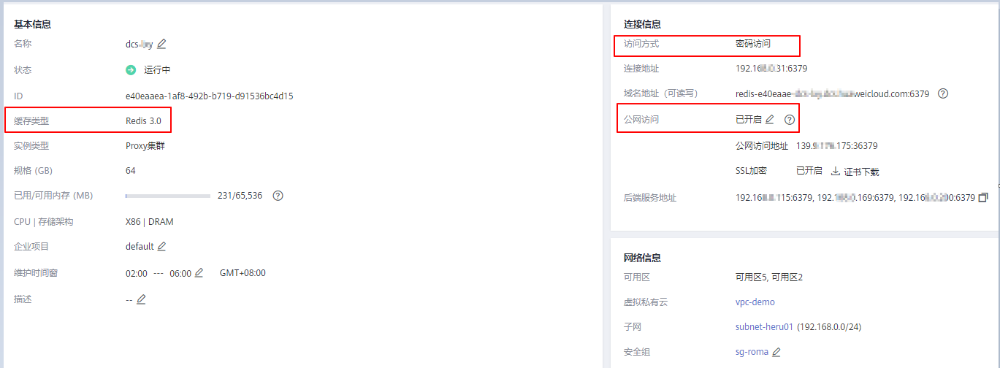
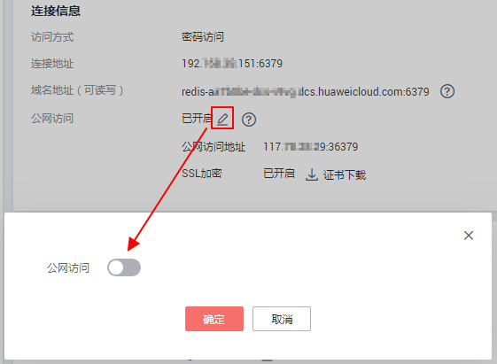
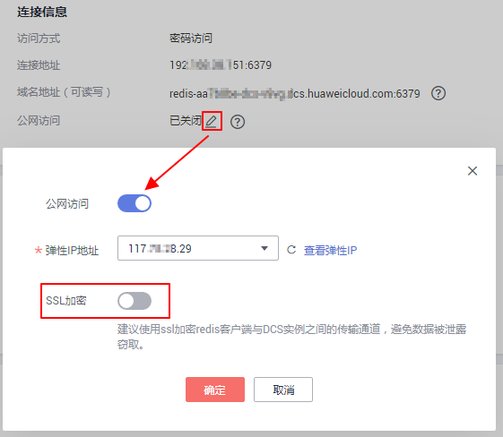

# 步骤一：检查实例是否支持公网访问

华为云DCS支持通过公网地址访问Redis3.0实例，公网访问与VPC内访问相比，可能存在网络丢包和抖动等情况，且访问时延有所增加，因此建议仅在业务开发测试阶段开启公网访问Redis实例。

在进行公网连接Redis实例之前，您首先需要检查实例是否支持公网访问：

-   Redis3.0实例

    目前**只有Redis3.0版本实例支持公网访问**。可通过公网访问开关来控制是否使用公网访问实例。

-   Redis4.0和Redis5.0实例

    **Redis 4.0&5.0实例暂不支持公网访问**，如单机、主备、Proxy集群实例确有公网访问场景，可使用Nginx方案，利用与Redis实例相同VPC与安全组的ECS做跳转。具体方案，请参考[使用Nginx实现公网访问Redis4.0/5.0实例](https://support.huaweicloud.com/bestpractice-dcs/dcs-bp-0514001.html)。

    Cluster集群暂无公网访问方案。

-   Memcached实例

    **暂不支持公网访问**，您必须通过同一虚拟私有云下的弹性云服务器来访问缓存实例，以确保缓存数据的安全。如果您在应用开发调试阶段，可以通过ssh代理方式，实现本地环境访问实例。具体操作参考[云下开发环境怎样连接DCS缓存实例](https://bbs.huaweicloud.com/forum/thread-1470-1-1.html)。

## 检查实例的操作步骤

您需要在实例“概览”页确认以下信息：

-   缓存类型：必须为Redis 3.0版本。如果不是，则不支持公网访问。
-   访问方式：必须为密码访问。如果是免密方式，请先参考[常见问题](#section1869973213305)修改为密码访问方式。
-   公网访问：必须是已开启状态。如果没有开启，参考[步骤二：开启Redis实例的公网访问](步骤二-开启Redis实例的公网访问.md)。

**图 1**  检查实例的缓存类型、密码访问和公网访问开关  

## 常见问题

-   实例为免密访问，公网访问开关置灰没法开启，怎么办？

    解决办法：在实例“概览”页，右上角单击“更多 \> 重置密码”，输入密码，重置成功后，“访问方式”修改为“密码访问”状态。此时，公网访问的开关就可以修改了。

-   实例开启了公网访问，如何关闭SSL开关？

    解决办法：在公网开启时，SSL加密是默认开启的。**公网访问开启后，SSL加密参数不支持直接修改**，如果需要关闭SSL加密，建议按照以下操作执行：

    1.  关闭公网开关。如下图所示。

        **图 2**  关闭公网开关  
        

        等待关闭公网访问。

    2.  待公网访问关闭成功后，重新执行开启公网访问开关操作，开启时，取消开启SSL加密功能。如下图所示。

        **图 3**  开启公网访问并取消开启SSL加密  
        

