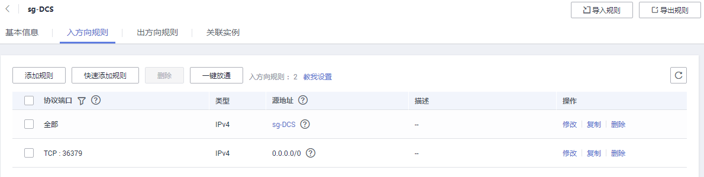
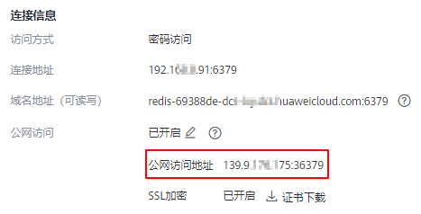
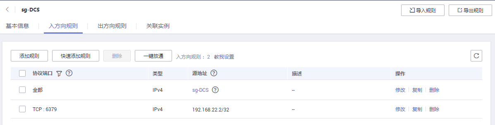
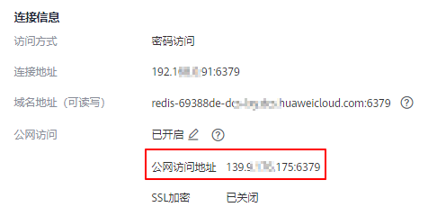

# 步骤三：连接Redis实例（Linux版）<a name="ZH-CN_TOPIC_0244529791"></a>

本文以本地环境为Linxu设备为例，提供使用Redis-cli客户端通过公网连接Redis3.0实例的具体操作。

公网访问功能便于开发人员在本地搭建开发或测试环境，提高开发效率。在生产环境（正式环境）中，请通过VPC内连接方式访问Redis实例，保障访问效率。

## 前提条件<a name="section1502270695932"></a>

使用Redis-cli客户端通过公网访问Redis实例时：

-   实例必须为Redis3.0实例，且已经开启了公网访问功能。
-   如果访问Redis实例需要使用证书，可根据[查看缓存实例信息](查看缓存实例信息.md)，进入到缓存实例详情页面提前下载该证书。

## 开启SSL加密的操作步骤<a name="section19593124395316"></a>

1.  <a name="li18706142285116"></a>确认Redis实例的安全组入方向规则是否配置正确，即是否允许外部地址访问36379端口。

    当SSL加密功能开启时，必须允许36379端口被外部地址访问。需要安装Stunnel客户端，然后访问Redis的公网地址。

    **图 1**  安全组规则（端口配置为36379）<a name="fig143331295815"></a>  
    

2.  <a name="li6901442342"></a>查看并获取待连接Redis实例的公网访问地址。

    单击实例，进入实例详情页即可查看，如下所示。

    **图 2**  查看公网访问地址（开启SSL，端口为36379）<a name="fig5230164113619"></a>  
    

3.  登录本地Linux设备。
4.  安装Stunnel客户端。

    这里主要介绍Stunnel客户端的几种常见安装方法，您可以选择其中一种方式进行操作。

    > **说明：**   
    >推荐使用apt和yum两种安装方式，常见Linux系统，一般至少支持其中一种。  
    >其他常见系统下的Stunnel客户端安装请参考：  
    >[“Mac下的Stunnel客户端安装”](https://bbs.huaweicloud.com/blogs/201166b14ac411e89fc57ca23e93a89f)。  

    -   apt-get方式安装。

        apt-get管理deb格式的软件包，适用于Debian类操作系统，如Ubuntu。命令如下：

        **apt install stunnel**  或**apt-get install stunnel**

        如果命令执行后提示找不到Stunnel，可以尝试执行**apt update**，更新配置后再安装Stunnel。

    -   yum方式安装。

        管理rpm格式的软件包，适用于Fedora、CentOS、Red Hat等操作系统。命令如下：

        **yum install stunnel**

5.  <a name="li093144193416"></a>打开Stunnel配置文件stunnel.conf。

    -   如果是apt-get安装方式，默认路径为/etc/stunnel/stunnel.conf。

        如果路径不存在或者路径下无配置文件，可新增。

    -   如果是yum安装方式，默认路径为/usr/local/stunnel/stunnel.conf。

        如果路径不存在或者路径下无配置文件，可新增。

    > **说明：**   
    >-   如果不确定配置文件应该存储在哪，可以在安装后直接输入stunnel命令，获取文件路径提示。  
    >-   配置文件可以存储在任何路径，在Stunnel启动的时候指定该配置文件即可。  

6.  <a name="li993944183418"></a>在配置文件stunnel.conf中新增如下内容，然后保存退出。

    ```
    debug = 4
    output = /var/log/stunnel.log
    sslVersion = all
    [redis-client]
    client = yes
    accept = 8000
    connect = {公网访问地址}
    CAfile = /etc/stunnel/dcs-ca.cer
    ```

    参数需要根据以下说明修改，其他参数不用修改：

    -   **client**值固定填**yes**，表示为Stunnel客户端。
    -   **CAfile**为CA证书，为可选参数。如果需要，请根据[查看缓存实例信息](查看缓存实例信息.md)，进入到缓存实例详情页面下载该证书，下载之后解压得到dcs-ca.cer证书；如果不需要，此参数请删除。
    -   **accept**为Stunnel监听端口，可以自定义。Redis客户端访问缓存实例时填写此端口。
    -   **connect**为Stunnel转发地址与端口，此处填Redis缓存实例的弹性IP与端口，替换为步骤[2](#li6901442342)获取的公网访问地址即可。

    配置示例如下：

    ```
    [redis-client]
    client = yes
    CAfile = D:\tmp\dcs\dcs-ca.cer
    accept = 8000
    connect = 49.**.**.211:36379
    ```

7.  执行以下命令，启动stunnel服务。

    **stunnel /_\{customdir\}_/stunnel.conf**

    其中\{customdir\}为[5](#li093144193416)中stunnel.conf配置文件的存储路径。命令示例如下：

    **stunnel /etc/stunnel/stunnel.conf**

    > **说明：**   
    >Ubuntu环境下，启动命令可以使用**/etc/init.d/stunnel4 start**。Stunnel4.x的版本，服务/进程名为stunnel4。  

    启动后可执行**ps -ef|grep stunnel**确认进程是否正常运行。

8.  执行以下命令，查看Stunnel是否已经被监听。

    **netstat -plunt |grep  _8000_|grep "LISTEN"**

    其中，8000替换为[6](#li993944183418)中accept字段配置的Stunnel监听端口。

    返回信息有包含8000的端口的记录行，表示stunnel客户端正常运行。Redis客户端连接“127.0.0.1:8000”，Stunnel会将请求转发给DCS的Redis实例。

9.  连接Redis实例。
    1.  登录本地Linux设备。
    2.  获取Redis客户端源码，下载路径为http://download.redis.io/releases/redis-3.0.7.tar.gz。

        **wget http://download.redis.io/releases/redis-3.0.7.tar.gz**

        > **说明：**   
        >您也可以使用yum、apt方式安装Redis客户端。  
        >-   yum方式，执行命令：**yum install redis**  
        >-   apt方式，执行命令：**apt install redis-server**  

    3.  执行如下命令，解压Redis客户端源码包。

        **tar -xzf redis-3.0.7.tar.gz**

    4.  进入Redis目录并编译Redis客户端源码。

        **cd redis-3.0.7**

        **make**

    5.  执行以下命令连接Redis实例。

        **cd src**

        **./redis-cli -h 127.0.0.1 -p  _8000_**

        > **注意：**   
        >连接命令中**-h**后的连接地址应该为Stunnel客户端地址，**-p**后的端口为Stunnel客户端监控端口，不要使用控制台展示的公网连接地址和端口，连接地址保持**127.0.0.1**即可；连接端口为[6](#li993944183418)中accept字段配置的Stunnel监听端口，本文示例定义的是8000。  

    6.  输入密码，校验通过后才可进行缓存数据读写。

        **auth <password\>**

        其中，**<password\>**为创建Redis实例时自定义的密码，请按实际情况修改后执行。

        连接成功后，回显信息如下：

        ```
        OK 
        127.0.0.1:8000>
        ```


## 关闭SSL加密的操作步骤<a name="section1920218163546"></a>

1.  <a name="li82984575228"></a>确认Redis实例的安全组入方向规则是否配置正确，即是否允许外部地址访问6379端口。

    当SSL加密功能关闭时，必须允许6379端口被外部地址访问。放开后，即可直接访问Redis的公网地址。

    **图 3**  安全组规则（端口配置为6379）<a name="fig1294816596302"></a>  
    

2.  <a name="li18583102124"></a>查看并获取待连接Redis实例的公网访问地址。

    单击实例，进入实例详情页即可查看，如下所示。

    **图 4**  查看公网访问地址（关闭SSL，端口为6379）<a name="fig1041193814311"></a>  
    

3.  登录本地Linux设备。
4.  获取Redis客户端源码，下载路径为http://download.redis.io/releases/redis-3.0.7.tar.gz。

    **wget http://download.redis.io/releases/redis-3.0.7.tar.gz**

    > **说明：**   
    >您也可以使用yum、apt方式安装Redis客户端。  
    >-   yum方式，执行命令：**yum install redis**  
    >-   apt方式，执行命令：**apt install redis-server**  

5.  执行如下命令，解压Redis客户端源码包。

    **tar -xzf redis-3.0.7.tar.gz**

6.  进入Redis目录并编译Redis客户端源码。

    **cd redis-3.0.7**

    **make**

7.  执行以下命令连接Redis实例。

    **cd src**

    **./redis-cli -h \{公网访问IP\} -p 6379**

    其中，\{公网访问IP\}替换为[2](#li18583102124)中获取的Redis实例的IP即可。示例如下：

    **./redis-cli -h 49.\*\*.\*\*.211 -p 6379**

8.  输入密码，校验通过后才可进行缓存数据读写。

    **auth <password\>**

    其中，**<password\>**为创建Redis实例时自定义的密码，请按实际情况修改后执行。

    连接成功后，回显信息如下：

    ```
    OK 
    49.**.**.211:6379>
    ```


## 常见问题<a name="section146277115219"></a>

-   Error: Connection reset by peer

    原因：安全组没有配置正确，需要参考[放通36379端口](#li18706142285116)或[放通6379端口](#li82984575228)。

-   使用redis-cli连接实例，会出现：远程主机强迫关闭一个现有的连接。

    原因：开启了SSL加密传输，连接时没有配置Stunnel，直接使用界面提示的IP地址进行连接。开启SSL加密时，您需要按照[开启SSL加密的操作步骤](#section19593124395316)的操作步骤执行。

-   更多连接失败的问题，请查看[Redis实例连接失败的原因排查](https://support.huaweicloud.com/dcs_faq/dcs-faq-0427014.html)。

