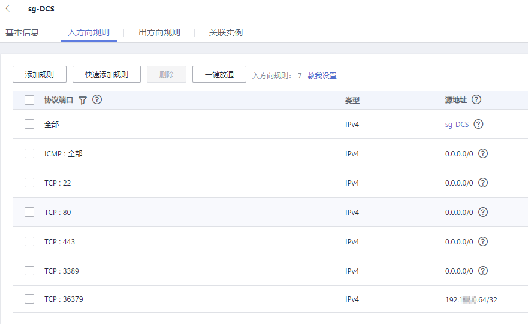
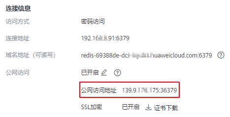
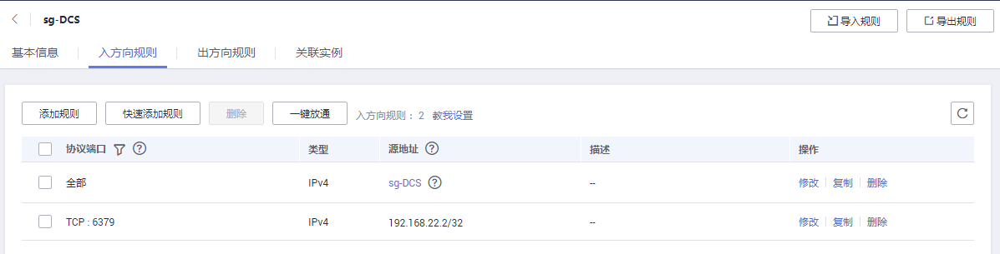
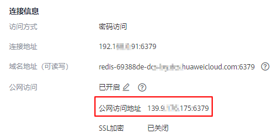

# 步骤三：连接Redis实例（Windows版）<a name="ZH-CN_TOPIC_0148195250"></a>

本文以本地环境为Windows设备为例，提供使用Redis-cli客户端通过公网地址连接Redis3.0实例的具体操作。

公网访问功能便于开发人员在本地搭建开发或测试环境，提高开发效率。在生产环境（正式环境）中，请通过VPC内连接方式访问Redis实例，保障访问效率。

## 前提条件<a name="section1502270695932"></a>

使用Redis-cli客户端通过公网访问Redis实例时：

-   实例必须为Redis3.0实例，且已经开启了公网访问功能。
-   如果访问Redis实例需要使用证书，可根据[查看缓存实例信息](查看缓存实例信息.md)，进入到缓存实例详情页面提前下载该证书。

## 开启SSL加密的操作步骤<a name="section15819133914471"></a>

1.  <a name="li3828194817518"></a>确认Redis实例的安全组入方向规则是否配置正确，即是否允许外部地址访问36379端口。

    当SSL加密功能开启时，必须允许36379端口被外部地址访问。放开后，需要安装Stunnel客户端，然后访问Redis的公网地址。

    **图 1**  安全组规则（端口配置为36379）<a name="fig143331295815"></a>  
    

2.  <a name="li1599942763612"></a>查看并获取待连接Redis实例的公网访问地址。

    单击实例，进入实例详情页即可查看，如下所示。

    **图 2**  查看公网访问地址（开启SSL，端口为36379）<a name="fig5230164113619"></a>  
    

3.  下载Stunnel安装包。从[https://www.stunnel.org/downloads.html](https://www.stunnel.org/downloads.html)下载最新版本的Windows版Stunnel安装包（以exe结尾的安装包，例如，stunnel-5.44-win32-installer.exe）到本地Windows设备。
4.  运行Stunnel安装程序，安装Stunnel客户端。
5.  <a name="li7999927123614"></a>配置Stunnel客户端。在任务栏单击图标右键，选择“Edit Configuration”，新增如下配置内容，然后保存退出。

    ```
    [redis-client]
    client = yes
    CAfile = D:\tmp\dcs\dcs-ca.cer
    accept = 8000
    connect = {公网访问地址}
    ```

    参数需要根据以下说明修改，其他参数不用修改：

    -   **client**值固定填yes，表示为Stunnel客户端。
    -   **CAfile**为CA证书，为可选参数。如果需要，请根据[查看缓存实例信息](查看缓存实例信息.md)，进入到Redis实例详情页面下载该证书，下载之后解压得到dcs-ca.cer证书；如果不需要，可不配置，删除此参数。
    -   **accept**为Stunnel监听端口，可以自定义。Redis客户端访问实例时填写此端口。
    -   **connect**为服务端连接地址，此处填Redis实例的弹性公网IP与端口，替换为步骤[2](#li1599942763612)获取的公网访问地址即可。

    已开启了SSL加密功能的配置为例，如下所示：

    ```
    [redis-client]
    client = yes
    CAfile = D:\tmp\dcs\dcs-ca.cer
    accept = 8000
    connect = 49.**.**.211:36379
    ```

6.  在任务栏单击图标右键，选择“Reload Configuration”。
7.  打开命令提示符工具**cmd.exe**，执行以下命令，查看127.0.0.1:8000是否已经被监听。

    **netstat -an |find "8000"**

    假设客户端的监听端口配置为“8000”。

    返回列表行中显示有“127.0.0.1:8000”，状态为“LISTENING”，表示stunnel客户端正常运行。Redis客户端连接“127.0.0.1:8000”，stunnel会将请求转发给DCS的Redis实例。

8.  连接Redis实例。
    1.  获取Redis客户端安装包到本地Windows设备，并解压安装包。

        Windows版本的Redis客户端安装包，下载请单击[这里](https://github.com/MicrosoftArchive/redis/tags)。

    2.  打开命令提示符工具**cmd.exe**，并执行以下命令，进入Redis客户端安装包的解压目录。

        以解压目录D:\\redis-64.3.0.503为例，命令如下：

        **D:**

        **cd D:\\redis-64.3.0.503**

    3.  执行以下命令连接Redis实例。

        **redis-cli -h 127.0.0.1 -p 8000 -a <password\>**

        > **注意：**   
        >连接命令中**-h**后的连接地址应该为Stunnel客户端地址，**-p**后的端口为Stunnel客户端监控端口，不要使用控制台展示的公网连接地址和端口，连接地址保持**127.0.0.1**即可；连接端口为[5](#li7999927123614)中accept字段配置的Stunnel监听端口，本文示例定义的是8000。  

        **<password\>**为创建Redis实例时自定义的密码，请按实际情况修改后执行。

        连接成功后，回显信息如下：

        ```
        127.0.0.1:8000>
        ```

        输入“info”可正常返回Redis实例信息。如果不能正常返回，或者连接异常断开，可在任务栏找到Stunnel图标，并右键单击，选择“Show Log Window”，打开Stunnel客户端的日志查看原因。


## 关闭SSL加密的操作步骤<a name="section97271599158"></a>

1.  <a name="li85504985112"></a>确认Redis实例的安全组入方向规则是否配置正确，即是否允许外部地址访问6379端口。

    当SSL加密功能关闭时，必须允许6379端口被外部地址访问。放开后，即可直接访问Redis的公网地址。

    **图 3**  安全组规则（端口配置为6379）<a name="fig1294816596302"></a>  
    

2.  查看并获取待连接Redis实例的公网访问地址。

    单击实例，进入实例详情页即可查看，如下所示。

    **图 4**  查看公网访问地址（关闭SSL，端口为6379）<a name="fig1041193814311"></a>  
    

3.  获取Redis客户端安装包到本地Windows设备，并解压安装包。

    Windows版本的Redis客户端安装包，下载请单击[这里](https://github.com/MicrosoftArchive/redis/tags)。

4.  打开命令提示符工具**cmd.exe**，并执行以下命令，进入Redis客户端安装包的解压目录。

    以解压目录D:\\redis-64.3.0.503为例，命令如下：

    **D:**

    **cd D:\\redis-64.3.0.503**

5.  执行以下命令连接Redis实例。

    **redis-cli -p 6379 -a <password\>**

    **<password\>**为创建Redis实例时自定义的密码，请按实际情况修改后执行。

    连接成功后，回显信息如下：

    ```
    49.**.**.211:6379>
    ```

    输入“info”可正常返回Redis实例信息。


## 常见问题<a name="section146277115219"></a>

-   Error: Connection reset by peer或者出现：远程主机强迫关闭一个现有的连接

    原因1：安全组没有配置正确，需要参考[放通36379端口](#li3828194817518)或[放通6379端口](#li85504985112)。

    原因2：开启了SSL加密传输，连接时没有配置Stunnel，直接使用界面提示的IP地址进行连接。开启SSL加密时，您需要按照[开启SSL加密的操作步骤](#section15819133914471)的操作步骤执行。

-   更多连接失败的问题，请查看[Redis实例连接失败的原因排查](https://support.huaweicloud.com/dcs_faq/dcs-faq-0427014.html)。

