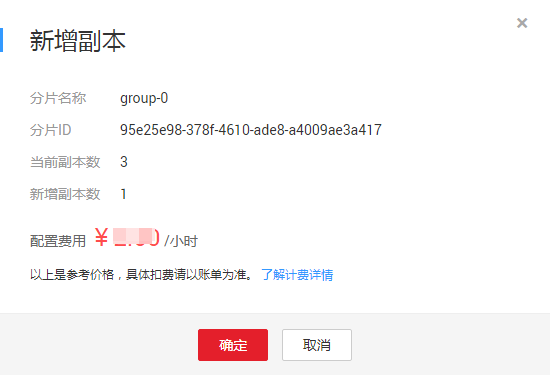

# 管理分片与副本

本节主要介绍如何给Redis实例分片增加副本，将从节点升级为主节点，以及删除副本的操作。

每一个分片都是一主一从的双副本结构，您可以根据业务需要为分片增加副本，升级为一主多从的结构，减少分片故障，分片数据不能读取的问题。当分片主节点故障时，系统自动主从切换，保证分片正常提供服务。

> **说明：**   
>-   只有角色为从的新增副本才允许执行删除操作，实例创建时的副本不能删除。  
>-   删除实例时，同时删除所有副本。  
>-   新增副本后，实例规格变更，新增的副本规格也随之变更。  
>-   Cluster集群实例规格对应的分片数，请参考[原生Cluster版Redis集群实例介绍](https://support.huaweicloud.com/productdesc-dcs/CacheCluster.html)。Redis4.0和Redis5.0主备实例，分片数默认都为1。  

当**前支持该功能的实例有Redis4.0主备实例、Redis5.0主备实例、Cluster集群实例。**如果是Redis4.0主备实例和Redis5.0主备实例，新增副本时，可为副本选择可用区。

> **说明：**   
>仅“华北-北京4”支持Redis4.0和Redis5.0主备实例读写分离，其他Region创建的Redis4.0和Redis5.0主备实例暂时不支持读写分离。  

## 新增副本

1.  登录[分布式缓存服务管理控制台](https://console.huaweicloud.com/dcs)。
2.  在管理控制台左上角单击，选择区域和项目。

    > **说明：**   
    >此处请选择与您的应用服务相同的区域。  

3.  单击左侧菜单栏的“缓存管理”，进入实例信息页面。
4.  单击需要新增副本的DCS缓存实例名称，进入该实例的基本信息页面。
5.  单击“分片与副本”页签，进入分片与副本页面。

    界面显示该实例的所有分片列表，以及每个分片的副本列表。

6.  在分片列表右侧，单击“操作”栏下的“新增副本”。

    页面显示下图，给当前分片新增1个副本数。

    **图 1**  新增副本  
    

7.  确认副本信息后，单击“确定”，页面跳转到“后台任务”页面，开始为分片新增副本。

    待新增副本任务状态为“成功”，新增副本成功，可返回“分片与副本”页签查看。

    > **说明：**   
    >对于新增的副本，当不需要该副本时，您可以单击“删除”，将新增副本删除。如果副本角色为主，您需要参考[升级副本](#section25872016114818)操作，将其他副本升级为主，倒换主从角色，才能执行删除操作。  

## 升级副本

1.  登录[分布式缓存服务管理控制台](https://console.huaweicloud.com/dcs)。
2.  在管理控制台左上角单击，选择区域和项目。

    > **说明：**   
    >此处请选择与您的应用服务相同的区域。  

3.  单击左侧菜单栏的“缓存管理”，进入实例信息页面。
4.  单击需要新增副本的DCS缓存实例名称，进入该实例的基本信息页面。
5.  单击“分片与副本”页签，进入分片与副本页面。

    界面显示该实例的所有分片列表，以及每个分片的副本列表。

6.  单击分片名称前面的图标，展开当前分片下的所有副本。

    **图 2**  分片与副本列表  
    

7.  选择一个角色为从的副本，单击“升级为主”。
8.  单击“是”，将选择的副本升级为主。

