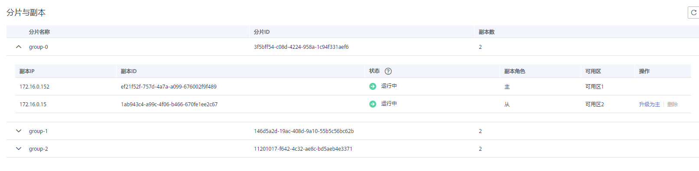

# 管理分片与副本

本节主要介绍如何查询Redis4.0/5.0/企业版Redis6.0实例分片和副本信息，以及将集群实例的从节点手动升级为主节点的操作。

当**前仅Redis4.0/5.0的主备、Proxy集群、Cluster集群实例和企业版Redis6.0的主备实例支持该功能，Redis4.0/5.0单机实例和Redis3.0实例不支持该功能。**

如果是主备实例，分片数为1，是一个一主一从的双副本架构，仅支持查看分片信息，如果需要手动切换主从节点，请执行[主备切换](主备切换.md)操作。

如果是Proxy集群、Cluster集群实例，每个集群是由多个分片组成，每个分片都是一个双副本架构，您可以查看分片信息，还可以根据业务需要，手动切换分片主从节点。不同实例规格对应的分片数，具体请参考[Redis4.0/5.0 Proxy集群实例介绍](https://support.huaweicloud.com/productdesc-dcs/CacheCluster.html#section1)和[Redis4.0/5.0 Cluster集群介绍](https://support.huaweicloud.com/productdesc-dcs/CacheProxy.html#section0)。

## 升级副本

1.  登录[分布式缓存服务管理控制台](https://console.huaweicloud.com/dcs)。
2.  在管理控制台左上角单击，选择区域和项目。

    > **说明：** 
    >此处请选择与您的应用服务相同的区域。

3.  单击左侧菜单栏的“缓存管理”，进入实例信息页面。
4.  单击缓存实例名称，进入该实例的基本信息页面。
5.  单击“分片与副本”页签，进入分片与副本页面。

    界面显示该实例的所有分片列表，以及每个分片的副本列表。

6.  单击分片名称前面的图标，展开当前分片下的所有副本。

    **图 1**  分片与副本列表  
    

7.  选择角色为从的副本，单击“升级为主”。
8.  单击“是”，将选择的副本升级为主。

