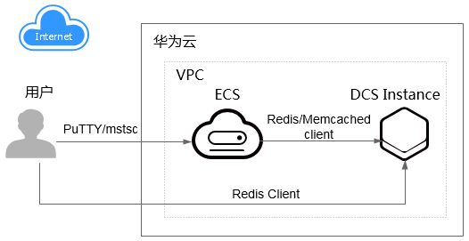

# 管理和使用分布式缓存服务

## 管理DCS缓存实例

DCS提供了Web化的服务管理平台，即管理控制台，还提供了基于HTTPS请求的RESTful API（Application programming interface）管理方式。

-   Web管理控制台方式

    您注册后登录[管理控制台](https://console.huaweicloud.com)，从主页选择“分布式缓存服务”即可进入DCS的管理界面。

    Web管理控制台DCS缓存实例的相关管理功能，具体操作，请参见本手册[购买缓存实例](购买缓存实例.md)到[密码管理](密码管理.md)。

    DCS各项指标的监控数据会记录在云监控服务中，如果您需要查看相关监控数据或配置监控告警规则，请登录云监控控制台查看，具体操作，请参考[查看监控指标](查看监控指标.md)。

    如果您开启了云审计服务，系统会将对DCS实例的操作记录到云审计服务，您可以登录云审计服务控制台查看，具体查看操作，请参考[查看云审计日志](查看云审计日志.md)。

-   API方式

    DCS提供了基于RESTful的API接口，支持您将分布式缓存服务集成到自己的应用系统，实现自动化统一管理，有关API的调用说明与具体的API接口内容，请参考《[分布式缓存服务API参考](https://support.huaweicloud.com/api-dcs/dcs-api-0312001.html)》。

    > **须知：**   
    >1.  已开放的API功能，可分别使用Web管理控制台方式和API方式操作，API方式，请参考《[分布式缓存服务API参考](https://support.huaweicloud.com/api-dcs/dcs-api-0312001.html)》；如果是没有开放API调用的功能，请使用Web管理控制台操作。  
    >2.  监控与审计的API请参考[云监控服务](https://support.huaweicloud.com/ces/index.html)以及[云审计服务](https://support.huaweicloud.com/cts/index.html)的帮助手册。  

## 使用DCS缓存实例

您购买DCS缓存实例后，可参考[连接Redis缓存实例](连接Redis缓存实例.md)，了解如何连接缓存实例。兼容开源Redis/Memcached协议的客户端都可以连接DCS的Redis/Memcached缓存实例，客户端连接成功后，您就可以开始享受DCS带来的高效数据读写。

> **须知：**   
>DCS本身不涉及用户敏感信息。使用DCS处理数据的目的、范围、处理方式、时限等请遵从当地适用的法律法规。DCS本身不建议传输和存储敏感数据，如果传输和存储敏感数据，请自行加密后再传输和存储。  

访问缓存实例的方法，如[图1](#fig178431316483)所示。

**图 1**  访问DCS服务简图  

> **说明：**   
>-   目前，客户端所在弹性云服务器（Elastic Cloud Server）必须和缓存实例处于同一虚拟私有云（Virtual Private Cloud）和子网。  
>-   Redis缓存实例如果开启公网访问功能，也可通过弹性IP（Elastic IP address）访问。  

