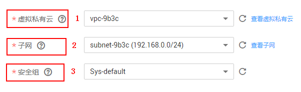

# 购买IMDG实例

购买IMDG实例支持“按需付费”。您可以根据业务需要购买相应计算能力和存储空间的IMDG实例。

> **说明：**   
>本操作目前仅“华北-北京一”、“华东-上海二”、“华南-广州”region支持，其他region暂未支持。  

## 准备工作

在购买实例之前，请先根据您的实际业务需要，明确购买需求，完成以下工作：

1.  准备网络环境。
    -   如果您已有VPC，则不需要重新创建，可重复使用。
    -   如果没有VPC，请参考[网络环境准备](网络环境准备.md)创建VPC、安全组和子网。

2.  确定购买的缓存类型。

    在购买前，需要您根据业务情况选择合适的缓存类型，选择了缓存类型后，不支持更改缓存类型。

    -   若要了解Redis、Memcached和IMDG，请参考[DCS Redis、DCS Memcached和IMDG的介绍](https://support.huaweicloud.com/productdesc-dcs/zh-cn_topic_0088428509.html)。
    -   若要了解Redis和Memcached的区别，请参考[Redis与Memcached之间如何选择](https://support.huaweicloud.com/productdesc-dcs/RedisAndMemcachedChoose.html)。

3.  确定要购买的缓存实例类型，即实例架构。

    确定缓存类型后，需要明确实例类型。实例规格特点和架构，可参考[选择实例架构](https://support.huaweicloud.com/productdesc-dcs/CacheSingleNode.html)。

4.  确定实例规格。

    确定实例架构后，需要明确购买规格大小。实例支持的连接数和内网带宽，可参考[产品规格](https://support.huaweicloud.com/productdesc-dcs/zh-cn_topic_0033568446.html)。

5.  确定选择的区域。

    选择的区域，建议选择接近您应用程序的区域，减少网络延时，例如，所在城市为中国-广州，可就近选择“华南-广州”。

## 购买IMDG实例

1.  登录[分布式缓存服务管理控制台](https://console.huaweicloud.com/dcs)。
2.  在管理控制台左上角单击，选择区域和项目。

    > **说明：**   
    >此处请选择与您的应用服务相同的区域。  

3.  单击左侧菜单栏的“缓存管理”进入“缓存管理”页面。
4.  单击“购买缓存实例”，进入购买页面。
5.  选择“计费模式”。选择“按需付费”。

    本章节描述购买IMDG的购买操作，IMDG只支持“按需付费”的计费模式。

6.  在“区域”下拉列表中，选择靠近您应用程序的区域，可降低网络延时、提高访问速度。
7.  设置实例的“名称”和“描述”。

    实例的名称，必须符合以下要求：

    -   名称不能为空。
    -   只能以英文字母开头。
    -   名称长度为4到64位的字符串。
    -   仅包含英文字母、数字、下划线（\_）和中划线（-）。

8.  根据购买前的[准备工作](#section1262819220505)，设置以下基本信息；
    1.  在“缓存类型”区域，选择缓存类型。

        本章节单击选择“IMDG”。

    2.  在“实例类型”区域，选择实例类型。

        IMDG只支持“单机”和“集群”实例类型。

    3.  在“可用区”区域，您可根据实际情况选择。

        如果提高访问速度，可选择和应用同一个可用区；如果提高可靠性，可选择和应用不在同一个可用区。

    4.  在“实例规格”区域，选择符合您的规格。

        默认配额请以控制台显示为准。

        如需增加配额，单击规格下方的“申请扩大配额”，即可跳转到工单管理界面提交工单，增加配额。

        配置的实例基本信息，如[图1](#fig442343421020)所示。

        **图 1**  购买IMDG实例  
        

9.  设置实例网络环境信息。
    1.  在“虚拟私有云”下拉列表，选择已经创建好的虚拟私有云。
        -   虚拟私有云可以为您的IMDG实例构建隔离的、您可以自主配置和管理的虚拟网络环境。
        -   可单击右侧的“查看虚拟私有云”，系统跳转到虚拟私有云界面，选择相应的虚拟私有云，可以查看安全组的出方向规则和入方向规则。

    2.  在“子网”下拉列表，选择已经创建好的子网。

        您可以单击右侧的“查看子网”，系统跳转到网络控制台页面，查看对应子网的私有IP地址等信息。

    3.  在“安全组”下拉列表，可以选择已经创建好的安全组。

        安全组是一组对弹性云服务器的访问规则的集合，为同一个VPC内具有相同安全保护需求并相互信任的弹性云服务器提供访问策略。

        **图 2**  购买IMDG时设置网络环境信息  
        

10. 设置实例访问用户名和密码。
    -   “用户名”：连接IMDG实例的用户名。
        -   名称不能为空。
        -   只能以英文字母开头。
        -   长度为1到64位的字符串。
        -   仅包含英文字母、数字、下划线（\_）和中划线（-）。

    -   “密码”和“确认密码”：表示连接IMDG实例的密码。

        > **说明：**   
        >DCS服务出于安全考虑，在密码访问模式下，连接使用IMDG实例时，需要先进行密码认证。请妥善保存密码，并定期更新密码。  

        IMDG实例密码复杂度要求，请参考[DCS账号密码规范](https://support.huaweicloud.com/dcs_faq/dcs-zh-ug-190228001.html)。

11. 设置实例维护时间窗。

    您可以设置华为服务运维对实例进行维护的时间，可选择22:00-02:00、02:00-06:00、06:00-10:00、10:00-14:00、14:00-18:00和18:00-22:00，在选择的时间段内，则可对实例节点进行维护操作。

12. 确定实例的信息和“配置费用”后，单击“立即购买”，进入确认页面。

    页面显示申请的分布式缓存服务的实例名称、缓存版本和实例规格等信息。

13. 确认实例信息无误后，提交请求，开始创建实例。
14. 缓存实例创建成功后，您可以在“缓存管理”页面，查看并管理自己的缓存实例。
    1.  创建缓存实例大约需要5到15分钟，如果创建集群实例，则需要大约30分钟。
    2.  缓存实例创建成功后，默认“状态”为“运行中”。
    3.  如果创建缓存实例失败，可参考[删除缓存实例](删除缓存实例.md)，删除创建失败的缓存实例，然后重新购买。如果重新申请仍然失败，请联系客服。

## 使用API方式购买实例

除了可以在控制台购买实例，您还可以使用API的方式购买缓存实例，具体操作请查看以下链接。

[使用API创建缓存实例](https://support.huaweicloud.com/api-dcs/dcs-zh-api-180423019.html)

## 有关购买IMDG实例的常见问题

-   [什么场景下选择IMDG数据库？](https://support.huaweicloud.com/dcs_faq/zh-cn_topic_0091565969.html)
-   [创建DCS实例时页面为什么无法自动获取子网和安全组等信息？](https://support.huaweicloud.com/dcs_faq/dcs-zh-ug-180703001.html)
-   [如何选择和配置安全组](https://support.huaweicloud.com/dcs_faq/zh-cn_topic_0082442607.html)
-   [DCS实例是否支持跨AZ？跨AZ有什么影响？](https://support.huaweicloud.com/dcs_faq/dcs-zh-ug-190117012.html)

## 相关产品及文档

<table><thead align="left"><tr id="rb27d733848ce4e7a9386965803595f1b"><th class="cellrowborder" valign="top" width="50%" id="mcps1.1.3.1.1">
相关产品

</th>
<th class="cellrowborder" valign="top" width="50%" id="mcps1.1.3.1.2">
相关文档

</th>
</tr>
</thead>
<tbody><tr id="re4588baf45714b4f80c021cca1290879"><td class="cellrowborder" valign="top" width="50%" headers="mcps1.1.3.1.1 ">
<a href="https://www.huaweicloud.com/product/dcs.html?infodocbz" target="_blank" rel="noopener noreferrer">分布式缓存 Redis</a>

<a href="https://www.huaweicloud.com/product/dcsmem.html?infodocbz" target="_blank" rel="noopener noreferrer">分布式缓存 Memcached</a>

<a href="https://www.huaweicloud.com/product/ecs.html?infodocbz" target="_blank" rel="noopener noreferrer">弹性云服务器 ECS</a>

<a href="http://www.huaweicloud.com/product/vpc.html?infodocbz" target="_blank" rel="noopener noreferrer">虚拟私有云 VPC</a>

</td>
<td class="cellrowborder" valign="top" width="50%" headers="mcps1.1.3.1.2 ">
<a href="https://support.huaweicloud.com/usermanual-dcs/dcs-zh-ug-180315001.html?infodocbz" target="_blank" rel="noopener noreferrer">购买Redis实例</a>

<a href="https://support.huaweicloud.com/usermanual-dcs/zh-cn_topic_0082114847.html?infodocbz" target="_blank" rel="noopener noreferrer">连接Redis实例</a>

<a href="https://support.huaweicloud.com/usermanual-dcs/zh-cn_topic_0061845451.html?infodocbz" target="_blank" rel="noopener noreferrer">变更缓存实例规格</a>

<a href="https://support.huaweicloud.com/usermanual-dcs/zh-cn_topic_0079545637.html?infodocbz" target="_blank" rel="noopener noreferrer">缓存实例备份恢复</a>

<a href="https://support.huaweicloud.com/migration-dcs/zh-cn_topic_0078784423.html?infodocbz" target="_blank" rel="noopener noreferrer">缓存实例数据迁移</a>

</td>
</tr>
</tbody>
</table>

