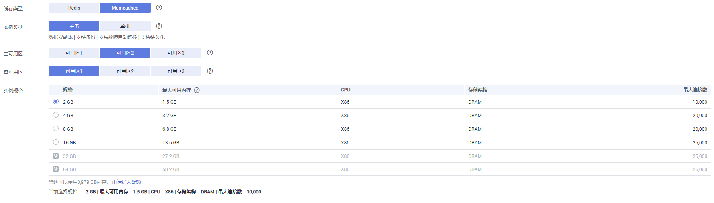
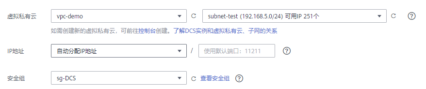

# 购买Memcached实例

您可以根据业务需要购买相应计算能力和存储空间的Memcached实例，同时可购买多个Memcached实例。

## 前提条件

注册华为云后，如果需要对华为云上的资源进行精细管理，请使用IAM服务创建IAM用户及用户组，并授权，以使得IAM用户获得具体的操作权限。具体操作，请参考[权限管理](权限管理.md)。

## 购买Memcached实例

1.  登录[分布式缓存服务管理控制台](https://console.huaweicloud.com/dcs)。
2.  在管理控制台左上角单击，选择区域和项目。

    > **说明：**   
    >此处请选择与您的应用服务相同的区域。  

3.  单击左侧菜单栏的“缓存管理”，进入“缓存管理”页面。
4.  单击“购买缓存实例”，进入购买页面。
5.  选择“计费模式”。
6.  在“区域”下拉列表中，选择靠近你应用程序的区域，可降低网络延时、提高访问速度。
7.  根据[购买前准备](购买前准备.md)，设置以下基本信息；
    1.  在“缓存类型”区域，选择缓存类型。

        本章节单击选择“Memcached”。

    2.  在“实例类型”区域，选择实例类型。

        Memcached只支持“单机”和“主备”实例类型。

    3.  在“可用区”区域，您可根据实际情况选择。

        > **说明：**   
        >如果提高访问速度，可选择和应用同一个可用区；如果提高可靠性，可选择和应用不在同一个可用区。  

        如果“实例类型”选择了主备，页面增加显示“备可用区”参数，您需要在“备可用区”为备实例设置备可用区。

    4.  在“实例规格”区域，选择符合您的规格。

        您的默认配额请以控制台显示为准。

        您如需增加配额，单击规格下方的“申请扩大配额”，即可跳转到工单管理界面提交工单，增加配额。

        配置的实例基本信息，如[图1](#fig442343421020)所示。

        **图 1**  购买Memcached实例  
        

8.  设置实例网络环境信息。
    1.  在“虚拟私有云”区域，选择已经创建好的虚拟私有云、子网、IP。

        支持自动分配IP地址和手动分配IP地址，用户可以输入一个在当前子网下可用的IP。

    2.  在“安全组”下拉列表，可以选择已经创建好的安全组。

        安全组是一组对弹性云服务器的访问规则的集合，为同一个VPC内具有相同安全保护需求并相互信任的弹性云服务器提供访问策略。

        如果选择的安全组没有开放11211端口，页面增加显示“开放11211端口”的复选框并默认勾选，表示实例创建后，会默认放开该实例安全组的11211端口。如果所选的安全组没有放开11211端口，将无法连接到该实例。

        **图 2**  购买Memcached时设置网络环境信息  
        

9.  设置实例密码。
    -   “访问方式”：支持“密码访问”和“免密访问”，您可以设置访问Memcached实例时是否要进行密码验证。

        > **说明：**   
        >-   选择“免密访问”，存在安全风险，请谨慎使用。  
        >-   实例申请成功后，可以通过“重置密码”进行密码重新设置或者修改为免密访问，具体可参考[修改Memcached实例的访问方式](修改Memcached实例的访问方式.md)章节。  
        >-   Memcached密码访问模式下，实例只能使用二进制访问且需要进行SASL鉴权。  

    -   “用户名”：连接Memcached实例的用户名。

        > **说明：**   
        >只有“免密访问”开关为关闭状态时，才会显示该参数。  

        -   名称不能为空。
        -   只能以英文字母开头。
        -   长度为1到64位的字符串。
        -   仅包含英文字母、数字、下划线（\_）和中划线（-）。

    -   “密码”和“确认密码”：只有“免密访问”开关为关闭状态时，才会显示该参数，表示连接Memcached实例的密码。

        > **说明：**   
        >DCS服务出于安全考虑，在密码访问模式下，连接使用Memcached实例时，需要先进行密码认证。请妥善保存密码，并定期更新密码。  

        Memcached实例密码复杂度要求，请参考[DCS账号密码规范](https://support.huaweicloud.com/dcs_faq/dcs-zh-ug-190228001.html)。

10. 设置实例购买时长和数量。
11. 单击“更多配置”，设置实例其他信息，包括备份恢复策略、实例标签等配置。
    1.  设置实例的“名称”和“描述”。

        创建单个实例时，名称长度为4到64位的字符串。批量创建实例时，名称长度为4到56位的字符串，且实例名称格式为“自定义名称-_n_”，其中n从000开始，依次递增。例如，批量创建两个实例，自定义名称为dcs\_demo，则两个实例的名称为dcs\_demo-000和dcs\_demo-001。

    2.  设置企业项目。
    3.  设置实例备份恢复策略。

        只有当实例类型为“主备”时显示该参数。关于实例备份的说明及备份策略的设置请参考[备份与恢复说明](备份与恢复说明.md)。

    4.  设置实例维护时间窗。

        您可以设置DCS服务运维对实例进行维护的时间，可选择22:00-02:00、02:00-06:00、06:00-10:00、10:00-14:00、14:00-18:00和18:00-22:00，在选择的时间段内，则可对实例节点进行维护操作。

    5.  设置“标签”。

        标签用于标识云资源，当您拥有相同类型的许多云资源时，可以使用标签按各种维度（例如用途、所有者或环境）对云资源进行分类。

        -   如果您已经预定义了标签，在“标签键”和“标签值”中选择已经定义的标签键值对。另外，您可以单击右侧的“查看预定义标签”，系统会跳转到标签管理服务页面，查看已经预定义的标签，或者创建新的标签。
        -   您也可以直接在“标签键”和“标签值”中设置标签。

        当前每个DCS实例最多支持设置10个不同标签，标签的命名规格，请参考[管理标签](管理标签.md)章节。

12. 实例信息配置完成后，单击““立即购买”，进入确认页面。

    页面显示申请的分布式缓存服务的实例名称、缓存版本和实例规格等信息。

13. 确认实例信息无误后，提交请求。
14. 缓存实例创建成功后，您可以在“缓存管理”页面，查看并管理自己的缓存实例。
    1.  创建缓存实例大约需要5到15分钟。
    2.  缓存实例创建成功后，默认“状态”为“运行中”。

## 使用API方式购买实例

除了可以在控制台购买实例，您还可以使用API的方式购买缓存实例，具体操作请查看以下链接。

[使用API创建缓存实例](https://support.huaweicloud.com/api-dcs/dcs-zh-api-180423019.html)

