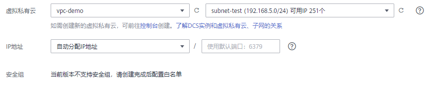

# 购买Redis实例

您可以根据业务需要购买相应计算能力和存储空间的Redis实例，同时可购买多个Redis实例。

> **说明：** 
>DCS Redis3.0已下线，暂停售卖，建议使用Redis4.0/5.0。

## 前提条件

注册华为云后，如果需要对华为云上的资源进行精细管理，请使用IAM服务创建IAM用户及用户组，并授权，以使得IAM用户获得具体的操作权限。具体操作，请参考[权限管理](权限管理.md)。

## 购买Redis实例

1.  登录[分布式缓存服务管理控制台](https://console.huaweicloud.com/dcs)。
2.  在管理控制台左上角单击，选择区域和项目。

    > **说明：** 
    >此处请选择与您的应用服务相同的区域。

3.  单击“购买缓存实例”，进入购买页面。
4.  选择“计费模式”。
5.  在“区域”下拉列表中，选择靠近您应用程序的区域，可降低网络延时、提高访问速度。
6.  根据[购买前准备](购买前准备.md)，设置以下基本信息；
    1.  在“缓存类型”区域，选择缓存实例类型。

        本章节选择“Redis”。

    2.  在“版本号”区域，选择Redis版本。

        当前DCS支持的Redis版本有：3.0、4.0、5.0和企业版Redis6.0。

    3.  在“实例类型”区域，选择单机、主备、Proxy集群、Cluster集群、读写分离实例类型。
    4.  选择“CPU架构”，当前支持“x86计算”和“Arm计算”。
    5.  在“副本数”区域，选择实例副本数，默认为2副本。

        当选择Redis4.0和Redis5.0，且实例类型为主备、Cluster集群时，页面才显示“副本数”。

    6.  如果选择了Cluster集群，页面增加显示“规格选择模式”，选择实例规格。

        快速选择：保持默认实例规格选择。

        自定义分片：自定义每个分片的容量，然后选择实例规格。

    7.  在“可用区”区域，您可根据实际情况选择。

        > **说明：** 
        >如果提高访问速度，可选择和应用同一个可用区。

        如果“实例类型”选择了主备、Proxy集群、Cluster集群，页面增加显示“备可用区”，您需要在“备可用区”为备节点设置备可用区。

    8.  在“实例规格”区域，选择符合您的规格。

        您的默认配额请以控制台显示为准。

        您如需增加配额，单击规格下方的“申请扩大配额”，即可跳转到工单管理界面提交工单，增加配额。

        配置的实例基本信息，如[图1](#fig442343421020)所示。

        **图 1**  购买Redis实例  
        

7.  设置实例网络环境信息。
    1.  在“虚拟私有云”区域，选择已经创建好的虚拟私有云、子网。
    2.  设置实例IP地址。

        Redis3.0、Redis4.0、Redis5.0和企业版Redis6.0，都支持自动分配IP和手动分配IP地址，如果您需要自定义实例IP地址（即内网IP），您需要选择手动分配IP地址。

        如果购买的Redis版本为4.0或5.0，支持自定义端口，自定义端口范围为1\~65535的任意数字；如果未自定义，则使用默认端口6379。

        如果购买的Redis版本为企业版Redis6.0，支持自定义端口，自定义端口范围为1\~65535的任意数字；如果未自定义，则使用默认端口6379。

        如果购买的Redis版本为3.0，不支持自定义端口，端口为6379。

    3.  在“安全组”下拉列表，可以选择已经创建好的安全组。

        安全组是一组对弹性云服务器的访问规则的集合，为同一个VPC内具有相同安全保护需求并相互信任的弹性云服务器提供访问策略。

        Redis4.0和Redis5.0是基于VPCEndpoint，暂不支持安全组，当选择的Reids版本为4.0或5.0，不需要设置实例“安全组”。

        企业版Redis6.0也是基于VPCEndpoint，暂不支持安全组，当选择的Reids版本为6.0时，不需要设置实例“安全组”。

        如果选择的安全组没有开放6379端口，页面增加显示“开放6379端口”的复选框并默认勾选，表示实例创建后，会默认放开该实例安全组的6379端口。如果所选的安全组没有放开6379端口，将无法连接到该实例。

        **图 2**  购买Redis时设置网络环境信息  
        

8.  设置实例密码。
    -   “访问方式”：支持“密码访问”和“免密访问”，您可以设置访问实例时是否要进行密码验证。

        > **说明：** 
        >-   选择免密访问方式时，存在安全风险，请谨慎使用。
        >-   若需要打开“公网访问”开关，您必须选择“密码访问”方式，并设置密码。
        >-   若申请免密模式的Redis实例，申请成功后，可以通过重置密码进行密码设置，具体可参考[修改Redis实例的访问方式](修改Redis实例的访问方式.md)章节。

    -   “密码”和“确认密码”：只有“访问方式”为“密码访问”时，才会显示该参数，表示连接Redis实例的密码。

        > **说明：** 
        >DCS服务出于安全考虑，在密码访问模式下，连接使用Redis实例时，需要先进行密码认证。请妥善保存密码，并定期更新密码。

9.  设置参数配置。

    “参数配置”支持“系统默认”和“使用自定义模板”，您在购买实例时可以设置是否使用自定义参数模板。

    .png)

    > **说明：** 
    >-   目前只有在北京四Region购买实例时，支持设置参数配置，若其他Region也需使用此功能，请您在控制台提交工单，技术人员在后台为您进行开通。
    >-   创建页面参数配置默认使用系统默认参数模板。
    >-   创建页面自定义模板只支持Redis缓存类型，只能选择该版本号和实例类型下的自定义模板。

10. 设置实例购买时长和数量。

    > **说明：** 
    >开启公网访问后，不支持批量创建Redis实例。

11. 单击“更多配置”，设置实例其他信息，包括公网访问、备份恢复策略、重命名高危命令等配置。
    1.  设置实例的“名称”和“描述”。

        创建单个实例时，名称长度为4到64位的字符串。批量创建实例时，名称长度为4到56位的字符串，且实例名称格式为“自定义名称-_n_”，其中n从000开始，依次递增。例如，批量创建两个实例，自定义名称为dcs\_demo，则两个实例的名称为dcs\_demo-000和dcs\_demo-001。

    2.  设置“公网访问”。

        您可以选择是否打开公网访问开关。目前只有Redis3.0实例支持公网访问，其他版本暂不支持。

        -   如果选择了开启，表示访问Redis实例需要通过弹性IP访问。这时页面会显示“弹性IP地址”和“SSL加密”，在“弹性IP地址”区域，您可下拉选择已有的弹性IP。另外，您可单击右侧的“查看弹性IP”，系统会跳转到网络控制台的弹性公网IP页面，查看弹性IP等信息或者创建弹性公网IP。
        -   “SSL加密”：表示开启公网访问功能时，访问Redis实例是否进行SSL加密。

            开启公网访问时，SSL加密默认选中开启。公网访问开启后，该参数不允许再进行修改。

            如果要修改，需要将公网开关暂时关闭，重新执行开启公网访问开关操作，开启时，取消开启SSL加密功能。

    3.  设置企业项目。
    4.  设置实例备份恢复策略。

        只有当实例类型为主备或者集群时显示该参数。关于实例备份的说明及备份策略的设置请参考[备份与恢复说明](备份与恢复说明.md)。

    5.  重命名实例高危命令。

        当购买的是Redis4.0、Redis5.0和企业版Redis6.0实例时，支持重命名高危命令。当前支持的高危命令有command、keys、flushdb、flushall和hgetall，其他命令暂时不支持重命名。

    6.  设置实例维护时间窗。

        设置DCS服务运维对实例进行维护的时间，在维护前，服务运维会提前和您沟通确认。

    7.  设置“标签”。

        标签用于标识云资源，当您拥有相同类型的许多云资源时，可以使用标签按各种维度（例如用途、所有者或环境）对云资源进行分类。

        -   如果您已经预定义了标签，在“标签键”和“标签值”中选择已经定义的标签键值对。另外，您可以单击右侧的“查看预定义标签”，系统会跳转到标签管理服务页面，查看已经预定义的标签，或者创建新的标签。
        -   您也可以直接在“标签键”和“标签值”中设置标签。

        当前每个DCS实例最多支持设置10个不同标签，标签的命名规格，请参考[管理标签](管理标签.md)章节。

12. 实例信息配置完成后，单击“立即购买”，进入规格确认页面。

    页面显示申请的分布式缓存服务的实例名称、缓存版本和实例规格等信息。

13. 确认实例信息无误后，提交请求。
14. 缓存实例创建成功后，您可以在“缓存管理”页面，查看并管理自己的缓存实例。

## 购买实例操作视频

如果需要详细了解购买实例的操作，请单击以下链接观看视频。

[创建缓存实例操作视频](https://support.huaweicloud.com/dcs_video/index.html)

