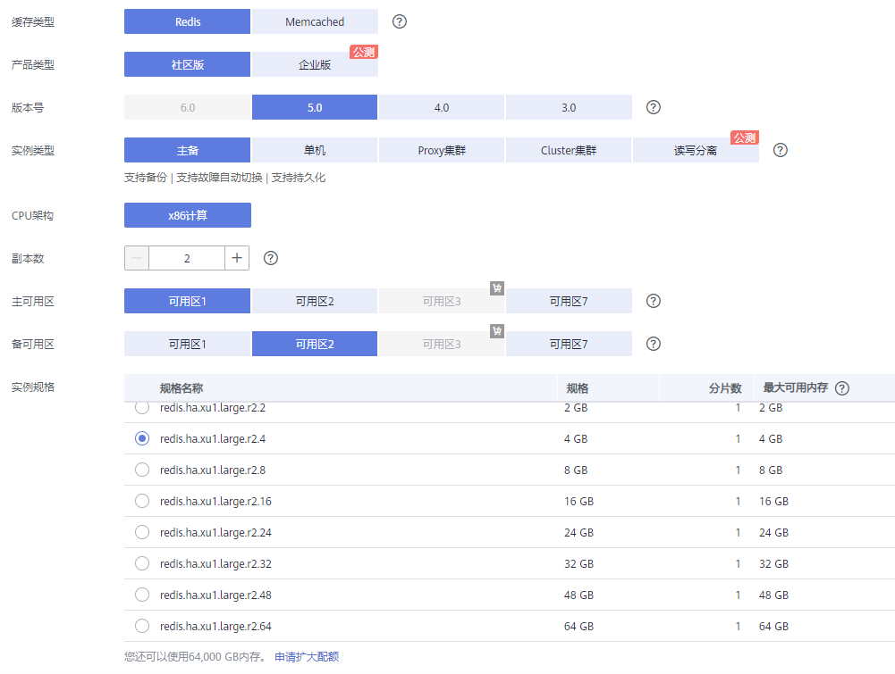

# 购买Redis实例

您可以根据业务需要购买相应计算能力和存储空间的Redis实例，同时可购买多个Redis实例。

> **说明：**   
>高性能版目前仅“华北-北京一”region支持，其他region暂未支持。  

## 准备工作

在购买实例之前，请先根据您的实际业务需要，明确购买需求，完成以下工作：

1.  准备网络环境。
    -   如果您已有VPC，则不需要重新创建，可重复使用。
    -   如果没有VPC，请参考[网络环境准备](网络环境准备.md)创建VPC、安全组和子网。

2.  确定购买的缓存类型。

    在购买前，需要您根据业务情况选择合适的缓存类型，选择了缓存类型后，不支持更改缓存类型。

    -   若要了解Redis、Memcached和IMDG，请参考[DCS Redis、DCS Memcached和IMDG的介绍](https://support.huaweicloud.com/productdesc-dcs/zh-cn_topic_0088428509.html)。
    -   若要了解Redis和Memcached的区别，请参考[Redis与Memcached之间如何选择](https://support.huaweicloud.com/productdesc-dcs/RedisAndMemcachedChoose.html)。

3.  确定产品类型和缓存版本。

    只有缓存类型选择的是Redis，才涉及此操作，如果缓存类型是Memcached和IMDG，则不涉及。

    当前DCS Redis支持“标准版”和“高性能版本”，其中高性能版本使用了华为自研的轻量级LibOS操作系统。不同的Redis版本，特性会不同，可参考[不同Redis版本支持的特性差异说明](https://support.huaweicloud.com/productdesc-dcs/RedisDifference.html)，了解不同版本的Redis。

4.  确定要购买的缓存实例类型，即实例架构。

    确定缓存类型后，需要明确实例架构。实例规格特点和架构，可参考[选择实例架构](https://support.huaweicloud.com/productdesc-dcs/CacheSingleNode.html)。

5.  确定实例规格。

    确定实例架构后，需要明确购买规格大小。实例支持的连接数和内网带宽，可参考[产品规格](https://support.huaweicloud.com/productdesc-dcs/zh-cn_topic_0033568446.html)。

6.  确定选择的区域以及实例是否跨可用区部署。

    选择的区域，建议选择接近您应用程序的区域，减少网络延时，例如，所在城市为中国-广州，可就近选择“华南-广州”。

    一个区域对应多个可用区（AZ），当前DCS支持将主备实例/集群实例部署在不同的AZ内，节点间电力与网络均物理隔离。您可以将应用程序也进行跨AZ部署，从而达到数据与应用全部高可用。

    > **说明：**   
    >-   当主备或者集群Redis实例进行跨可用区部署时，如果其中一个可用区故障，另一个可用区的节点不受影响。备节点会自动升级为主节点，对外提供服务，从而提供更高的容灾能力。  
    >-   由于实例跨可用区部署时网络访问效率略低于部署在同一可用区内，因此Redis实例跨可用区部署时，主备节点之间同步效率会略有降低。  

7.  确定实例是否开启公网访问。

    当前只有DCS Redis3.x的实例支持公网访问，且可选择是否通过SSL方式来访问DCS缓存实例。具体描述，可参考[DCS公网访问说明](https://support.huaweicloud.com/dcs_faq/zh-cn_topic_0033568440.html)。

8.  确定实例是否配置备份策略。

    当前只有主备和集群实例支持配置备份恢复策略。关于备份恢复，可参考[备份与恢复说明](备份与恢复说明.md)。

## 购买Redis实例

1.  登录[分布式缓存服务管理控制台](https://console.huaweicloud.com/dcs)。
2.  在管理控制台左上角单击，选择区域和项目。

    > **说明：**   
    >此处请选择与您的应用服务相同的区域。  

3.  单击“购买缓存实例”，进入购买页面。
4.  选择“计费模式”。单击选择“包年/包月”或者“按需付费”。

    -   “包年/包月”：这种购买方式相对于按需付费提供更大的折扣，对于长期使用者，推荐该方式。
    -   “按需付费”：这种购买方式比较灵活，可以即开即停，DCS实例从“开通”开启计费到“关闭”或“删除”结束计费，以秒为单位统计时长，按实际使用时长计费。

    当前支持“按需付费”转换为“包年/包月”，即转包周期。如果您选择了“按需付费”，可以申请转换为“包年/包月”，具体操作可参考[转包周期](转包周期.md)。

5.  在“区域”下拉列表中，选择靠近您应用程序的区域，可降低网络延时、提高访问速度。
6.  设置实例的“名称”和“描述”。

    实例的名称，必须符合以下要求：

    -   名称不能为空。
    -   只能以英文字母开头。
    -   创建单个实例时，名称长度为4到64位的字符串。批量创建实例时，名称长度为4到56位的字符串，且实例名称格式为“自定义名称-_n_”，其中n从000开始，依次递增。例如，批量创建两个实例，自定义名称为dcs\_demo，则两个实例的名称为dcs\_demo-000和dcs\_demo-001。
    -   仅包含英文字母、数字、下划线（\_）和中划线（-）。

7.  根据购买前的[准备工作](#section1262819220505)，设置以下基本信息；
    1.  在“缓存类型”区域，选择缓存实例类型。

        本章节选择“Redis”。

    2.  在“产品类型”区域，选择实例的产品类型。

        Redis缓存实例，支持“标准版”和“高性能版”。

        如果“计费模式”为“包年/包月”，则支持“标准版”。“计费模式”为“按需付费”，才可以选择“高性能版”。

    3.  在“版本号”区域，选择Redis版本。

        当前DCS支持的Redis版本有：3.x、4.x和5.x。

    4.  在“实例类型”区域，选择单机或主备或集群实例类型。

        > **说明：**   
        >-   如果是Redis3.x实例，实例类型为“单机”、“主备”、“Proxy集群”。  
        >-   如果是Redis4.x和Redis5.x实例，实例类型为“单机”、“主备”、“Redis Cluster集群”。  

    5.  在“可用区”区域，您可根据实际情况选择。

        > **说明：**   
        >如果提高访问速度，可选择和应用同一个可用区。如果提高可靠性，可选择和应用不在同一个可用区。  

        如果“实例类型”选择了主备或集群，页面增加显示“跨可用区部署”，您可以选择是否打开跨可用区部署开关。

        如果打开了跨可用区部署开关，页面增加显示“备可用区”，您需要在“备可用区”为备实例设置备可用区。

    6.  在“实例规格”区域，选择符合您的规格。

        您的默认配额请以控制台显示为准。

        您如需增加配额，单击规格下方的“申请扩大配额”，即可跳转到工单管理界面提交工单，增加配额。

        配置的实例基本信息，如[图1](#fig442343421020)所示。

        **图 1**  购买Redis实例  
        

8.  设置实例网络环境信息。
    1.  在“虚拟私有云”下拉列表，选择已经创建好的虚拟私有云。
        -   虚拟私有云可以为您的Redis实例构建隔离的、能自主配置和管理的虚拟网络环境。
        -   您可单击右侧的“查看虚拟私有云”，系统跳转到虚拟私有云界面，选择相应的虚拟私有云，可以查看安全组的出方向规则和入方向规则。

    2.  在“子网”下拉列表，选择已经创建好的子网。

        您可以单击右侧的“查看子网”，系统跳转到网络控制台页面，查看对应子网的私有IP地址等信息。

    3.  在“IP地址”区域，您可以选择“自动分配”和“手动指定”。

        当选择的Reids版本为4.x或5.x，页面不显示该参数，只有Redis版本为3.x时才需要设置实例“IP地址”。

        -   “自动分配”：系统随机分配当前子网下的可用IP。
        -   “手动指定”：选择该项，系统会显示一个输入IP地址输入框，您可以自己输入一个在当前子网下可用的IP，同时，也可以单击右侧的“查看已使用的IP地址”，系统弹出“查看已使用的IP地址”页面，您可以查看当前子网下的IP使用情况。

    4.  在“安全组”下拉列表，可以选择已经创建好的安全组。

        当选择的Reids版本为4.x或5.x，页面不显示该参数，只有Redis版本为3.x时才需要设置实例“安全组”。

        安全组是一组对弹性云服务器的访问规则的集合，为同一个VPC内具有相同安全保护需求并相互信任的弹性云服务器提供访问策略。

        **图 2**  购买Redis时设置网络环境信息  
        

9.  设置“公网访问”。

    您可以选择是否打开公网访问开关。

    -   如果选择了开启，表示访问Redis实例需要通过弹性IP访问。这时页面会显示“弹性IP地址”和“SSL加密”，在“弹性IP地址”区域，您可下拉选择已有的弹性IP。另外，您可单击右侧的“查看弹性IP”，系统会跳转到网络控制台的弹性公网IP页面，查看弹性IP等信息或者购买弹性公网IP。
    -   “SSL加密”：表示开启公网访问功能时，访问Redis实例是否进行SSL加密。

        公网访问开启后，该参数不允许再进行修改。

10. 设置实例密码。
    -   “免密访问”：是一个免密访问的开关。您可以设置访问实例时是否要进行密码验证。

        > **说明：**   
        >-   打开免密开关，免密模式访问实例，存在安全风险，请谨慎使用。  
        >-   若打开了“公网访问”开关，必须设置密码。  
        >-   若申请免密模式的Redis实例，申请成功后，可以通过重置密码进行密码设置，具体可参考[开启Redis实例的免密访问](开启Redis实例的免密访问.md)章节。  

    -   “密码”和“确认密码”：只有“免密访问”开关为关闭状态时，才会显示该参数，表示连接Redis实例的密码。

        > **说明：**   
        >DCS服务出于安全考虑，在密码访问模式下，连接使用Redis实例时，需要先进行密码认证。请妥善保存密码，并定期更新密码。  

        Redis实例密码复杂度要求，请参考[DCS账号密码规范](https://support.huaweicloud.com/dcs_faq/dcs-zh-ug-190228001.html)。

11. 设置实例维护时间窗。

    您可以设置华为服务运维对实例进行维护的时间，可选择22:00-02:00、02:00-06:00、06:00-10:00、10:00-14:00、14:00-18:00和18:00-22:00，在选择的时间段内，则可对实例节点进行维护操作。

12. 设置实例备份恢复策略。

    只有当实例类型为“主备”或者“集群”时显示该参数。关于实例备份的说明及备份策略的设置请参考[备份与恢复说明](备份与恢复说明.md)。

13. 设置实例购买时长和数量。

    -   选择“包年/包月”付费模式时购买量包括使用时长和实例个数。

        购买的时长。您可选择1个月、2个月、3个月、4个月、5个月、6个月、7个月、8个月、9个月、1年、2年和3年。

        同时您可勾选“自动续费”，如果是包月，自动续费周期为1个月； 如果是包年，自动续费周期为1年。

    -   选择“按需付费”时购买量指购买缓存实例个数。

    > **说明：**   
    >开启公网访问后，不支持批量创建Redis实例。  

14. 确定实例的信息和“配置费用”后，单击“立即购买”，进入确认页面。

    页面显示申请的分布式缓存服务的实例名称、缓存版本和实例规格等信息。

15. 确认实例信息无误后，提交请求。
    -   如果选择“包年/包月”，单击“去支付”，进入付款页面，完成付款后即可创建实例。

        如果暂不确定，可关闭页面，暂不支付，稍后可在“费用 \> 我的订单”中支付或取消订单。

    -   如果选择“按需付费”，单击“提交”，开始创建实例。

16. 缓存实例创建成功后，您可以在“缓存管理”页面，查看并管理自己的缓存实例。
    1.  如果是创建标准版实例，单机和主备实例大约需要5到15分钟，如果集群实例，则需要大约30分钟；如果是高性能版实例，则只需要8秒。
    2.  缓存实例创建成功后，默认“状态”为“运行中”。
        -   对于“按需付费”模式的实例，如果创建缓存实例失败，可参考[删除缓存实例](删除缓存实例.md)，删除创建失败的缓存实例，然后重新购买。如果重新购买仍然失败，请联系客服。
        -   对于“包年/包月”模式的实例，有如下约束：
            -   付款成功后，才会创建缓存实例。
            -   如果创建缓存实例失败，可能是因为资源开通失败导致。您可以联系客服取消订单，然后到“费用 \> 我的订单”中执行退订操作。

## 购买实例操作视频

如果需要详细了解购买实例的操作，请单击以下链接观看视频。

[创建缓存实例操作视频](https://support.huaweicloud.com/dcs_video/index.html)

## 使用API方式购买实例

除了可以在控制台购买实例，您还可以使用API的方式购买缓存实例，具体操作请查看以下链接。

[使用API创建缓存实例](https://support.huaweicloud.com/api-dcs/dcs-zh-api-180423019.html)

## 有关购买Redis实例的常见问题

-   [DCS的不同Redis版本支持的特性差异说明](https://support.huaweicloud.com/dcs_faq/dcs-zh-ug-190117011.html)
-   [创建DCS实例时页面为什么无法自动获取子网和安全组等信息？](https://support.huaweicloud.com/dcs_faq/dcs-zh-ug-180703001.html)
-   [如何选择和配置安全组](https://support.huaweicloud.com/dcs_faq/zh-cn_topic_0082442607.html)
-   [DCS实例是否支持跨AZ？跨AZ有什么影响？](https://support.huaweicloud.com/dcs_faq/dcs-zh-ug-190117012.html)

## 相关产品及文档

<table><thead align="left"><tr id="rb27d733848ce4e7a9386965803595f1b"><th class="cellrowborder" valign="top" width="50%" id="mcps1.1.3.1.1">
相关产品

</th>
<th class="cellrowborder" valign="top" width="50%" id="mcps1.1.3.1.2">
相关文档

</th>
</tr>
</thead>
<tbody><tr id="re4588baf45714b4f80c021cca1290879"><td class="cellrowborder" valign="top" width="50%" headers="mcps1.1.3.1.1 ">
<a href="https://www.huaweicloud.com/product/dcs.html?infodocbz" target="_blank" rel="noopener noreferrer">分布式缓存 Redis</a>

<a href="https://www.huaweicloud.com/product/dcsmem.html?infodocbz" target="_blank" rel="noopener noreferrer">分布式缓存 Memcached</a>

<a href="https://www.huaweicloud.com/product/ecs.html?infodocbz" target="_blank" rel="noopener noreferrer">弹性云服务器 ECS</a>

<a href="http://www.huaweicloud.com/product/vpc.html?infodocbz" target="_blank" rel="noopener noreferrer">虚拟私有云 VPC</a>

</td>
<td class="cellrowborder" valign="top" width="50%" headers="mcps1.1.3.1.2 ">
<a href="https://support.huaweicloud.com/usermanual-dcs/dcs-zh-ug-180315001.html?infodocbz" target="_blank" rel="noopener noreferrer">购买Redis实例</a>

<a href="https://support.huaweicloud.com/usermanual-dcs/zh-cn_topic_0082114847.html?infodocbz" target="_blank" rel="noopener noreferrer">连接Redis实例</a>

<a href="https://support.huaweicloud.com/usermanual-dcs/zh-cn_topic_0061845451.html?infodocbz" target="_blank" rel="noopener noreferrer">变更缓存实例规格</a>

<a href="https://support.huaweicloud.com/usermanual-dcs/zh-cn_topic_0079545637.html?infodocbz" target="_blank" rel="noopener noreferrer">缓存实例备份恢复</a>

<a href="https://support.huaweicloud.com/migration-dcs/zh-cn_topic_0078784423.html?infodocbz" target="_blank" rel="noopener noreferrer">缓存实例数据迁移</a>

</td>
</tr>
</tbody>
</table>

