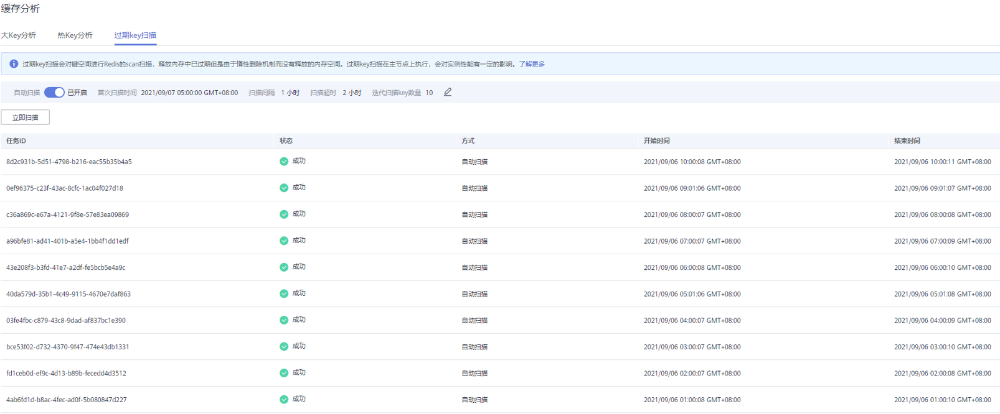

# 过期key扫描

在Redis的键空间中，有两种删除Key的方式。

-   使用DEL等命令直接显式对Key进行删除。
-   使用类似于EXPIRE等命令对Key设置过期时间，当达到过期时间时，Redis键空间中的Key将不可访问。对于设置了过期时间的Key，当达到过期时间时，Redis不会立即对Key进行删除，由于Redis当前主线程仍然为单线程，故Redis设计了几种机制对已经过期的Key进行内存释放：
    -   惰性删除：Redis的删除策略由主循环中的判断逻辑进行控制，所有Key读写命令执行之前都会调用函数对其进行检查，如果过期，则删除该键，然后返回Key不存在的结果；未过期则不做操作，继续执行原有的命令。

    -   定期删除：由Redis的定时任务函数实现，该函数以一定的频率运行，每次运行时，都从键空间中取出一定数量的随机Key进行检查，并删除其中的过期键。

        > **说明：** 
        >不是每次定时任务都会检查所有的Key，而是随机检查一定数量的Key，该机制旨在防止阻塞Redis主进程太久而造成业务阻塞，所以会造成已过期的Key释放内存速度较慢。

基于Redis以上机制，华为云分布式缓存服务提供了一种通用的方式，来定时释放所有已经过期Key占用的内存，通过自行配置定时任务，在任务执行期间，会对所有缓存实例的主节点进行扫描操作，扫描操作会遍历整个实例的键空间，触发Redis引擎中对Key过期的判断，从而释放已过期的Key。

> **说明：** 
>只有Redis 4.0、Redis 5.0实例支持过期key扫描。

## 操作步骤

1.  登录[分布式缓存服务管理控制台](https://console.huaweicloud.com/dcs)。
2.  在管理控制台左上角单击，选择区域和项目。

    > **说明：** 
    >此处请选择与您的应用服务相同的区域。

3.  单击左侧菜单栏的“缓存管理”，进入实例信息页面。
4.  单击需要缓存分析的Redis实例名称，进入该实例的基本信息页面。
5.  选择“分析与诊断 \> 缓存分析”进入缓存分析页面。
6.  单击“过期key扫描”，您可以通过单击“立即扫描”对实例立即进行过期key扫描也可设置定时任务，到设定时间便会自动扫描。
7.  当过期key扫描任务提交后，可以在任务列表查看提交的任务。

    **图 1**  过期key扫描任务列表  
    

> **说明：** 
>-   扫描失败的情况分两种：
>    -   一种是出现异常导致扫描失败。
>    -   另一种是扫描超时导致失败，可能是key数量太多，未能在超时时间内扫描完，也会失败，但其实已经删除了部分key了。

## 自动扫描参数配置

在执行过期key扫描时，若您想设置自动扫描，单击“自动扫描”右侧的，弹出“自动扫描设置”页面，进行相应设置后，单击“确定”自动扫描配置完成。

自动扫描配置参数说明如下[表1](#table74477042711)。

**表 1**  自动扫描配置参数

<table><thead align="left"><tr id="row16447800274"><th class="cellrowborder" valign="top" width="20%" id="mcps1.2.6.1.1">
配置参数

</th>
<th class="cellrowborder" valign="top" width="20%" id="mcps1.2.6.1.2">
参数含义

</th>
<th class="cellrowborder" valign="top" width="20%" id="mcps1.2.6.1.3">
取值范围

</th>
<th class="cellrowborder" valign="top" width="20%" id="mcps1.2.6.1.4">
默认值

</th>
<th class="cellrowborder" valign="top" width="20%" id="mcps1.2.6.1.5">
备注

</th>
</tr>
</thead>
<tbody><tr id="row18448805277"><td class="cellrowborder" valign="top" width="20%" headers="mcps1.2.6.1.1 ">
首次扫描时间

</td>
<td class="cellrowborder" valign="top" width="20%" headers="mcps1.2.6.1.2 ">
设定的第一次扫描时间，须设定在当前时间之后。

</td>
<td class="cellrowborder" valign="top" width="20%" headers="mcps1.2.6.1.3 ">
取值格式：yyyy/MM/dd hh:mm:ss

</td>
<td class="cellrowborder" valign="top" width="20%" headers="mcps1.2.6.1.4 ">
-

</td>
<td class="cellrowborder" valign="top" width="20%" headers="mcps1.2.6.1.5 ">
-

</td>
</tr>
<tr id="row6448102270"><td class="cellrowborder" valign="top" width="20%" headers="mcps1.2.6.1.1 ">
扫描间隔

</td>
<td class="cellrowborder" valign="top" width="20%" headers="mcps1.2.6.1.2 ">
从首次扫描时间开始，每隔一个间隔时间，便启动一次扫描。

</td>
<td class="cellrowborder" valign="top" width="20%" headers="mcps1.2.6.1.3 ">
0~43,200，单位：分

</td>
<td class="cellrowborder" valign="top" width="20%" headers="mcps1.2.6.1.4 ">
1440

</td>
<td class="cellrowborder" valign="top" width="20%" headers="mcps1.2.6.1.5 "><ul id="ul1816717521932"><li>如果到达启动时刻，上一次扫描还未结束，则本次轮空。</li><li>启动扫描的时机有五分钟冗余量，即超过本次启动时刻，不足五分钟，仍然会启动，不至于轮空。
 说明： 

连续扫描可能使cpu占用率较高，建议根据实例中key总量以及key增长情况来配置，可参考下面性能说明和配置建议。

</li></ul>
</td>
</tr>
<tr id="row2044810014273"><td class="cellrowborder" valign="top" width="20%" headers="mcps1.2.6.1.1 ">
扫描超时

</td>
<td class="cellrowborder" valign="top" width="20%" headers="mcps1.2.6.1.2 ">
此参数的目的在于避免不可知原因造成的扫描超时，导致后面的定时任务无法执行。设定此参数，超过超时时间后，返回失败，以便能继续进行下一轮扫描。

</td>
<td class="cellrowborder" valign="top" width="20%" headers="mcps1.2.6.1.3 ">
1~86,400，单位：分

</td>
<td class="cellrowborder" valign="top" width="20%" headers="mcps1.2.6.1.4 ">
2880

</td>
<td class="cellrowborder" valign="top" width="20%" headers="mcps1.2.6.1.5 "><ul id="ul186674312413"><li>时间不少于扫描间隔时间的2倍。</li><li>可根据每次过期key扫描的时间，以及使用场景所能承受的最大超时时间，设定一个经验值。</li></ul>
</td>
</tr>
<tr id="row144488082711"><td class="cellrowborder" valign="top" width="20%" headers="mcps1.2.6.1.1 ">
迭代扫描key数量

</td>
<td class="cellrowborder" valign="top" width="20%" headers="mcps1.2.6.1.2 ">
SCAN命令用于迭代当前数据库中的key集合。 COUNT选项的作用就是让用户告知迭代命令， 在每次迭代中应该从数据集里返回多少元素。具体参见<a href="http://redis.cn/commands/scan.html" target="_blank" rel="noopener noreferrer">scan命令介绍</a>。迭代式扫描可降低一次扫描过多key而造成扫描时间过长，影响redis性能的问题。

</td>
<td class="cellrowborder" valign="top" width="20%" headers="mcps1.2.6.1.3 ">
10~1,000，单位：个

</td>
<td class="cellrowborder" valign="top" width="20%" headers="mcps1.2.6.1.4 ">
10

</td>
<td class="cellrowborder" valign="top" width="20%" headers="mcps1.2.6.1.5 ">
举例：redis中有1000万个key，迭代扫描key数量设为1000，则迭代10000次可完成全库扫描。

</td>
</tr>
</tbody>
</table>

**性能说明：**

-   数据面底层SCAN扫描间隔5ms，相当于1秒钟扫描200次。迭代扫描key数量设为10/100/1000时，每秒钟扫描2000/20000/200000个key。
-   每秒钟扫描key数量越大，cpu占用率也相应增加。

**测试参考：**

主备实例测试，若有1000万不过期和500万过期的key，过期时间为1-10秒场景下，扫描完一遍。

-   自然删除，1万条每秒，删除500万过期key需要8分钟，cpu占用率约为5%。
-   “迭代扫描key数量”设为10，耗时约为 1500万/0.2万/60秒 = 125分，cpu占用率约为8%。
-   “迭代扫描key数量”设为100，耗时约为 1500万/2万/60秒 = 12.5分， 删除key时cpu占用率约20%。
-   “迭代扫描key数量”设为1000，耗时约为 1500万/20万/60秒 = 1.25分，删除key时cpu占用率约为25%。

**建议配置**：

-   您可根据实例中key总量以及key增长情况，来配置迭代扫描key数量和扫描间隔。
-   如测试参考中，1500万key总量，“迭代扫描key数量”设为10，扫完一遍需约125分，那么间隔建议设置4小时以上。
-   如果希望提高扫描速度，那么可以将“迭代扫描key数量”设为100，扫完一遍需约12.5分，那么间隔建议设置30分钟以上。
-   迭代扫描key数量越大，扫描速度越快，cpu占用率也相应增加，用户要平衡耗时和cpu占用率。
-   如果过期key数量增长速度不快，可以一天执行一次过期key扫描。

    > **说明：** 
    >可以将扫描开始时间设置为业务低峰期。将扫描间隔设为1天，超时时间设为2天。

