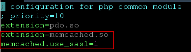

# 连接Memcached实例<a name="zh-cn_topic_0082114845"></a>

任何兼容Memcached协议的客户端都可以连接Memcached实例。您可以根据自身应用特点选用合适的Memcached客户端。

## 前提条件<a name="section14501642174811"></a>

-   已成功申请Memcached实例，且状态为“运行中”。
-   使用Telnet客户端连接Memcached实例时，需要开启免密访问模式，若未开启请参考[开启Memcached实例的免密访问](开启Memcached实例的免密访问.md)。其他客户端密码模式和免密模式都支持。
-   已创建弹性云服务器，并已安装好客户端。创建弹性云服务器的方法，请参见《弹性云服务器用户指南》。

    > **说明：**   
    >您创建的弹性云服务器必须与Memcached实例属于同一个VPC，并配置相同的安全组，以确保弹性云服务器与缓存实例的网络是连通的。  
    >如果弹性云服务器与Memcached实例不在相同VPC中，可以通过建立VPC对等连接方式连通网络，具体请参考常见问题：[缓存实例是否支持跨VPC访问？](https://support.huaweicloud.com/dcs_faq/dcs-zh-ug-180312006.md)  
    >如果弹性云服务器与Memcached实例配置了不同的安全组，可以通过设置安全组规则连通网络，具体请参考常见问题：[如何选择和配置安全组？](https://support.huaweicloud.com/dcs_faq/zh-cn_topic_0082442607.html)  


-   建议在使用本手册时删除示例代码中的所有注释信息。
-   请确保所有命令行、代码块输入格式都是UTF-8，否则会出现编译出错或者运行失败的情况。

## **Telnet客户端示例**<a name="section10709163710106"></a>

Telnet客户端只支持连接免密访问模式下的Memcached实例，此时只支持二进制协议。若未开启请参考[开启Memcached实例的免密访问](开启Memcached实例的免密访问.md)。

1.  登录[分布式缓存服务管理控制台](https://console.huaweicloud.com/dcs)。
2.  在管理控制台左上角单击，选择区域和项目。

    > **说明：**   
    >此处请选择与租户的应用服务相同的区域。  

3.  单击左侧菜单栏的“缓存管理”，进入缓存实例信息页面。
4.  <a name="li7304143"></a>单击需要使用的其中一个Memcached实例的名称，进入该Memcached实例的基本信息页面。查看并获取该Memcached实例的IP地址/域名和端口。
5.  连接Memcached实例。
    1.  登录已创建的弹性云服务器。
    2.  执行如下命令，确认是否已安装Telnet客户端。

        **_which telnet_**

        若界面显示Telnet客户端所在目录，表示当前云服务器已安装Telnet客户端。否则请自行安装Telnet客户端。

        > **说明：**   
        >在Windows系统中，可通过“控制面板 \> 程序 \> 打开或关闭Windows功能”，找到并打开“Telnet客户端”功能。  

    3.  执行如下命令，连接并使用Memcached实例。

        _**telnet \{ip or domain name\} \{port\}**_

        其中\{ip or domain name\} 为Memcached实例的IP地址/域名，\{port\}为Memcached实例的端口。IP地址/域名和端口获取方法请参考步骤[4](#li7304143)，请按实际情况修改后执行。

        界面提示如下表示连接缓存实例成功。

        ```
        Trying XXX.XXX.XXX.XXX...
        Connected to XXX.XXX.XXX.XXX.
        Escape character is '^]'.
        ```

        使用示例如下（其中set和get两行为输入的命令，其他为命令返回内容）：

        ```
        set hello 0 0 6
        world!
        STORED
        get hello
        VALUE hello 0 6
        world!
        END
        ```


## **Java客户端示例**<a name="section39831643171118"></a>

-   用户的弹性云服务器已安装好Java JDK和常用的IDE（如Eclipse）。
-   已获取[spymemcached-x.y.z.jar](http://central.maven.org/maven2/net/spy/spymemcached)依赖包。

    > **说明：**   
    >其中x.y.z为依赖包的版本号，建议获取最新版本。  


1.  <a name="li11825141112015"></a>获取Memcached实例的IP/域名和端口。
    1.  登录[分布式缓存服务管理控制台](https://console.huaweicloud.com/dcs)。
    2.  在管理控制台左上角单击，选择区域和项目。

        > **说明：**   
        >此处请选择与租户的应用服务相同的区域。  

    3.  单击左侧菜单栏的“缓存管理”，进入缓存实例信息页面。
    4.  单击需要使用的其中一个Memcached实例的名称，进入该Memcached实例的基本信息页面。查看并获取该Memcached实例的IP地址/域名和端口。

2.  将已获取的spymemcached-x.y.z.jar依赖包上传到已创建的弹性云服务器。
3.  登录弹性云服务器。
4.  在Eclipse中创建一个Java工程，并将spymemcached-x.y.z.jar依赖包导入，工程名可自定义。
5.  新建一个ConnectMemcached1类，将如下Java代码复制到类中并修改代码。
    -   密码模式代码示例

        其中ip or domain name:port需要修改为[1](#li11825141112015)获取的Memcached实例IP地址/域名和端口。userName和password需要修改为Memcached实例的用户名和密码。

        ```
        //java 连接加密的Memcached代码
        import java.io.IOException;
        import java.util.concurrent.ExecutionException;
        
        import net.spy.memcached.AddrUtil;
        import net.spy.memcached.ConnectionFactoryBuilder;
        import net.spy.memcached.ConnectionFactoryBuilder.Protocol;
        import net.spy.memcached.MemcachedClient;
        import net.spy.memcached.auth.AuthDescriptor;
        import net.spy.memcached.auth.PlainCallbackHandler;
        import net.spy.memcached.internal.OperationFuture;
        
        public class ConnectMemcached1
        {
            public static void main(String[] args)
            {
                final String connectionaddress = "ip or domain name:port"; 
                final String username = "userName";//用户名
                final String password = "password";//密码
                MemcachedClient client = null;
                try
                {
                    AuthDescriptor authDescriptor =
                        new AuthDescriptor(new String[] {"PLAIN"}, new PlainCallbackHandler(username,
                                password));
                    client = new MemcachedClient(
                            new ConnectionFactoryBuilder().setProtocol(Protocol.BINARY)
                                    .setAuthDescriptor(authDescriptor)
                                    .build(),
                            AddrUtil.getAddresses(connectionaddress));
                    String key = "memcached";//向Memcached中存一个key为"memcached"的数据
                    String value = "Hello World";//value为Hello World
                    int expireTime = 5; // 过期时间，单位s; 从写入时刻开始计时，超过expireTime s后，该数据过期失效，无法再读出；
                    doExcute(client, key, value, expireTime);//执行操作
                }
                catch (IOException e)
                {
                    e.printStackTrace();
                }
            }
        
            /**
             *向Memcached写数据方法
             */
            private static void doExcute(MemcachedClient client, String key, String value, int expireTime)
            {
                try
                {
                    OperationFuture<Boolean> future = client.set(key, expireTime, value);
                    future.get();// spymemcached set()是异步的，future.get() 等待cache.set()操作结束，也可以不等待，用户根据自己需求选择;
                    System.out.println("Set操作成功");
                    System.out.println("Get操作:" + client.get(key));
                    Thread.sleep(6000);//等待6000毫秒，即6秒，该数据将会过期失效，无法再读出
                    System.out.println("6秒后再执行Get操作:" + client.get(key));
        
                }
                catch (InterruptedException e)
                {
                    e.printStackTrace();
                }
                catch (ExecutionException e)
                {
                    e.printStackTrace();
                }
                if (client != null)
                {
                    client.shutdown();
                }
            }
        }
        ```


    -   免密模式代码示例

        其中ip or domain name:port需要修改为[1](#li11825141112015)获取的Memcached实例IP地址/域名和端口。

        ```
        //java 连接免密的Memcached代码
        import java.io.IOException;
        import java.util.concurrent.ExecutionException;
        
        import net.spy.memcached.AddrUtil;
        import net.spy.memcached.BinaryConnectionFactory;
        import net.spy.memcached.MemcachedClient;
        import net.spy.memcached.internal.OperationFuture;
        
        public class ConnectMemcached
        {
            public static void main(String[] args)
            {
                final String connectionaddress = "ip or domain name:port"; 
                MemcachedClient client = null;
                try
                {
                    client = new MemcachedClient(new BinaryConnectionFactory(), AddrUtil.getAddresses(connectionaddress));
                    String key = "memcached";//向Memcached中存一个key为"memcached"的数据
                    String value = "Hello World";//value为Hello World
                    int expireTime = 5; // 过期时间，单位s; 从写入时刻开始计时，超过 expireTime s后，该数据过期失效，无法再读出；
                    doExcute(client, key, value, expireTime);//执行操作
                }
                catch (IOException e)
                {
                    e.printStackTrace();
                }
            }
        
            /**
             *向Memcached写数据方法
             */
            private static void doExcute(MemcachedClient client, String key, String value, int expireTime)
            {
                try
                {
                    OperationFuture<Boolean> future = client.set(key, expireTime, value);
                    future.get();// spymemcached set()是异步的，future.get() 等待cache.set()操作结束，也可以不等待，用户根据自己需求选择;
                    System.out.println("Set操作成功");
                    System.out.println("Get操作:" + client.get(key));
                    Thread.sleep(6000);//等待6000毫秒，即6秒，该数据将会过期失效，无法再读出
                    System.out.println("6秒后再执行Get操作:" + client.get(key));
        
                }
                catch (InterruptedException e)
                {
                    e.printStackTrace();
                }
                catch (ExecutionException e)
                {
                    e.printStackTrace();
                }
                if (client != null)
                {
                    client.shutdown();
                }
            }
        }
        ```


6.  运行main方法，在Eclipse下的Console窗口可以看到如下结果。

    ```
    Set操作成功
    Get操作:Hello World
    6秒后再执行Get操作:null
    ```


## **Python客户端示例**<a name="section16774173023520"></a>

-   用户的弹性云服务器已安装好Python，建议为2.7.6或更高版本。
-   已获取[<u>python-binary-memcached-x.y.z.zip</u>](https://github.com/jaysonsantos/python-binary-memcached/releases)依赖包。

    > **说明：**   
    >其中x.y.z为依赖包的版本号，建议获取最新版本。  


1.  <a name="li122821753153715"></a>获取Memcached实例的IP地址/域名和端口。
    1.  登录[分布式缓存服务管理控制台](https://console.huaweicloud.com/dcs)。
    2.  在管理控制台左上角单击，选择区域和项目。

        > **说明：**   
        >此处请选择与租户的应用服务相同的区域。  

    3.  单击左侧菜单栏的“缓存管理”，进入缓存实例信息页面。
    4.  单击需要使用的其中一个Memcached实例的名称，进入该Memcached实例的基本信息页面。查看并获取该Memcached实例的IP地址/域名和端口。

2.  将已获取的python-binary-memcached-x.y.z.zip依赖包上传到已创建的弹性云服务器，假设下载得到的包名为python-binary-memcached-x.y.z.zip。
3.  登录弹性云服务器。
4.  执行如下命令安装依赖包。

    **unzip** **-xzvf python-binary-memcached-x.y.z.zip**

    **cd python-binary-memcached-x.y.z**

    **python setup.py install**

    > **说明：**   
    >如以上步骤安装报错，可使用apt或yum方式安装依赖包，如apt方式安装的具体命令如下：  
    >**apt install python-pip;**  
    >**pip install python-binary-memcached;**  

5.  新建Python文件如dcs\_test.py，将如下Python代码复制到dcs\_test.py文件并修改代码。
    -   密码模式代码示例

        其中ip or domain name:port需要修改为[1](#li122821753153715)获取的Memcached实例IP地址/域名和端口。userName和password需要修改为Memcached实例的用户名和密码。

        ```
        import bmemcached
        client = bmemcached.Client(('ip or domain name:port'), 'userName', 'password')
        print "set('key', 'hello world!')"
        print client.set('key', 'hello world!')
        print "get('key')"
        print client.get('key')
        ```

    -   免密模式代码示例

        其中ip or domain name:port需要修改为[1](#li122821753153715)获取的Memcached实例IP地址/域名和端口。

        ```
        import bmemcached
        client = bmemcached.Client('ip or domain name:port')
        print "set('key', 'hello world!')"
        print client.set('key', 'hello world!')
        print "get('key')"
        print client.get('key')
        ```


6.  运行dcs\_test.py文件，可以看到如下结果。

    ```
    # python test.py 
    set('key', 'hello world!')
    True
    get('key')
    hello world!
    ```


## **C++客户端示例**<a name="section15431539195717"></a>

-   用户的弹性云服务器已安装好GCC，建议为4.8.4或更高版本。
-   已获取[l](https://launchpad.net/libmemcached/+download)[ibmemcached-x.y.z.tar.gz](https://launchpad.net/libmemcached/+download)依赖包。

    > **说明：**   
    >其中x.y.z为依赖包的版本号，建议获取最新版本。  


1.  <a name="li134451239105715"></a>获取Memcached实例的IP地址/域名和端口。
    1.  登录[分布式缓存服务管理控制台](https://console.huaweicloud.com/dcs)。
    2.  在管理控制台左上角单击，选择区域和项目。

        > **说明：**   
        >此处请选择与租户的应用服务相同的区域。  

    3.  单击左侧菜单栏的“缓存管理”，进入缓存实例信息页面。
    4.  单击需要使用的其中一个Memcached实例的名称，进入该Memcached实例的基本信息页面。查看并获取该Memcached实例的IP地址/域名和端口。

2.  将已获取的libmemcached-x.y.z.tar.gz依赖包上传到已创建的弹性云服务器。
3.  登录弹性云服务器。
4.  安装sasl相关依赖包。

    debian类系统：**apt install libsasl2-dev cloog.ppl**

    Redhat类系统：  **yum install cyrus-sasl\***

5.  执行如下命令安装依赖包。

    _**tar -xzvf libmemcached-x.y.z.tar.gz**_

    **_cd libmemcached-x.y.z_**

    **_./configure --enable-sasl_**

    **_make_**

    **_make install_**

6.  新建build.sh文件，将如下代码复制到build.sh文件。

    ```
    g++ -o dcs_sample dcs_sample.cpp -lmemcached -std=c++0x -lpthread -lsasl2
    ```

    > **说明：**   
    >编译如果报错找不到libmemcached.so.11文件，请用find命令找到此文件，并将其拷贝到/usr/lib目录下。  

7.  新建dcs\_sample.cpp文件，将如下C++代码复制到dcs\_sample.cpp文件并修改代码。
    -   密码模式代码示例

        其中ip or domain name和port需要修改为[1](#li134451239105715)获取的Memcached实例IP地址/域名和端口。userName和password需要修改为Memcached实例的用户名和密码。

        ```
        #include <iostream>
        #include <string>
        #include <libmemcached/memcached.h>
        using namespace std;
        
        #define IP  "ip or domain name"
        #define PORT  port
        #define USERNAME "userName"
        #define PASSWORD "password"
        memcached_return rusult;
        
        memcached_st * init()
        {
            memcached_st *memcached = NULL;
            memcached_server_st *cache;
            memcached = memcached_create(NULL);
            cache = memcached_server_list_append(NULL, IP, PORT, &rusult);
        
            sasl_client_init(NULL);
                 memcached_set_sasl_auth_data(memcached, USERNAME, PASSWORD); 
                 memcached_behavior_set(memcached,MEMCACHED_BEHAVIOR_BINARY_PROTOCOL,1);
                 memcached_server_push(memcached,cache);
                 memcached_server_list_free(cache);
                    return memcached;
        }
        
        int main(int argc, char *argv[])
        {
                 memcached_st *memcached=init();
            string key = "memcached";
            string value = "hello world!";
            size_t value_length = value.length();
            int expire_time = 0;
            uint32_t flag = 0;
        
            rusult = memcached_set(memcached,key.c_str(),key.length(),value.c_str(),value.length(),expire_time,flag);  
            if (rusult != MEMCACHED_SUCCESS){
              cout <<"set data failed: " << rusult << endl;
              return -1;
            }
            cout << "set succesed, key: " << key << ", value: " << value << endl;
            cout << "get key:" << key << endl;
            char* result = memcached_get(memcached,key.c_str(),key.length(),&value_length,&flag,&rusult);
            cout << "value:" << result << endl;
                        
            memcached_free(memcached);
            return 0;
        }
        ```

    -   免密模式代码示例

        其中ip or domain name和port需要修改为[1](#li134451239105715)获取的Memcached实例IP地址/域名和端口。

        ```
        #include <iostream>
        #include <string>
        #include <libmemcached/memcached.h>
        using namespace std;
        
        #define IP  "ip or domain name"
        #define PORT  port
        memcached_return rusult;
        
        memcached_st * init()
        {
            memcached_st *memcached = NULL;
            memcached_server_st *cache;
            memcached = memcached_create(NULL);
            cache = memcached_server_list_append(NULL, IP, PORT, &rusult);
                 memcached_server_push(memcached,cache);
            memcached_server_list_free(cache);
                 return memcached;
        }
        
        int main(int argc, char *argv[])
        {
                 memcached_st *memcached=init();
            string key = "memcached";
            string value = "hello world!";
            size_t value_length = value.length();
            int expire_time = 0;
            uint32_t flag = 0;
        
            rusult = memcached_set(memcached,key.c_str(),key.length(),value.c_str(),value.length(),expire_time,flag);  
            if (rusult != MEMCACHED_SUCCESS){
              cout <<"set data failed: " << rusult << endl;
              return -1;
            }
            cout << "set succesed, key: " << key << " ,value: " << value << endl;
            cout << "get key:" << key << endl;
            char* result = memcached_get(memcached,key.c_str(),key.length(),&value_length,&flag,&rusult);
            cout << "value:" << result << endl;
                         
            memcached_free(memcached);
            return 0;
        }
        ```


8.  执行如下命令编译源码。

    chmod 700 build.sh

    ./build.sh

    生成dcs\_sample二进制文件。

9.  执行如下命令连接使用Memcached实例。

    ./dcs\_sample

    ```
    set succesed, key: memcached ,value: hello world!
    get key:memcached
    value:hello world!
    ```


## PHP客户端<a name="section16569161111543"></a>

**RedHat系列**：

以CentOS7为例介绍PHP版本客户端的安装。Redhat、Fedora等系统也适用。

1.  安装gcc-c++及make等编译组件。

    **yum install gcc-c++ make**

2.  安装sasl相关包。

    **yum install cyrus-sasl\***

3.  安装libmemcached。

    由于libmemcached库需要增加sasl认证参数，因此不能直接使用yum命令安装。

    **wget https://launchpad.net/libmemcached/1.0/1.0.18/+download/libmemcached-1.0.18.tar.gz**

    **tar -xvf libmemcached-1.0.18.tar.gz**

    **cd libmemcached-1.0.18**

    **./configure --prefix=/usr/local/libmemcached --enable-sasl**

    **make && make install**

    > **说明：**   
    >安装libmemcached之前要完成gcc-c++、sasl相关组件的安装。否则会在编译过程中报错，报错问题解决后请执行make clean之后重新make。  

4.  安装php。

    **yum install php-devel php-common php-cli**

5.  安装memcached客户端。

    注意运行configure配置安装时，增加开启sasl参数。

    **wget http://pecl.php.net/get/memcached-2.1.0.tgz**

    **tar zxvf memcached-2.1.0.tgz**

    **cd memcached-2.1.0**

    **phpize**

    **./configure --with-libmemcached-dir=/usr/local/libmemcached --enable-memcached-sasl**

    **make && make install**

6.  增加php.ini配置。

    使用find或者locate命令找到php.ini文件。

    **find / -name php.ini**

    编辑该文件，增加以下两行：

    ```
    extension=memcached.so
    memcached.use_sasl = 1
    ```

    **图 1**  增加php.ini配置<a name="fig19586203114111"></a>  
    

7.  测试连接。

    新增一个memcached.php文件，增加如下内容：

    ```
    <?php
        $connect = new Memcached; //声明一个Memcached连接
        $connect->setOption(Memcached::OPT_COMPRESSION, false); //关闭压缩
        $connect->setOption(Memcached::OPT_BINARY_PROTOCOL, true); //使用二进制协议
        $connect->setOption(Memcached::OPT_TCP_NODELAY, true); //关闭TCP网络延迟策略
        $connect->addServer('{memcached_instance_ip}', 11211); //此处填写实例ip和端口
        $connect->setSaslAuthData('{username}', '{password}'); //如果实例开启免密访问，则删除或者注释此行
        $connect->set("DCS", "Come on!");
        echo 'DCS: ',$connect->get("DCS");
        echo "\n";
        $connect->quit();
    ?>
    ```

    保存后运行情况如下：

    ```
    [root@testphpmemcached ~]# php memcached.php 
        DCS: Come on!
    [root@testphpmemcached ~]# 
    ```


**debian系列**

以Ubuntu为例，安装步骤如下：

1.  安装gcc及make等编译组件。

    **apt install gcc make**

2.  安装php。

    推荐使用php5.x的版本，对sasl认证兼容性较好。

    按照如下步骤先添加php低版本的镜像源，然后安装php5.6以及php5.6-dev。

    **apt-get install -y language-pack-en-base;**

    **LC\_ALL=en\_US.UTF-8;**

    **add-apt-repository ppa:ondrej/php;**

    **apt-get update;**

    **apt-get install php5.6 php5.6-dev;**

    安装完成后，使用php -version，查看版本号为5.6，说明安装成功。

    ```
    root@dcs-nodelete:/etc/apt# php -version
    PHP 5.6.36-1+ubuntu16.04.1+deb.sury.org+1 (cli) 
    Copyright (c) 1997-2016 The PHP Group
    ```

    > **说明：**   
    >如果需要卸载php，可使用如下命令：  
    >**apt install aptitude -y**  
    >**aptitude purge \`dpkg -l | grep php| awk '\{print $2\}' |tr "\\n" " "\`**  

3.  安装sasl组件。

    **apt install libsasl2-dev cloog.ppl**

4.  安装libmemcached。

    **wget https://launchpad.net/libmemcached/1.0/1.0.18/+download/libmemcached-1.0.18.tar.gz**

    **tar -xvf libmemcached-1.0.18.tar.gz**

    **cd libmemcached-1.0.18**

    **./configure --prefix=/usr/local/libmemcached**

    **make && make install**

    > **说明：**   
    >安装libmemcached之前要完成gcc、sasl相关组件的安装。否则会在编译过程中报错，报错问题解决后请执行make clean之后重新make。  

5.  安装memcached客户端。

    首先安装zlib组件。

    **apt install zlib1g.dev**

    安装注意运行configure配置安装时，增加开启sasl参数。

    **wget http://pecl.php.net/get/memcached-2.2.0.tgz**;

    **tar zxvf memcached-2.2.0.tgz**;

    **cd memcached-2.2.0**;

    **phpize5.6**;

    **./configure --with-libmemcached-dir=/usr/local/libmemcached --enable-memcached-sasl**;

    **make && make install**;

6.  增加pdo.ini配置。

    使用find命令找到pdo.ini文件。

    **find / -name pdo.ini**

    默认应该在/etc/php/5.6/mods-available路径下。编辑该文件，增加以下两行：

    ```
    extension=memcached.so
    memcached.use_sasl = 1
    ```

    **图 2**  增加pdo.ini配置<a name="fig811317524210"></a>  
    

7.  测试连接。

    新增一个memcached.php文件，增加如下内容：

    ```
    <?php
        $connect = new Memcached; //声明一个Memcached连接
        $connect->setOption(Memcached::OPT_COMPRESSION, false); //关闭压缩
        $connect->setOption(Memcached::OPT_BINARY_PROTOCOL, true); //使用二进制协议
        $connect->setOption(Memcached::OPT_TCP_NODELAY, true); //关闭TCP网络延迟策略
        $connect->addServer('{memcached_instance_ip}', 11211); //此处填写实例ip和端口
        $connect->setSaslAuthData('{username}', '{password}'); //如果实例开启免密访问，则删除或者注释此行
        $connect->set("DCS", "Come on!");
        echo 'DCS: ',$connect->get("DCS");
        echo "\n";
        $connect->quit();
    ?>
    ```

    保存后运行情况如下：

    ```
    [root@dcs-nodelete ~]# php memcached.php 
        DCS: Come on!
    [root@dcs-nodelete ~]# 
    ```


## 相关产品及文档<a name="section9775204424615"></a>

<a name="td475c361406b4841ba0faa98fc782ed5"></a>
<table><thead align="left"><tr id="rb27d733848ce4e7a9386965803595f1b"><th class="cellrowborder" valign="top" width="50%" id="mcps1.1.3.1.1"><p id="a5cc8ae3032d8416f9696b6f2a50d82d4"><a name="a5cc8ae3032d8416f9696b6f2a50d82d4"></a><a name="a5cc8ae3032d8416f9696b6f2a50d82d4"></a>相关产品</p>
</th>
<th class="cellrowborder" valign="top" width="50%" id="mcps1.1.3.1.2"><p id="ad3b8309045294369bdb9a006daef8f00"><a name="ad3b8309045294369bdb9a006daef8f00"></a><a name="ad3b8309045294369bdb9a006daef8f00"></a>相关文档</p>
</th>
</tr>
</thead>
<tbody><tr id="re4588baf45714b4f80c021cca1290879"><td class="cellrowborder" valign="top" width="50%" headers="mcps1.1.3.1.1 "><p id="a8c37acc50b884e0b9a71051bcb9179b4"><a name="a8c37acc50b884e0b9a71051bcb9179b4"></a><a name="a8c37acc50b884e0b9a71051bcb9179b4"></a><a href="https://www.huaweicloud.com/product/dcs.html?infodocbz" target="_blank" rel="noopener noreferrer">分布式缓存 Redis</a></p>
<p id="a11d9314698354304b9a9e9cb1270b5c9"><a name="a11d9314698354304b9a9e9cb1270b5c9"></a><a name="a11d9314698354304b9a9e9cb1270b5c9"></a><a href="https://www.huaweicloud.com/product/dcsmem.html?infodocbz" target="_blank" rel="noopener noreferrer">分布式缓存 Memcached</a></p>
<p id="abeaed75bd99c4aeeb5ef850c82a274f2"><a name="abeaed75bd99c4aeeb5ef850c82a274f2"></a><a name="abeaed75bd99c4aeeb5ef850c82a274f2"></a><a href="https://www.huaweicloud.com/product/ecs.html?infodocbz" target="_blank" rel="noopener noreferrer">弹性云服务器 ECS</a></p>
<p id="zh-cn_topic_0046844820_p841193941416"><a name="zh-cn_topic_0046844820_p841193941416"></a><a name="zh-cn_topic_0046844820_p841193941416"></a><a href="http://www.huaweicloud.com/product/vpc.html?infodocbz" target="_blank" rel="noopener noreferrer">虚拟私有云 VPC</a></p>
</td>
<td class="cellrowborder" valign="top" width="50%" headers="mcps1.1.3.1.2 "><p id="a0c4ea7b976b745079231aeb676430680"><a name="a0c4ea7b976b745079231aeb676430680"></a><a name="a0c4ea7b976b745079231aeb676430680"></a><a href="https://support.huaweicloud.com/usermanual-dcs/dcs-zh-ug-180315001.html?infodocbz" target="_blank" rel="noopener noreferrer">购买Redis实例</a></p>
<p id="zh-cn_topic_0046844820_p682916370595"><a name="zh-cn_topic_0046844820_p682916370595"></a><a name="zh-cn_topic_0046844820_p682916370595"></a><a href="https://support.huaweicloud.com/usermanual-dcs/zh-cn_topic_0082114847.html?infodocbz" target="_blank" rel="noopener noreferrer">连接Redis实例</a></p>
<p id="a3d146c9e41904a09b098cc34a53b5652"><a name="a3d146c9e41904a09b098cc34a53b5652"></a><a name="a3d146c9e41904a09b098cc34a53b5652"></a><a href="https://support.huaweicloud.com/usermanual-dcs/zh-cn_topic_0061845451.html?infodocbz" target="_blank" rel="noopener noreferrer">变更缓存实例规格</a></p>
<p id="zh-cn_topic_0046844820_p12250886517"><a name="zh-cn_topic_0046844820_p12250886517"></a><a name="zh-cn_topic_0046844820_p12250886517"></a><a href="https://support.huaweicloud.com/usermanual-dcs/zh-cn_topic_0079545637.html?infodocbz" target="_blank" rel="noopener noreferrer">缓存实例备份恢复</a></p>
<p id="zh-cn_topic_0046844820_p143616360517"><a name="zh-cn_topic_0046844820_p143616360517"></a><a name="zh-cn_topic_0046844820_p143616360517"></a><a href="https://support.huaweicloud.com/migration-dcs/zh-cn_topic_0078784423.html?infodocbz" target="_blank" rel="noopener noreferrer">缓存实例数据迁移</a></p>
</td>
</tr>
</tbody>
</table>

