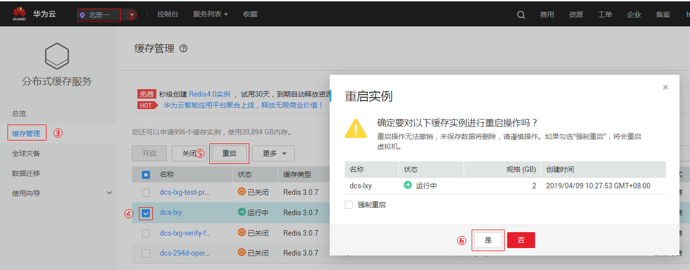

# 重启缓存实例

DCS管理控制台支持重启运行中的DCS缓存实例，且可批量重启DCS缓存实例。

> **警告：**   
>-   重启DCS缓存实例后，单机实例中原有的数据将被删除。  
>-   在重启DCS缓存实例过程中，您无法对实例进行读写操作。  
>-   在重启DCS缓存实例过程中，如果有正在进行的备份操作，可能会重启失败。  

## 前提条件

只有当DCS缓存实例处于“运行中”或“故障”状态，才能执行此操作。

## 操作步骤

1.  登录[分布式缓存服务管理控制台](https://console.huaweicloud.com/dcs)。
2.  在管理控制台左上角单击，选择区域和项目。
3.  单击左侧菜单栏的“缓存管理”。
4.  勾选“名称”栏下的相应DCS缓存实例名称左侧的方框，可选一个或多个。
5.  单击信息栏左上侧的“重启”。
6.  单击“是”，完成重启DCS缓存实例。

    重启DCS缓存实例大约需要1到30分钟。DCS缓存实例重启成功后，缓存实例状态切换为“运行中”。

    > **说明：**   
    >-   默认情况只会重启实例进程，若勾选“强制重启”将会重启实例所在虚拟机。  
    >-   如果重启单个实例，也可以在需要重启的DCS缓存实例右侧，单击“操作”栏下的“更多 \> 重启”。  

    **图 1**  重启缓存实例  
    

## 使用API方式重启缓存实例

您还可以使用API的方式重启实例，具体操作请查看以下链接。

[启动/停止/重启实例或清空数据](https://support.huaweicloud.com/api-dcs/dcs-zh-api-180423030.html)

## 相关产品及文档

<table><thead align="left"><tr id="rb27d733848ce4e7a9386965803595f1b"><th class="cellrowborder" valign="top" width="50%" id="mcps1.1.3.1.1">
相关产品

</th>
<th class="cellrowborder" valign="top" width="50%" id="mcps1.1.3.1.2">
相关文档

</th>
</tr>
</thead>
<tbody><tr id="re4588baf45714b4f80c021cca1290879"><td class="cellrowborder" valign="top" width="50%" headers="mcps1.1.3.1.1 ">
<a href="https://www.huaweicloud.com/product/dcs.html?infodocbz" target="_blank" rel="noopener noreferrer">分布式缓存 Redis</a>

<a href="https://www.huaweicloud.com/product/dcsmem.html?infodocbz" target="_blank" rel="noopener noreferrer">分布式缓存 Memcached</a>

<a href="https://www.huaweicloud.com/product/ecs.html?infodocbz" target="_blank" rel="noopener noreferrer">弹性云服务器 ECS</a>

<a href="http://www.huaweicloud.com/product/vpc.html?infodocbz" target="_blank" rel="noopener noreferrer">虚拟私有云 VPC</a>

</td>
<td class="cellrowborder" valign="top" width="50%" headers="mcps1.1.3.1.2 ">
<a href="https://support.huaweicloud.com/usermanual-dcs/dcs-zh-ug-180315001.html?infodocbz" target="_blank" rel="noopener noreferrer">购买Redis实例</a>

<a href="https://support.huaweicloud.com/usermanual-dcs/zh-cn_topic_0082114847.html?infodocbz" target="_blank" rel="noopener noreferrer">连接Redis实例</a>

<a href="https://support.huaweicloud.com/usermanual-dcs/zh-cn_topic_0061845451.html?infodocbz" target="_blank" rel="noopener noreferrer">变更缓存实例规格</a>

<a href="https://support.huaweicloud.com/usermanual-dcs/zh-cn_topic_0079545637.html?infodocbz" target="_blank" rel="noopener noreferrer">缓存实例备份恢复</a>

<a href="https://support.huaweicloud.com/migration-dcs/zh-cn_topic_0078784423.html?infodocbz" target="_blank" rel="noopener noreferrer">缓存实例数据迁移</a>

</td>
</tr>
</tbody>
</table>

